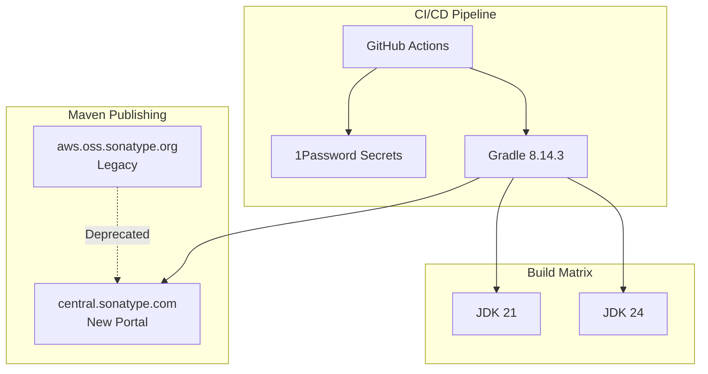

---
tags:
  - indexing
  - observability
  - security
---

# Observability Infrastructure

## Summary

This release includes infrastructure maintenance updates for the OpenSearch Observability plugin, focusing on Maven snapshot publishing migration and Gradle/JDK upgrades to ensure continued CI/CD compatibility and build reliability.

## Details

### What's New in v3.2.0

Two key infrastructure changes were made:

1. **Maven Snapshot Publishing Migration**: Updated the Maven snapshot publish endpoint from the legacy Sonatype OSS repository to the new Central Portal endpoint, along with credential management migration from AWS Secrets Manager to 1Password.

2. **Gradle and JDK Upgrade**: Upgraded Gradle from 8.10.2 to 8.14.3 and added JDK 24 support for CI checks.

### Technical Changes

#### Architecture Changes



#### New Configuration

| Setting | Description | Old Value | New Value |
|---------|-------------|-----------|-----------|
| Maven Snapshots URL | Repository for snapshot publishing | `https://aws.oss.sonatype.org/content/repositories/snapshots` | `https://central.sonatype.com/repository/maven-snapshots/` |
| Gradle Version | Build tool version | 8.10.2 | 8.14.3 |
| Kotlin Version | Kotlin compiler version | 2.0.21 | 2.2.0 |
| Nebula OSPackage | Packaging plugin version | 11.6.0 | 12.0.0 |
| CI Java Matrix | JDK versions for CI | [21] | [21, 24] |

#### Credential Management Changes

| Aspect | Before | After |
|--------|--------|-------|
| Secret Storage | AWS Secrets Manager | 1Password |
| Authentication | AWS IAM Role (`PUBLISH_SNAPSHOTS_ROLE`) | 1Password Service Account Token |
| Credential Retrieval | `aws secretsmanager get-secret-value` | `1password/load-secrets-action` |

### Usage Example

The new Maven publishing workflow:

```yaml
# .github/workflows/maven-publish.yml
- name: Load secret
  uses: 1password/load-secrets-action@v2
  with:
    export-env: true
  env:
    OP_SERVICE_ACCOUNT_TOKEN: ${{ secrets.OP_SERVICE_ACCOUNT_TOKEN }}
    SONATYPE_USERNAME: op://opensearch-infra-secrets/maven-central-portal-credentials/username
    SONATYPE_PASSWORD: op://opensearch-infra-secrets/maven-central-portal-credentials/password

- name: publish snapshots to maven
  run: |
    ./gradlew publishPluginZipPublicationToSnapshotsRepository
```

### Migration Notes

For plugin maintainers:
1. Update `build.gradle` to use the new Central Portal URL
2. Add the new repository URL to both `buildscript.repositories` and project `repositories`
3. Configure 1Password secrets in GitHub repository settings
4. Update CI workflows to use `1password/load-secrets-action`

## Limitations

- Detekt static analysis tool does not yet support JDK 24, requiring `jvmTarget = "21"` workaround
- Legacy Sonatype URL is kept as fallback in repositories for backward compatibility

## References

### Documentation
- [Sonatype Central Portal Snapshots](https://central.sonatype.org/publish/publish-portal-snapshots/): Official migration documentation

### Pull Requests
| PR | Description |
|----|-------------|
| [#1931](https://github.com/opensearch-project/observability/pull/1931) | Update the maven snapshot publish endpoint and credential |
| [#1937](https://github.com/opensearch-project/observability/pull/1937) | Upgrade gradle to 8.14.3 and run CI checks with JDK24 |

### Issues (Design / RFC)
- [Issue #1932](https://github.com/opensearch-project/observability/issues/1932): Release version 3.2.0
- [Issue #5551](https://github.com/opensearch-project/opensearch-build/issues/5551): Plugin snapshot publishing migration

## Related Feature Report

- [Full feature documentation](../../../../features/observability/observability-infrastructure.md)
