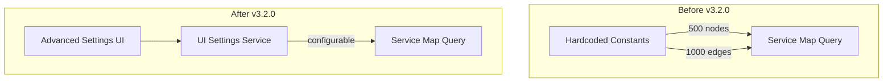

---
tags:
  - domain/observability
  - component/server
  - dashboards
  - observability
  - search
---
# Observability Service Map

## Summary

This enhancement makes the service map maximum nodes and maximum edges values user-configurable in OpenSearch Dashboards Observability plugin. Previously, these were hardcoded constants (500 nodes, 1000 edges), which could result in inaccurate service maps for large-scale deployments with more than 500 unique services.

## Details

### What's New in v3.2.0

Users can now configure the maximum number of nodes and edges displayed in service maps through the Advanced Settings panel in OpenSearch Dashboards. This addresses a limitation where organizations with large microservice architectures (650+ services) could not visualize complete service relationships.

### Technical Changes

#### Architecture Changes



#### New Configuration

| Setting | Description | Default |
|---------|-------------|---------|
| `observability:traceAnalyticsServiceMapMaxNodes` | Maximum number of nodes (services) in service map queries | 500 |
| `observability:traceAnalyticsServiceMapMaxEdges` | Maximum number of edges (connections) in service map queries | 1000 |

#### Changed Files

| File | Change |
|------|--------|
| `common/constants/trace_analytics.ts` | Replaced hardcoded constants with setting keys and defaults |
| `public/components/trace_analytics/components/common/helper_functions.tsx` | Added getter/setter methods for new settings |
| `public/components/trace_analytics/requests/queries/services_queries.ts` | Updated queries to use configurable values |
| `server/plugin_helper/register_settings.ts` | Registered new UI settings with schema validation |

### Usage Example

Navigate to **Management** → **Advanced Settings** → **Observability** section:

```
Trace analytics service map maximum nodes: 1000
Trace analytics service map maximum edges: 2000
```

After updating these settings, the service map will request up to the configured number of nodes and edges, allowing visualization of larger service architectures.

### Migration Notes

- No migration required - existing deployments will use the default values (500 nodes, 1000 edges)
- Users with large service deployments should increase these values based on their environment
- Higher values may impact query performance and browser rendering

## Limitations

- Very high values may cause performance degradation in both query execution and UI rendering
- Settings apply globally to all users in the tenant
- Minimum value is 1 for both settings

## References

### Documentation
- [Trace Analytics Documentation](https://docs.opensearch.org/latest/observing-your-data/trace/ta-dashboards/): Official documentation

### Pull Requests
| PR | Description |
|----|-------------|
| [#2472](https://github.com/opensearch-project/dashboards-observability/pull/2472) | [Traces] Make service map max nodes and max edges values user-configurable |

### Issues (Design / RFC)
- [Issue #2471](https://github.com/opensearch-project/dashboards-observability/issues/2471): Feature request for configurable service map limits

## Related Feature Report

- Full feature documentation
