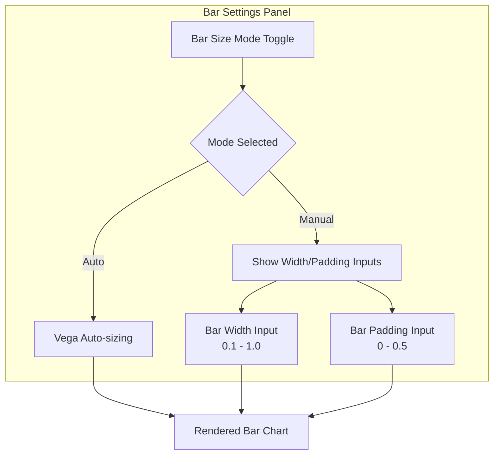

# Bar Chart Enhancements

## Summary

This release introduces a "Bar Size Control Switch" to bar chart visualizations in OpenSearch Dashboards. Users can now toggle between "Auto" and "Manual" modes for bar sizing, providing greater flexibility in customizing bar chart appearance.

## Details

### What's New in v3.2.0

A new bar size mode toggle has been added to the bar chart style options panel. This allows users to choose between automatic bar sizing (where Vega determines optimal width and padding) or manual control with custom values.

### Technical Changes

#### User Interface Flow



#### New Components

| Component | Description |
|-----------|-------------|
| `barSizeMode` | New style control property with values `'auto'` or `'manual'` |
| `EuiButtonGroup` | Toggle switch for selecting bar size mode |
| `configureBarSizeAndSpacing()` | Utility function to conditionally apply size settings |

#### New Configuration

| Setting | Description | Default |
|---------|-------------|---------|
| `barSizeMode` | Controls whether bar sizing is automatic or manual | `'auto'` |
| `barWidth` | Bar width multiplier (only in manual mode) | `0.7` |
| `barPadding` | Bar padding multiplier (only in manual mode) | `0.1` |

#### API Changes

The `BarChartStyleControls` interface now includes:

```typescript
interface BarChartStyleControls {
  // ... existing properties
  barSizeMode: 'auto' | 'manual';
  barWidth: number;
  barPadding: number;
  // ...
}
```

### Usage Example

1. Navigate to OpenSearch Dashboards Discover page
2. Run a PPL query to generate data
3. Open the "Bar Settings" accordion in the style options panel
4. Select "Auto" for automatic bar sizing, or "Manual" to customize:
   - **Bar Width**: Value between 0.1 and 1.0 (scaled to actual pixel width)
   - **Bar Padding**: Value between 0 and 0.5 (scaled to actual spacing)

### Migration Notes

- Existing bar charts will default to "Auto" mode
- No breaking changes - manual width/padding settings are preserved when switching modes

## Limitations

- Bar size controls are only available in the Explore plugin's bar chart visualization
- Manual mode settings are scaled values, not direct pixel measurements

## Related PRs

| PR | Description |
|----|-------------|
| [#10152](https://github.com/opensearch-project/OpenSearch-Dashboards/pull/10152) | Add Bar Size Control Switch for auto/manual bar sizing |

## References

- [PR #10152](https://github.com/opensearch-project/OpenSearch-Dashboards/pull/10152): Main implementation
- [Building data visualizations](https://docs.opensearch.org/3.0/dashboards/visualize/viz-index/): OpenSearch visualization documentation
- [Vega](https://docs.opensearch.org/3.0/dashboards/visualize/vega/): Vega visualization documentation

## Related Feature Report

- [Full feature documentation](../../../../features/opensearch-dashboards/bar-chart-enhancements.md)
