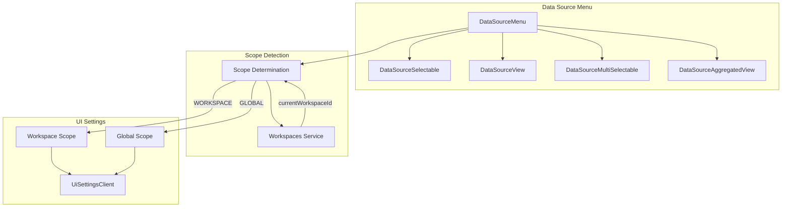

---
tags:
  - domain/core
  - component/dashboards
  - dashboards
---
# Data Source Selector Scope

## Summary

This release adds scope support to the data source selector component in OpenSearch Dashboards. The data source selector now automatically determines the appropriate UI settings scope (workspace or global) based on the current workspace context, ensuring that default data source settings are correctly retrieved for the user's current environment.

## Details

### What's New in v3.2.0

The data source selector components now support workspace-aware scope handling for UI settings. When a user is working within a workspace, the selector uses workspace-scoped settings; otherwise, it falls back to global settings.

### Technical Changes

#### Architecture Changes



#### New Components

| Component | Description |
|-----------|-------------|
| `getWorkspaces` | Utility function to access the workspaces service |
| `setWorkspaces` | Setter function to initialize the workspaces service reference |

#### API Changes

The `DataSourceMenuProps` interface has been updated:

| Property | Type | Required | Description |
|----------|------|----------|-------------|
| `scope` | `UiSettingScope` | Yes | The UI settings scope (WORKSPACE or GLOBAL) |
| `onManageDataSource` | `() => void` | No | Callback for managing data sources (now optional) |

The `getDefaultDataSourceId` function signature has been updated:

```typescript
// Before
getDefaultDataSourceId(uiSettings?: IUiSettingsClient): Promise<string | undefined>

// After
getDefaultDataSourceId(uiSettings?: IUiSettingsClient, scope: UiSettingScope): Promise<string | undefined>
```

#### Scope Determination Logic

```typescript
const currentWorkspaceId = workspaces.currentWorkspaceId$.getValue();
const scope: UiSettingScope = !!currentWorkspaceId
  ? UiSettingScope.WORKSPACE
  : UiSettingScope.GLOBAL;
```

### Usage Example

The data source menu automatically determines scope based on workspace context:

```tsx
// In DataSourceMenu component
const workspaces = getWorkspaces();
const currentWorkspaceId = workspaces.currentWorkspaceId$.getValue();
const scope: UiSettingScope = !!currentWorkspaceId
  ? UiSettingScope.WORKSPACE
  : UiSettingScope.GLOBAL;

// Scope is passed to child components
<DataSourceSelectable
  scope={scope}
  // ... other props
/>
```

For plugins using the data source menu directly:

```tsx
// The scope is automatically determined internally
<DataSourceMenu
  componentType={DataSourceComponentType.DataSourceSelectable}
  componentConfig={{
    savedObjects: client,
    notifications,
    onSelectedDataSources: handleSelection,
  }}
/>
```

### Migration Notes

- The `onManageDataSource` prop is now optional in `DataSourceSelectableConfig`
- Plugins using `createDataSourceMenu` do not need to pass `scope`, `uiSettings`, `hideLocalCluster`, or `application` props as these are handled internally
- The `getDefaultDataSourceId` utility now requires a `scope` parameter

## Limitations

- The scope is determined at component mount time; dynamic workspace switching requires component remounting
- Direct usage of `DataSourceSelector` (legacy component) requires manual scope handling via `getWorkspaces()`

## References

### Documentation
- [Workspace Documentation](https://docs.opensearch.org/3.0/dashboards/workspace/workspace/): Official workspace documentation
- [Data Sources Documentation](https://docs.opensearch.org/3.0/dashboards/management/data-sources/): Data source management guide

### Pull Requests
| PR | Description |
|----|-------------|
| [#9832](https://github.com/opensearch-project/OpenSearch-Dashboards/pull/9832) | Support scope in data source selector |

## Related Feature Report

- [Full feature documentation](../../../../features/opensearch-dashboards/opensearch-dashboards-data-source-selector.md)
