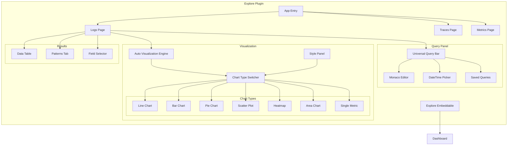

---
tags:
  - domain/core
  - component/dashboards
  - dashboards
  - observability
  - performance
  - search
  - sql
---
# Explore UI Enhancements

## Summary

OpenSearch Dashboards v3.2.0 introduces the new Explore plugin, an evolution of the Discover experience that provides enhanced query capabilities, multi-dataset support, and rule-based auto-visualization. The Explore plugin features a redesigned query panel with Monaco Editor, support for logs/traces/metrics flavors, dashboard embeddable support, and multiple chart types including line, bar, pie, scatter, heatmap, area, and single metric visualizations. This release also includes significant UI enhancements including PPL filter support, improved fields selector, query editor performance optimizations, and bidirectional URL-Redux synchronization.

## Details

### What's New in v3.2.0

The Explore plugin is a major new feature that modernizes the data exploration experience in OpenSearch Dashboards:

- **New Query Panel Layout**: Universal query bar powered by Monaco Editor v0.52.2 with dual editor support
- **Multi-Flavor Support**: Separate pages for logs, traces, and metrics exploration registered in side navigation
- **Rule-Based Auto-Visualization**: Automatic chart type selection based on data characteristics
- **Dashboard Embeddable**: Explore visualizations can be embedded in dashboards
- **Chart Type Switcher**: Users can switch between available chart types with collapsible style panels
- **Patterns Tab**: New log patterns table UI for pattern analysis
- **PPL Filter Support**: Filters added from sidebar or results table directly modify PPL queries with WHERE clauses
- **Improved Fields Selector**: New grouping by "result" and "schema" replacing "selected/popular/available", with column filter UI
- **Query Editor Performance**: Optimized state management to reduce re-renders on slower computers
- **Global Header Controls**: Datepicker and run button moved to global header with smart Update/Refresh states
- **URL-Redux Synchronization**: Bidirectional sync enabling browser back/forward navigation support
- **PPL Documentation**: In-editor documentation for PPL commands with categorized suggestions
- **Language Reference Tooltips**: Improved query language reference with tooltips

### Technical Changes

#### Architecture



#### New Components

| Component | Description |
|-----------|-------------|
| `ExploreEmbeddable` | Embeddable component for adding Explore visualizations to dashboards |
| `QueryPanel` | New query panel with Monaco Editor integration |
| `AutoVisualization` | Rule-based automatic chart type selection engine |
| `ChartTypeSwitcher` | UI component for switching between available chart types |
| `PatternsTable` | Log patterns analysis table with pagination |
| `StylePanel` | Collapsible panels for chart styling options |
| `TabRegistry` | Service for managing Explore tabs (Data, Visualization, Patterns) |
| `useTabResults` | Hook for managing tab results, replacing repeated code |
| `PPLFilterUtils` | Utility functions for PPL filter manipulation |
| `ColumnsFilterUI` | Column filter UI with "selected" group in fields selector |
| `URLReduxSync` | Bidirectional URL-Redux synchronization system |
| `GlobalHeaderControls` | Datepicker and run button in global header |
| `PPLDocumentation` | In-editor documentation for PPL commands |

#### UI Improvements

| Feature | Description |
|---------|-------------|
| Inspection Button | Added to action bar in tabs for query inspection |
| PPL Filters | Filters from sidebar/table modify PPL query directly with WHERE clauses |
| Fields Selector Grouping | Changed from selected/popular/available to result/schema grouping |
| Chart UI Updates | Removed index pattern UI from fields selector, fixed empty panel issue |
| Log Table Columns | Controlled by query result using `fields` keyword, auto-shows columns for <8 fields |
| Missing Fields | Default setting changed to show missing fields in selector |
| Query Editor Performance | State moved from EditorContext to useQueryPanelEditor hook for reduced re-renders |
| Global Header | Datepicker and run button moved to header with smart Update/Refresh states |
| Keyword Suggestions | Segregated into Commands, Operators, Functions subcategories |
| Documentation Panel | Shown by default in suggestion wizard |
| Language Reference | Added tooltips, disabled button for unhandled languages |

#### Auto-Visualization Rules

| Data Pattern | Chart Type |
|--------------|------------|
| 1 numerical + 0 date + 0 categorical | Single Metric |
| 2 numerical + 0 date + 0 categorical | Scatter |
| 2 numerical + 0 date + 1 categorical | Scatter (colored) |
| 3 numerical + 0 date + 1 categorical | Scatter (sized) |
| 1 numerical + 0 date + 2 categorical | Heatmap |
| 3 numerical + 0 date + 0 categorical | Heatmap |
| 1 metric + 1 category | Bar |
| 1 metric + 2 category (low cardinality) | Stacked Bar |
| 1 metric + 2 category (high cardinality) | Heatmap |
| Time-based data | Line (default), Bar (switchable) |

### Usage Example

```ppl
# Single metric visualization
stats count() as total

# Scatter plot (2 numerical columns)
stats avg(price), avg(quantity)

# Bar chart (1 metric + 1 category)
stats min(products.base_price) by manufacturer

# Stacked bar (1 metric + 2 categories)
stats min(products.base_price) by manufacturer, customer_gender

# Heatmap (1 numerical + 2 categorical)
stats avg(response_time) by service, region
```

### Migration Notes

The Explore plugin is experimental and runs alongside the existing Discover plugin. Users can access Explore through the side navigation under the logs, traces, or metrics sections. No migration is required as both plugins coexist.

## Limitations

- Experimental feature that may change in future releases
- When a PPL embeddable is added to a dashboard, other embeddables using different query languages may conflict due to search service honoring global query language
- Table rendering for unmatched visualizations is pending finalization
- Patterns tab pagination has a known issue where clicking numerical page buttons may not trigger the onChange handler

## References

### Documentation
- [OpenSearch Dashboards Repository](https://github.com/opensearch-project/OpenSearch-Dashboards)

### Pull Requests
| PR | Description |
|----|-------------|
| [#9874](https://github.com/opensearch-project/OpenSearch-Dashboards/pull/9874) | Add pie, scatter, heatmap, single metric auto visualization |
| [#9886](https://github.com/opensearch-project/OpenSearch-Dashboards/pull/9886) | New query editor in storybook (Query Panel Phase 1) |
| [#9901](https://github.com/opensearch-project/OpenSearch-Dashboards/pull/9901) | Consume tab registry service and related state |
| [#9902](https://github.com/opensearch-project/OpenSearch-Dashboards/pull/9902) | Support logs, traces, metrics flavor for explore plugin |
| [#9908](https://github.com/opensearch-project/OpenSearch-Dashboards/pull/9908) | Add explore embeddable |
| [#9920](https://github.com/opensearch-project/OpenSearch-Dashboards/pull/9920) | Add bar chart with style panel |
| [#9933](https://github.com/opensearch-project/OpenSearch-Dashboards/pull/9933) | Created patterns tab with patterns table UI |
| [#9953](https://github.com/opensearch-project/OpenSearch-Dashboards/pull/9953) | Support filters for Explore PPL visualizations |
| [#9961](https://github.com/opensearch-project/OpenSearch-Dashboards/pull/9961) | Add chart type switcher for explore vis |
| [#9964](https://github.com/opensearch-project/OpenSearch-Dashboards/pull/9964) | Update mapping and support saving style options |
| [#9973](https://github.com/opensearch-project/OpenSearch-Dashboards/pull/9973) | Add area chart as available chart types |
| [#9978](https://github.com/opensearch-project/OpenSearch-Dashboards/pull/9978) | Support loading state from object |
| [#9985](https://github.com/opensearch-project/OpenSearch-Dashboards/pull/9985) | Update table action bar and field selector |
| [#10001](https://github.com/opensearch-project/OpenSearch-Dashboards/pull/10001) | Add inspection button to action bar in tabs |
| [#10045](https://github.com/opensearch-project/OpenSearch-Dashboards/pull/10045) | Support PPL filters in Explore |
| [#10048](https://github.com/opensearch-project/OpenSearch-Dashboards/pull/10048) | Update fields selector grouping (result/schema) |
| [#10092](https://github.com/opensearch-project/OpenSearch-Dashboards/pull/10092) | Update explore chart UI |
| [#10095](https://github.com/opensearch-project/OpenSearch-Dashboards/pull/10095) | Add documentation for PPL commands |
| [#10109](https://github.com/opensearch-project/OpenSearch-Dashboards/pull/10109) | Make log table columns controlled by query result |
| [#10136](https://github.com/opensearch-project/OpenSearch-Dashboards/pull/10136) | Add columns filter UI and update fields selector panel style |
| [#10140](https://github.com/opensearch-project/OpenSearch-Dashboards/pull/10140) | Change fields selector default to show missing fields |
| [#10249](https://github.com/opensearch-project/OpenSearch-Dashboards/pull/10249) | Query editor for explore layout refactor |
| [#10265](https://github.com/opensearch-project/OpenSearch-Dashboards/pull/10265) | Move datepicker and run button to global header |
| [#10274](https://github.com/opensearch-project/OpenSearch-Dashboards/pull/10274) | Segregate keywords into Commands, Operators, Functions |
| [#10285](https://github.com/opensearch-project/OpenSearch-Dashboards/pull/10285) | Improve query editor performance |
| [#10321](https://github.com/opensearch-project/OpenSearch-Dashboards/pull/10321) | Implement bidirectional URL-Redux synchronization |
| [#10334](https://github.com/opensearch-project/OpenSearch-Dashboards/pull/10334) | Change query panel UI around editor language |
| [#10347](https://github.com/opensearch-project/OpenSearch-Dashboards/pull/10347) | Add tooltip for language reference in explore |

## Related Feature Report

- Full feature documentation
