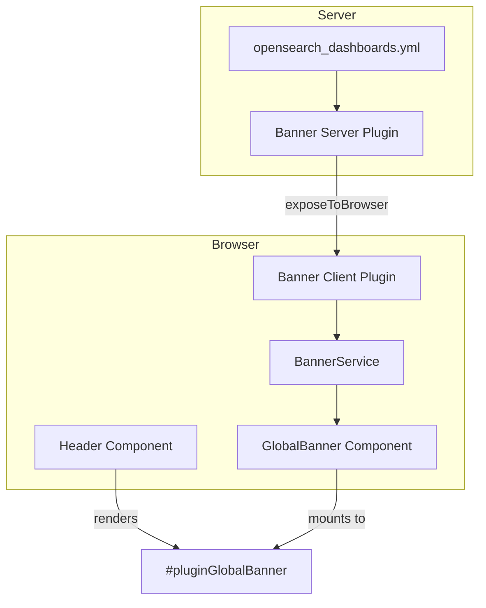

# Static Banner Plugin

## Summary

OpenSearch Dashboards v3.2.0 introduces a new Banner Plugin that displays a global, configurable header banner for important announcements or notifications. The plugin is disabled by default and can be enabled via configuration, providing administrators with a non-intrusive way to communicate with users across all dashboard pages.

## Details

### What's New in v3.2.0

This release introduces the initial implementation of the Banner Plugin with the following capabilities:

- Global banner displayed at the top of all OpenSearch Dashboards pages
- Feature flag to enable/disable the banner (`banner.enabled`)
- Markdown support for rich text content including links
- Configurable banner color (primary, success, warning)
- Configurable icon type
- Dismissible by users
- Smooth CSS transitions when showing/hiding
- Dynamic layout adjustment to prevent content overlap

### Technical Changes

#### Architecture



#### New Components

| Component | Description |
|-----------|-------------|
| `BannerPlugin` (server) | Server-side plugin that reads configuration and exposes it to browser |
| `BannerPlugin` (public) | Client-side plugin that initializes banner service and renders component |
| `BannerService` | Manages banner state using RxJS BehaviorSubject |
| `GlobalBanner` | React component that renders the EuiCallOut banner |
| `LinkRenderer` | Custom markdown renderer for links (opens in new tab) |

#### New Configuration

| Setting | Description | Default |
|---------|-------------|---------|
| `banner.enabled` | Enable/disable the banner plugin | `false` |
| `banner.text` | Banner message text (supports Markdown) | Default announcement text |
| `banner.color` | Banner color: `primary`, `success`, `warning` | `primary` |
| `banner.iconType` | EUI icon type for the banner | `iInCircle` |
| `banner.isVisible` | Initial visibility state | `true` |
| `banner.useMarkdown` | Enable Markdown rendering | `true` |

### Usage Example

Enable the banner in `opensearch_dashboards.yml`:

```yaml
# Enable the banner plugin
banner.enabled: true

# Customize banner content (optional)
banner.text: "System maintenance scheduled for Saturday. [Learn more](https://example.com)"
banner.color: warning
banner.iconType: alert
```

### CSS Implementation

The plugin uses a CSS variable (`--global-banner-height`) to dynamically adjust the layout:

```css
:root {
  --global-banner-height: 0;
}

#pluginGlobalBanner {
  position: fixed;
  top: 0;
  left: 0;
  right: 0;
  z-index: 1100;
}

.expandedHeader {
  top: var(--global-banner-height) !important;
}
```

A ResizeObserver monitors the banner's actual height and updates the CSS variable accordingly.

## Limitations

- Banner content is static (configured via YAML only in this release)
- No server-side dynamic content fetching yet
- No role-based visibility or scheduled banners
- No Advanced Settings UI for customization (planned for future releases)

## References

### Pull Requests
| PR | Description |
|----|-------------|
| [#9989](https://github.com/opensearch-project/OpenSearch-Dashboards/pull/9989) | Add static banner plugin and feature flag |
| [#10251](https://github.com/opensearch-project/OpenSearch-Dashboards/pull/10251) | Fix font size and center alignment for banner text |
| [#10254](https://github.com/opensearch-project/OpenSearch-Dashboards/pull/10254) | Reset lighthouse baseline limit for dashboard and discover |

### Issues (Design / RFC)
- [Issue #9861](https://github.com/opensearch-project/OpenSearch-Dashboards/issues/9861): RFC - OpenSearch Dashboards Banner Plugin
- [Issue #9990](https://github.com/opensearch-project/OpenSearch-Dashboards/issues/9990): Meta issue tracking banner plugin development

## Related Feature Report

- [Full feature documentation](../../../../features/opensearch-dashboards/banner-plugin.md)
