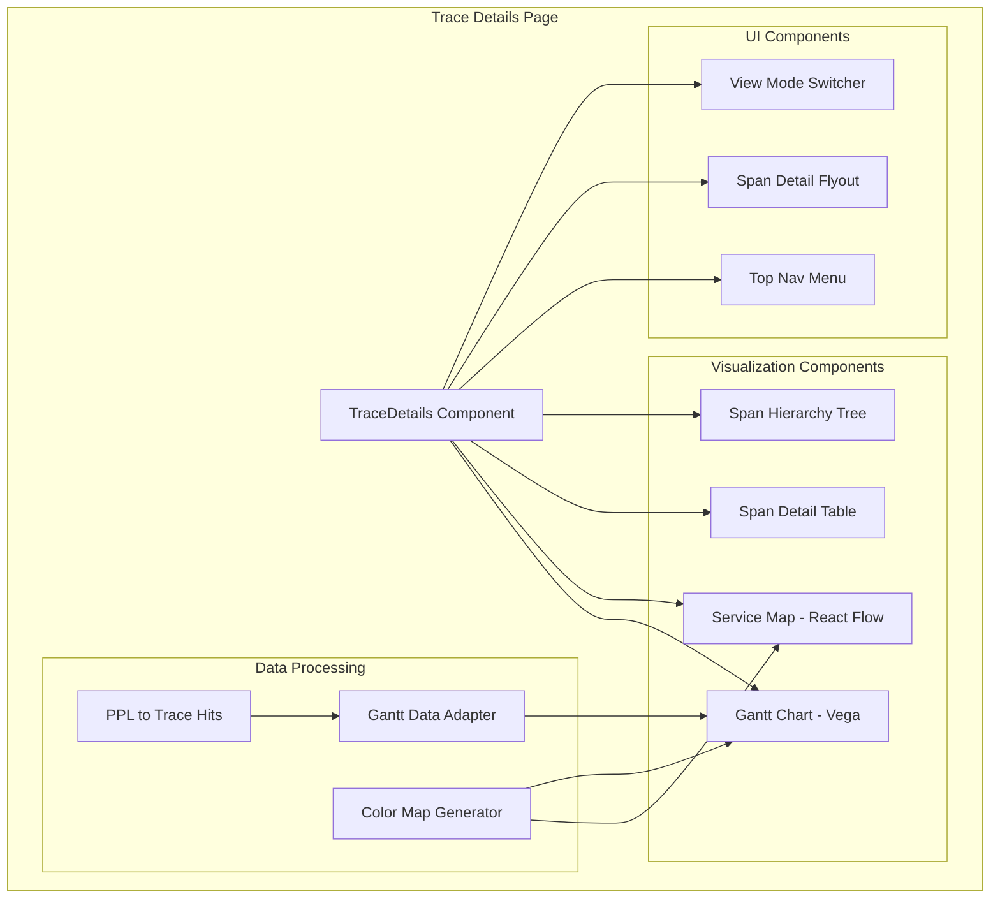

# Trace Details Page

## Summary

The Trace Details page is a new feature in OpenSearch Dashboards that provides a dedicated interface for viewing and analyzing individual trace journeys within the Explore plugin's Traces flavor. It displays complete metadata, attributes, execution context, and service relationships for specific traces, enabling deep investigation of distributed system behavior.

Key capabilities include:
- Gantt chart visualization of span timelines using Vega
- Interactive service map using React Flow and dagre.js for automatic layout
- Span detail flyout with filtering capabilities
- Multiple view modes: timeline, span list, and tree view
- URL-based navigation with trace ID and span ID parameters

## Details

### What's New in v3.2.0

This release introduces the Trace Details page as part of the Explore plugin's Traces flavor. The page is accessible via URL navigation with the following format:

```
/app/explore/traces/traceDetails#/?_a=(dataSourceId:{id},indexPattern:'{pattern}',spanId:{spanId},traceId:'{traceId}')
```

### Technical Changes

#### Architecture Changes



#### New Components

| Component | Description |
|-----------|-------------|
| `TraceDetails` | Main page component with trace data fetching and state management |
| `GanttChart` | Vega-based Gantt chart for span timeline visualization |
| `ServiceMap` | React Flow-based interactive service dependency graph |
| `SpanDetailPanel` | Container for span visualization with view mode switching |
| `SpanDetailTable` | Flat list view of spans with sorting and filtering |
| `SpanDetailTableHierarchy` | Tree view showing parent-child span relationships |
| `FlyoutListItem` | Reusable component for span attribute display in flyout |
| `TraceTopNavMenu` | Top navigation with "View raw trace" action |

#### New Dependencies

| Package | Version | Purpose |
|---------|---------|---------|
| `@xyflow/react` | ^12.8.2 | React Flow library for service map visualization |
| `@dagrejs/dagre` | ^1.1.5 | Automatic graph layout algorithm |

#### Gantt Chart Configuration

| Constant | Value | Description |
|----------|-------|-------------|
| `TOP_PADDING` | 20 | Top padding in pixels |
| `BOTTOM_PADDING` | 20 | Bottom padding in pixels |
| `MIN_ROW_HEIGHT` | 30 | Minimum height per span row |
| `MIN_HEIGHT` | 150 | Minimum chart height |
| `MAX_HEIGHT` | 600 | Maximum chart height |

### Usage Example

Navigate to a trace details page:
```
http://localhost:5601/app/explore/traces/traceDetails#/?_a=(dataSourceId:e2681970-5b5b-11f0-84cd-1f27cd4c7d84,indexPattern:'otel-v1-apm-span-*',spanId:a8b6dd34808083b3,traceId:'23a88fa559da1b6c7521658fba2cb82f')
```

If `spanId` is not provided, the root span or first available span is automatically selected.

### Service Map Features

- **Focus on Service**: Filter view to show only selected service and its direct connections
- **Metric Visualization**: Request rate, error rate, and duration displayed as color-coded bars
- **Expandable Cards**: Toggle between compact and detailed service card views
- **Automatic Layout**: dagre.js provides hierarchical left-to-right layout

### View Modes

| Mode | Description |
|------|-------------|
| Timeline | Gantt chart showing span execution timeline |
| Span List | Flat table with sortable columns |
| Tree View | Hierarchical view showing parent-child relationships |

### Migration Notes

To enable the Trace Details page:
1. Enable the Explore plugin (experimental feature)
2. Navigate to Traces flavor in Explore
3. Click on a trace to view details

## Limitations

- Requires Explore plugin to be enabled (experimental)
- Service map performance may degrade with very large numbers of services (50+)
- React Flow library is experimental in OpenSearch Dashboards core
- Gantt chart has maximum height of 600px

## Related PRs

| PR | Description |
|----|-------------|
| [#10253](https://github.com/opensearch-project/OpenSearch-Dashboards/pull/10253) | Trace Details page implementation |

## References

- [Issue #9898](https://github.com/opensearch-project/OpenSearch-Dashboards/issues/9898): RFC for React Flow library introduction
- [React Flow Documentation](https://reactflow.dev/): Interactive node-based visualization library
- [OpenSearch 3.3 Blog](https://opensearch.org/blog/explore-opensearch-3-3/): Feature announcement

## Related Feature Report

- [Full feature documentation](../../../features/opensearch-dashboards/explore.md)
