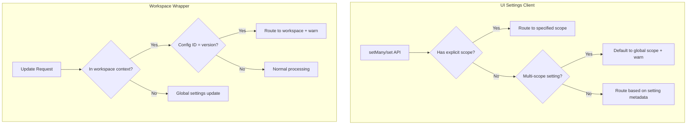

# UI Settings Backward Compatibility

## Summary

This release item restores backward compatibility for the UI settings client in OpenSearch Dashboards. A previous change ([#9726](https://github.com/opensearch-project/OpenSearch-Dashboards/pull/9726)) introduced multi-scope UI settings support but inadvertently created a breaking change for the `uiSettingClient` and the `/api/opensearch-dashboards/settings` router. This fix ensures existing code continues to work while adding deprecation warnings to guide developers toward the new API patterns.

## Details

### What's New in v3.2.0

The backward compatibility fix addresses the breaking change introduced by multi-scope UI settings:

1. **Multi-scope settings without explicit scope**: Previously threw an error; now defaults to global scope (or first available scope) with a deprecation warning
2. **Workspace settings via global scope**: Previously failed; now routes to workspace settings when inside a workspace context with a deprecation warning
3. **Deprecation logging**: Warns developers about deprecated usage patterns that will be removed in the next major release

### Technical Changes

#### Architecture Changes



#### Modified Components

| Component | File | Description |
|-----------|------|-------------|
| UiSettingsClient | `src/core/server/ui_settings/ui_settings_client.ts` | Modified `groupChanges()` to handle multi-scope settings gracefully |
| WorkspaceUiSettingsClientWrapper | `src/plugins/workspace/server/saved_objects/workspace_ui_settings_client_wrapper.ts` | Added backward compatibility for workspace settings updates |
| WorkspacePlugin | `src/plugins/workspace/server/plugin.ts` | Wired up UI settings client for scope detection |

#### Behavior Changes

| Scenario | Before (Breaking) | After (Compatible) |
|----------|-------------------|-------------------|
| Update multi-scope setting without scope | Error: "Unable to update, has multiple scopes" | Defaults to global scope + deprecation warning |
| Update workspace setting via global config ID | Failed silently or error | Routes to workspace settings + deprecation warning |

### Usage Example

```bash
# This call now works with a deprecation warning
# (previously would throw an error for multi-scope settings like defaultDataSource)
curl 'http://localhost:5601/api/opensearch-dashboards/settings' \
  -H 'Content-Type: application/json' \
  -H 'osd-xsrf: osd-fetch' \
  --data-raw '{"changes":{"defaultDataSource":"my-data-source-id"}}'
```

Server log output:
```
[warn] Deprecation warning: The setting "defaultDataSource" has multiple scopes. Please specify a scope when updating it.
```

### Migration Notes

Developers should update their code to explicitly specify scopes when updating multi-scope settings:

```typescript
// Deprecated (will be removed in next major version)
uiSettings.set('defaultDataSource', 'my-ds-id');

// Recommended
uiSettings.setWithScope('defaultDataSource', 'my-ds-id', UiSettingScope.GLOBAL);
// or
uiSettings.setWithScope('defaultDataSource', 'my-ds-id', UiSettingScope.WORKSPACE);
```

## Limitations

- Deprecation warnings are logged but the deprecated behavior will be removed in the next major release
- Settings with multiple scopes that don't include `global` will default to the first scope in the array

## References

### Pull Requests
| PR | Description |
|----|-------------|
| [#9854](https://github.com/opensearch-project/OpenSearch-Dashboards/pull/9854) | Keep backward compatibility for UI setting client |
| [#9726](https://github.com/opensearch-project/OpenSearch-Dashboards/pull/9726) | Original multi-scope UI settings implementation (introduced breaking change) |

### Issues (Design / RFC)
- [Issue #7821](https://github.com/opensearch-project/OpenSearch-Dashboards/issues/7821): Original feature request for workspace-scoped UI settings

## Related Feature Report

- [Full feature documentation](../../../features/opensearch-dashboards/ui-settings.md)
