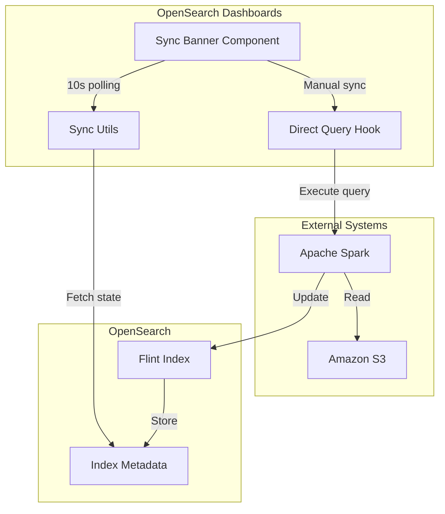

---
tags:
  - dashboards
  - indexing
  - search
---

# Vended Dashboard Progress

## Summary

This release adds polling-based index state detection for Vended Dashboards, enabling automatic progress tracking for background data synchronization jobs. Previously, progress was only tracked for queries initiated within OpenSearch Dashboards. Now, the system can detect and display progress for auto-refresh jobs running in the background via Apache Spark, providing users with real-time visibility into data synchronization status.

## Details

### What's New in v3.2.0

The Vended Dashboard progress banner now polls for external index state changes at 10-second intervals. This enables detection of data sync operations that were started outside of the current Dashboards session, such as scheduled auto-refresh jobs managed by Apache Spark.

### Technical Changes

#### Architecture Changes



#### New Components

| Component | Description |
|-----------|-------------|
| `sync_progress.tsx` | New module for converting index states to progress percentages |
| `ExternalIndexState` enum | Defines Flint index state machine states (creating, active, refreshing, recovering, cancelling) |
| `SyncProgress` type | Union type representing sync progress status |
| `asSyncProgress()` | Function to convert index state and query status to progress |

#### New Configuration

| Setting | Description | Default |
|---------|-------------|---------|
| `SYNC_INFO_POLLING_INTERVAL_MS` | Interval for polling index state | 10000 (10 seconds) |

#### State Machine Integration

The feature integrates with the Flint Index State Machine from opensearch-spark:

| Index State | Progress % | Description |
|-------------|------------|-------------|
| `creating` | 30% | Index is being created |
| `active` (no refresh) | 30% | Index activated but initial refresh pending |
| `active` (with refresh) | Complete | Index is ready and has been refreshed |
| `refreshing` | 60% | Data refresh in progress |
| `recovering` | 60% | Index recovering from error |
| `cancelling` | 90% | Cancellation in progress |

Query status takes precedence over index state when a query is actively running:

| Query Status | Progress % |
|--------------|------------|
| `submitted` | 0% |
| `scheduled` | 25% |
| `waiting` | 50% |
| `running` | 75% |

### Usage Example

The Vended Dashboard banner automatically appears when viewing a dashboard backed by a direct query data source (e.g., Amazon S3). The banner shows:

1. **Idle state**: Last sync time and scheduled refresh interval with "Sync data" link
2. **In-progress state**: Progress percentage with loading spinner and auto-reload on completion

```typescript
// Progress calculation example
const progress = asSyncProgress(
  syncInfo.indexState,      // e.g., 'refreshing'
  queryStatus,              // e.g., DirectQueryLoadingStatus.INITIAL
  Boolean(syncInfo.lastRefreshTime)
);
// Returns: { in_progress: true, percentage: 60 }
```

### Migration Notes

No migration required. The feature is automatically enabled when viewing Vended Dashboards. The polling only runs when the sync banner is rendered, so there is no performance impact on other dashboards.

## Limitations

- Requires opensearch-spark PR #1195 for full functionality (index state reporting)
- Polling interval is fixed at 10 seconds (not configurable via UI)
- Progress percentages are approximations based on state machine stages

## References

### Documentation
- [Flint Index State Machine](https://github.com/opensearch-project/opensearch-spark/blob/main/docs/index.md#index-state-transition): State transition documentation
- [Scheduled Query Acceleration](https://docs.opensearch.org/3.0/dashboards/management/scheduled-query-acceleration/): Official documentation
- [opensearch-spark #1195](https://github.com/opensearch-project/opensearch-spark/pull/1195): Index state reporting support

### Pull Requests
| PR | Description |
|----|-------------|
| [#9862](https://github.com/opensearch-project/OpenSearch-Dashboards/pull/9862) | Implement polling for index state in Vended Dashboard progress |

## Related Feature Report

- [Full feature documentation](../../../../features/opensearch-dashboards/vended-dashboard-progress.md)
