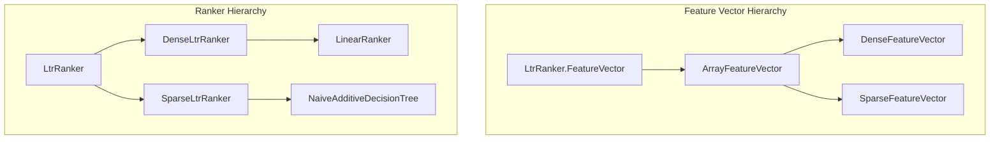

# XGBoost Missing Values Support

## Summary

This release adds proper support for handling missing values in XGBoost models within the Learning to Rank (LTR) plugin. Previously, the plugin incorrectly interpreted missing feature values (NaN), causing a mismatch between local XGBoost predictions and OpenSearch predictions. This fix ensures the LTR plugin's predictions align with native XGBoost behavior.

## Details

### What's New in v3.2.0

The LTR plugin now correctly handles missing values in XGBoost models by:

1. Introducing a new `SparseFeatureVector` class that uses `Float.NaN` as the default value for missing features
2. Updating `NaiveAdditiveDecisionTree` to use sparse feature vectors instead of dense vectors
3. Improving explanation messages to show the actual default value used when features are missing

### Technical Changes

#### Architecture Changes



#### New Components

| Component | Description |
|-----------|-------------|
| `ArrayFeatureVector` | Base class for feature vectors with configurable default score |
| `SparseFeatureVector` | Feature vector using `Float.NaN` as default for missing values |
| `SparseLtrRanker` | Base ranker class that works with sparse feature vectors |

#### Key Code Changes

The `FeatureVector` interface now includes a `getDefaultScore()` method:

```java
interface FeatureVector {
    void setFeatureScore(int featureId, float score);
    float getFeatureScore(int featureId);
    float getDefaultScore();  // New method
}
```

`SparseFeatureVector` initializes all scores to `Float.NaN`:

```java
public class SparseFeatureVector extends ArrayFeatureVector {
    public SparseFeatureVector(int size) {
        super(size, Float.NaN);
        reset();
    }
}
```

`NaiveAdditiveDecisionTree` now extends `SparseLtrRanker` instead of `DenseLtrRanker`, enabling proper XGBoost missing value handling.

### Usage Example

When a feature is missing (no match in the query), XGBoost models now correctly follow the `missing` branch defined in the model:

```json
[{
    "nodeid": 0,
    "split": "text_feature1",
    "depth": 0,
    "split_condition": 100.0,
    "yes": 1,
    "no": 2,
    "missing": 2,
    "children": [
        {"nodeid": 1, "depth": 1, "leaf": 0.5},
        {"nodeid": 2, "depth": 1, "leaf": 0.2}
    ]
}]
```

If `text_feature1` is missing (NaN), the model now correctly follows the `missing` branch (node 2) and returns `0.2`, matching native XGBoost behavior.

### Migration Notes

No migration required. Existing XGBoost models will automatically benefit from correct missing value handling. The change is backward compatible.

## Limitations

- This fix specifically addresses XGBoost models; RankLib models continue to use dense feature vectors with 0.0 as the default
- The explanation output now shows the actual default value (e.g., "default value of NaN used" instead of "default value 0.0 used")

## Related PRs

| PR | Description |
|----|-------------|
| [#206](https://github.com/opensearch-project/opensearch-learning-to-rank-base/pull/206) | Add support to handle missing values for XGBoost models |

## References

- [Issue #200](https://github.com/opensearch-project/opensearch-learning-to-rank-base/issues/200): Support missing value handling for XGBoost models in OpenSearch LTR
- [Elasticsearch LTR PR #482](https://github.com/o19s/elasticsearch-learning-to-rank/pull/482): Original implementation in Elasticsearch LTR plugin
- [Learning to Rank Documentation](https://docs.opensearch.org/3.0/search-plugins/ltr/index/)
- [XGBoost Missing Values Documentation](https://xgboost.readthedocs.io/en/stable/faq.html#how-to-deal-with-missing-values)

## Related Feature Report

- [Full feature documentation](../../../../features/learning/learning-to-rank.md)
