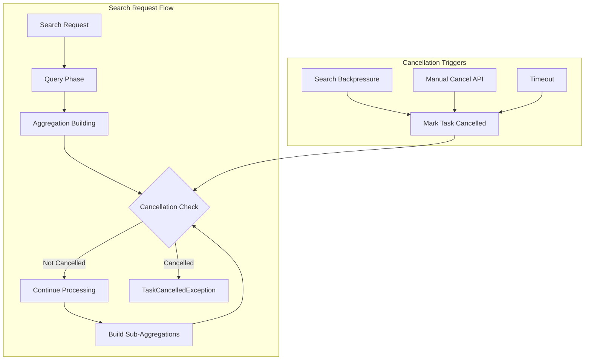

# Aggregation Task Cancellation

## Summary

OpenSearch v3.2.0 adds task cancellation checks in aggregation code paths, enabling long-running aggregation queries to be properly cancelled when requested. This addresses a critical issue where deeply nested aggregations could not be terminated, potentially causing Out of Memory errors on data nodes.

## Details

### What's New in v3.2.0

This release introduces cancellation checkpoints throughout the aggregation framework, allowing the search backpressure mechanism and manual task cancellation to effectively terminate resource-intensive aggregation queries during the query phase.

### Technical Changes

#### Architecture Changes



#### New Components

| Component | Description |
|-----------|-------------|
| `AggregatorBase.checkCancelled()` | New protected method that checks if the search context is cancelled and throws `TaskCancelledException` |
| Cancellation checkpoints | Strategic placement of `checkCancelled()` calls in aggregation building methods |

#### Modified Aggregators

The following aggregator classes now include cancellation checks:

| Aggregator Type | Files Modified |
|-----------------|----------------|
| Bucket Aggregators | `BucketsAggregator.java` |
| Terms Aggregators | `GlobalOrdinalsStringTermsAggregator.java`, `MapStringTermsAggregator.java`, `NumericTermsAggregator.java`, `MultiTermsAggregator.java` |
| Rare Terms | `LongRareTermsAggregator.java`, `StringRareTermsAggregator.java` |
| Histogram | `AbstractHistogramAggregator.java`, `AutoDateHistogramAggregator.java`, `DateRangeHistogramAggregator.java`, `VariableWidthHistogramAggregator.java` |
| Range | `RangeAggregator.java` |
| Filter | `FiltersAggregator.java`, `AdjacencyMatrixAggregator.java` |
| Composite | `CompositeAggregator.java` |

### Usage Example

The cancellation mechanism works automatically with existing search backpressure settings:

```json
PUT /_cluster/settings
{
  "persistent": {
    "search_backpressure": {
      "mode": "enforced",
      "search_task": {
        "elapsed_time_millis_threshold": 30000,
        "cpu_time_millis_threshold": 15000
      }
    }
  }
}
```

When a query exceeds thresholds, the aggregation will now properly terminate:

```json
{
  "error": {
    "type": "task_cancelled_exception",
    "reason": "The query has been cancelled"
  }
}
```

### Migration Notes

- No configuration changes required
- Existing search backpressure settings will now effectively cancel aggregation queries
- Manual task cancellation via `_tasks/{task_id}/_cancel` API now works for aggregations

## Limitations

- Cancellation checks are added during the **query phase** only
- The fetch phase (where `InternalAggregation` results are transformed) does not yet have cancellation checks
- A follow-up PR is planned to add cancellation checks in the fetch phase

## Related PRs

| PR | Description |
|----|-------------|
| [#18426](https://github.com/opensearch-project/OpenSearch/pull/18426) | Add task cancellation check in aggregation code paths |

## References

- [Issue #15413](https://github.com/opensearch-project/OpenSearch/issues/15413): Original bug report - Deeply nested aggregations are not terminable
- [Search Backpressure Documentation](https://docs.opensearch.org/3.0/tuning-your-cluster/availability-and-recovery/search-backpressure/): Official documentation on search backpressure

## Related Feature Report

- [Full feature documentation](../../../../features/opensearch/aggregation-task-cancellation.md)
