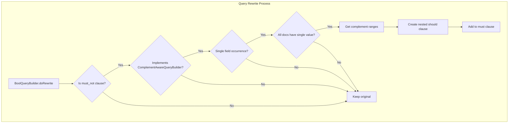

# BooleanQuery Rewrite Optimizations

## Summary

OpenSearch 3.2.0 introduces automatic query rewrite optimizations for BooleanQuery `must_not` clauses on numeric fields. When a `must_not` clause contains a match, term, or terms query on a numeric field, OpenSearch automatically rewrites it to an equivalent `should` clause containing range queries that represent the complement. This optimization delivers up to 54x performance improvement for common exclusion patterns.

## Details

### What's New in v3.2.0

This release extends the existing BooleanQuery `must_not` rewrite optimization (introduced for range queries) to support:

- **Match queries** on numeric fields
- **Term queries** on numeric fields  
- **Terms queries** on numeric fields (multiple values)

The optimization transforms slow `must_not` clauses into faster `should` clauses by computing the mathematical complement of the excluded values.

### Technical Changes

#### Architecture Changes



#### New Components

| Component | Description |
|-----------|-------------|
| `ComplementAwareQueryBuilder` | Interface for queries that can provide their complement as range queries |
| `ComplementHelperUtils` | Utility class with helper functions to construct complement range queries |
| `WithFieldName` | Interface to identify queries that target a specific field |

#### Query Rewrite Flow


### Usage Example

Original query (slow):
```json
{
  "query": {
    "bool": {
      "must_not": {
        "term": { "status": 200 }
      }
    }
  }
}
```

Internally rewritten to (fast):
```json
{
  "query": {
    "bool": {
      "must": {
        "bool": {
          "should": [
            { "range": { "status": { "lt": 200 } } },
            { "range": { "status": { "gt": 200 } } }
          ],
          "minimum_should_match": 1
        }
      }
    }
  }
}
```

### Performance Benchmarks

Benchmarks on `http_logs` dataset (c5.2xl EC2 instances):

| Excluded Value | Query Type | p50 Before (ms) | p50 After (ms) | Speedup |
|----------------|------------|-----------------|----------------|---------|
| 200 | `must_not` of `match` | 1021 | 20.72 | 49x |
| 200 | `must_not` of `term` | 1011 | 18.83 | 54x |
| 404 | `must_not` of `match` | 515.6 | 12.03 | 43x |
| 404 | `must_not` of `term` | 513.0 | 12.01 | 43x |
| 500 | `must_not` of `match` | 481.6 | 9.49 | 44x |
| 500 | `must_not` of `term` | 487.3 | 9.53 | 51x |
| 200, 500 | `must_not` of `terms` | 958.6 | 17.76 | 54x |
| 404, 500 | `must_not` of `terms` | 508.1 | 11.75 | 43x |

### Why This Optimization Works

The `must_not` clause is inherently slow because it must:
1. Gather all documents in the index
2. Filter out documents matching the excluded condition

By rewriting to `should` clauses with the complement ranges, OpenSearch can:
1. Directly iterate over matching documents using efficient BKD tree traversal
2. Skip the expensive filtering step entirely

### Conditions for Rewrite

The optimization applies when:
1. The `must_not` clause contains a `ComplementAwareQueryBuilder` (match, term, terms, or range on numeric fields)
2. There is exactly one query per field in the `must_not` clause
3. All documents in the field have exactly one value (no multi-valued fields)

## Limitations

- Only applies to numeric fields (integer, long, float, double, short)
- Does not apply to text or keyword fields
- Requires single-valued fields (multi-valued fields are not rewritten)
- Multiple `must_not` clauses on the same field are not rewritten
- Terms queries using BITMAP value type are not rewritten
- Terms queries using termsLookup are not rewritten

## Related PRs

| PR | Description |
|----|-------------|
| [#18498](https://github.com/opensearch-project/OpenSearch/pull/18498) | Extend BooleanQuery must_not rewrite to numeric match, term, and terms queries |

## References

- [Issue #17586](https://github.com/opensearch-project/OpenSearch/issues/17586): Feature request for BooleanQuery rewrites
- [Boolean Query Documentation](https://docs.opensearch.org/3.0/query-dsl/compound/bool/): Official docs

## Related Feature Report

- [Full feature documentation](../../../features/opensearch/booleanquery-rewrite-optimizations.md)
