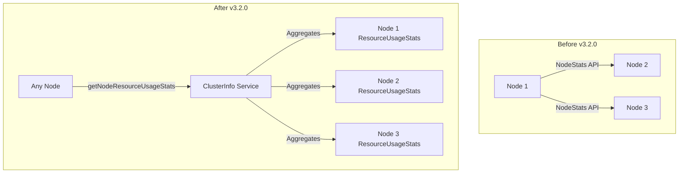

---
tags:
  - search
---

# Cluster Info & Resource Stats

## Summary

This release adds `NodeResourceUsageStats` to `ClusterInfo`, making node-level resource usage statistics (CPU, JVM memory, I/O) available to all nodes in the cluster. Previously, resource usage stats were only available within the scope of the current node, requiring additional API calls to retrieve stats for other nodes.

## Details

### What's New in v3.2.0

The `ClusterInfo` service now aggregates `NodeResourceUsageStats` alongside existing disk usage statistics. This enables any node in the cluster to access resource usage information for all other nodes without making separate NodeStats API calls.

### Technical Changes

#### Architecture Changes



#### New Components

| Component | Description |
|-----------|-------------|
| `NodeResourceUsageStats` in `ClusterInfo` | New field storing resource usage stats per node |
| `fillNodeResourceUsageStatsPerNode()` | New method in `InternalClusterInfoService` to populate stats |
| `getNodeResourceUsageStats()` | New getter method in `ClusterInfo` |

#### New Configuration

No new configuration settings are required. The feature uses existing resource tracker settings:

| Setting | Description | Default |
|---------|-------------|---------|
| `node.resource.tracker.global_cpu_usage.window_duration` | Window duration for CPU usage tracking | 30s |
| `node.resource.tracker.global_jvm_usage.window_duration` | Window duration for JVM memory tracking | 30s |
| `node.resource.tracker.global_io_usage.window_duration` | Window duration for I/O usage tracking | 5s |

#### API Changes

The `ClusterInfo` constructor now accepts an additional parameter:

```java
public ClusterInfo(
    final Map<String, DiskUsage> leastAvailableSpaceUsage,
    final Map<String, DiskUsage> mostAvailableSpaceUsage,
    final Map<String, Long> shardSizes,
    final Map<ShardRouting, String> routingToDataPath,
    final Map<NodeAndPath, ReservedSpace> reservedSpace,
    final Map<String, AggregateFileCacheStats> nodeFileCacheStats,
    final Map<String, NodeResourceUsageStats> nodeResourceUsageStats  // NEW
)
```

The `NodeResourceUsageStats` class now implements `ToXContentFragment` for JSON serialization:

```json
{
  "node_resource_usage_stats": {
    "nodeId": {
      "timestamp": 1698401391000,
      "cpu_utilization_percent": "0.1",
      "memory_utilization_percent": "3.9",
      "io_usage_stats": {
        "max_io_utilization_percent": "99.6"
      }
    }
  }
}
```

### Usage Example

Resource usage stats are now included in the `ClusterInfo` response and can be accessed programmatically:

```java
ClusterInfo clusterInfo = clusterInfoService.getClusterInfo();
Map<String, NodeResourceUsageStats> resourceStats = clusterInfo.getNodeResourceUsageStats();

for (Map.Entry<String, NodeResourceUsageStats> entry : resourceStats.entrySet()) {
    String nodeId = entry.getKey();
    NodeResourceUsageStats stats = entry.getValue();
    
    double cpuPercent = stats.getCpuUtilizationPercent();
    double memoryPercent = stats.getMemoryUtilizationPercent();
    IoUsageStats ioStats = stats.getIoUsageStats();
}
```

### Migration Notes

- The old 6-parameter `ClusterInfo` constructor is deprecated and will be removed in a future release
- Existing code using `ClusterInfo` should update to use the new 7-parameter constructor
- Serialization is backward compatible: nodes running older versions will receive empty resource usage stats

## Limitations

- Resource usage stats require the `ResourceUsageCollector` to have collected sufficient data (typically 5-6 seconds after node startup)
- I/O usage stats are only available on Linux systems
- Stats are collected at configurable intervals and may not reflect real-time values

## References

### Documentation
- [Nodes Stats API Documentation](https://docs.opensearch.org/3.0/api-reference/nodes-apis/nodes-stats/): Official documentation for resource_usage_stats metric

### Pull Requests
| PR | Description |
|----|-------------|
| [#18480](https://github.com/opensearch-project/OpenSearch/pull/18480) | Add NodeResourceUsageStats to ClusterInfo |

### Issues (Design / RFC)
- [Issue #18472](https://github.com/opensearch-project/OpenSearch/issues/18472): [Writable Warm] Adding Support For NodeResourceUsageStats in ClusterInfo

## Related Feature Report

- [Full feature documentation](../../../features/opensearch/opensearch-cluster-info-resource-stats.md)
