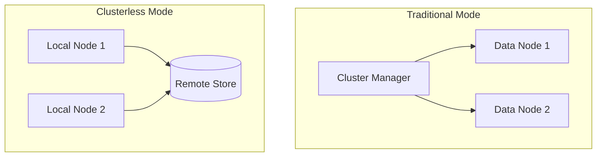

# Clusterless Mode

## Summary

OpenSearch v3.2.0 introduces experimental support for "clusterless" mode, enabling nodes to operate independently without joining a traditional cluster. This foundational capability supports cloud-native architectures where nodes can function as shared-nothing data nodes, fetching segments from remote storage without cluster manager coordination.

## Details

### What's New in v3.2.0

This release adds two key capabilities for clusterless operation:

1. **Clusterless Startup Mode**: Nodes can start without discovering or joining a cluster when a clusterless `ClusterPlugin` is loaded
2. **Custom Remote Store Path Prefix**: A new index setting allows injecting unique writer identifiers into remote store paths, enabling multiple writers to write to the same shard without conflicts

### Technical Changes

#### Architecture Changes



#### New Components

| Component | Description |
|-----------|-------------|
| `LocalClusterService` | ClusterService implementation without cluster manager coordination |
| `LocalDiscovery` | Discovery implementation that only "discovers" the local node |
| `LocalShardStateAction` | Applies shard state changes directly to local cluster state |
| `ClusterPlugin.isClusterless()` | Plugin interface method to indicate clusterless mode |

#### New Configuration

| Setting | Description | Default |
|---------|-------------|---------|
| `index.remote_store.segment.path_prefix` | Unique writer identifier injected into remote store paths | `null` (empty) |

The path prefix setting:
- Is index-scoped and dynamic
- Only works when `index.remote_store.enabled` is `true`
- Cannot contain path separators (`/`, `\`) or drive specifiers (`:`)
- Empty/whitespace values are ignored for backward compatibility

#### Path Structure Change

**Before:**
```
remote_repository/hash/index-uuid/shard-id/segments/data/file
```

**After (with path prefix):**
```
remote_repository/hash/index-uuid/shard-id/writer-node-id/segments/data/file
```

### Usage Example

To enable clusterless mode, implement a `ClusterPlugin` that returns `true` from `isClusterless()`:

```java
public class MyClusterlessPlugin extends Plugin implements ClusterPlugin {
    @Override
    public boolean isClusterless() {
        return true;
    }
}
```

To configure a unique writer path prefix:

```json
PUT /my-index/_settings
{
  "index.remote_store.segment.path_prefix": "writer-node-1"
}
```

### Migration Notes

- This is an **experimental** feature and not recommended for production use
- Clusterless mode requires a custom plugin that implements `ClusterPlugin.isClusterless()`
- Existing remote store indexes are not affected unless the path prefix setting is explicitly configured

## Limitations

- **Experimental status**: The feature is marked experimental and APIs may change
- **Plugin required**: Clusterless mode requires a custom plugin implementation
- **No cluster state updates**: `submitStateUpdateTasks` throws `UnsupportedOperationException` in clusterless mode
- **Limited discovery**: Only the local node is discoverable in clusterless mode

## Related PRs

| PR | Description |
|----|-------------|
| [#18479](https://github.com/opensearch-project/OpenSearch/pull/18479) | Start in "clusterless" mode if a clusterless ClusterPlugin is loaded |
| [#18857](https://github.com/opensearch-project/OpenSearch/pull/18857) | Add support for custom remote store segment path prefix |

## References

- [Issue #17957](https://github.com/opensearch-project/OpenSearch/issues/17957): RFC - Cloud-native OpenSearch
- [Issue #18750](https://github.com/opensearch-project/OpenSearch/issues/18750): Feature request for custom remote store path component
- [Remote-backed storage documentation](https://docs.opensearch.org/3.2/tuning-your-cluster/availability-and-recovery/remote-store/index/)

## Related Feature Report

- [Full feature documentation](../../../features/opensearch/clusterless-mode.md)
