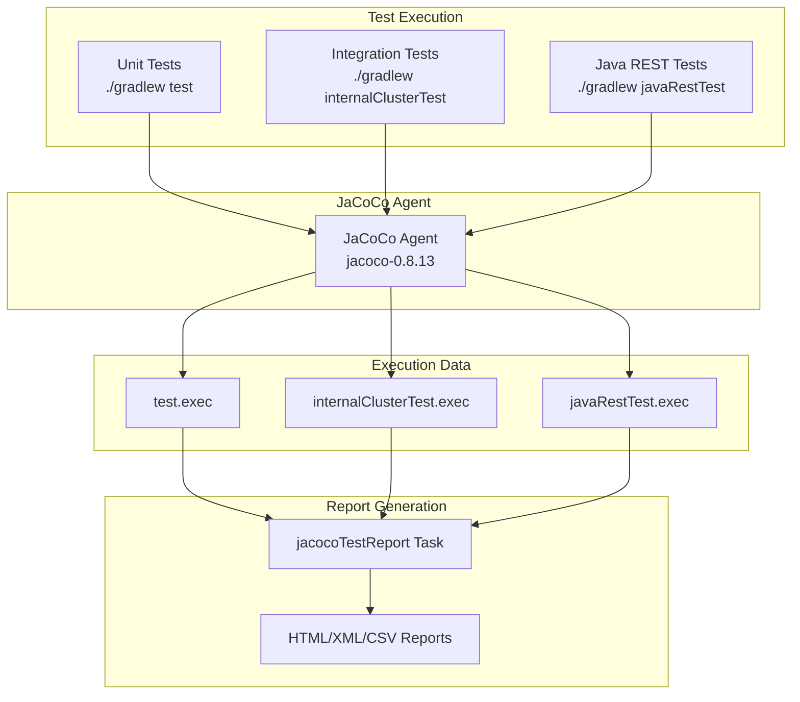

---
tags:
  - domain/core
  - component/server
  - ml
---
# Code Coverage (Gradle)

## Summary

This release adds the ability to run code coverage locally using Gradle with the JaCoCo plugin. Developers can now generate coverage reports for unit tests, integration tests, and REST tests directly from their local environment, ensuring consistency with the coverage reported by GitHub CI.

## Details

### What's New in v3.2.0

This enhancement enables local code coverage generation using Gradle, addressing the limitation where coverage reports were only available after the Gradle Check workflow passed on GitHub.

### Technical Changes

#### Architecture Changes



#### New Components

| Component | Description |
|-----------|-------------|
| `jacocoTestReport` task enhancement | Aggregates execution data from multiple test types |
| `testCodeCoverageReport` | Coverage report for unit tests |
| `testCodeCoverageReportJavaRestTest` | Coverage report for Java REST tests |

#### New Configuration

| Setting | Description | Default |
|---------|-------------|---------|
| `tests.coverage` | Enable coverage during `check` task | `false` |
| `tests.coverage.report.xml` | Generate XML report | `true` |
| `tests.coverage.report.html` | Generate HTML report | `false` |
| `tests.coverage.report.csv` | Generate CSV report | `false` |

### Usage Example

Run unit tests with coverage for a specific module:

```bash
# Run unit tests
./gradlew :server:test

# Generate coverage report
./gradlew :server:jacocoTestReport
```

Run a specific test with HTML coverage report:

```bash
./gradlew :server:test --tests "org.opensearch.search.approximate.ApproximatePointRangeQueryTests.testNycTaxiDataDistribution"
./gradlew :server:jacocoTestReport -Dtests.coverage.report.html=true
```

Run integration tests with coverage:

```bash
./gradlew :server:internalClusterTest
./gradlew :server:jacocoTestReport
```

Run Java REST tests with coverage:

```bash
./gradlew :qa:die-with-dignity:javaRestTest
./gradlew :qa:die-with-dignity:jacocoTestReport -Dtests.coverage.report.html=true
```

Generate combined coverage after `check` task:

```bash
./gradlew check -Dtests.coverage=true
```

### Report Location

Coverage reports are generated at:
```
$buildDir/build/reports/jacoco/test/html/
```

### Migration Notes

The previous commands `codeCoverageReportForUnitTest`, `codeCoverageReportForIntegrationTest`, and `codeCoverageReport` have been replaced with the new workflow using `jacocoTestReport`.

## Limitations

- Coverage reports require running tests first to generate `.exec` files
- The `jacocoTestReport` task only runs if at least one `.exec` file exists
- HTML and CSV reports are disabled by default to save disk space

## References

### Documentation
- [JaCoCo Gradle Plugin](https://docs.gradle.org/current/userguide/jacoco_plugin.html): Official documentation
- [PR #18509](https://github.com/opensearch-project/OpenSearch/pull/18509): Main implementation
- [PR #18358](https://github.com/opensearch-project/OpenSearch/pull/18358): Related coverage improvement work
- [PR #18376](https://github.com/opensearch-project/OpenSearch/pull/18376): javaRestTest coverage addition

### Pull Requests
| PR | Description |
|----|-------------|
| [#18509](https://github.com/opensearch-project/OpenSearch/pull/18509) | Ability to run Code Coverage locally with Gradle |

## Related Feature Report

- Full feature documentation
