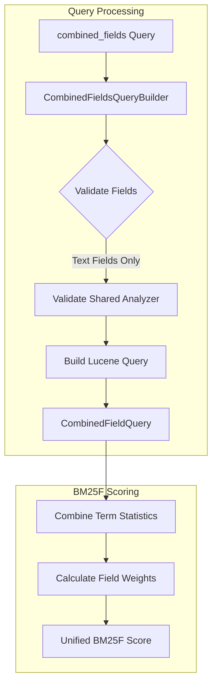

---
tags:
  - search
---

# Combined Fields Query

## Summary

OpenSearch v3.2.0 introduces the `combined_fields` query, a new full-text search query type that treats multiple text fields as a single combined field for scoring purposes. This query leverages Lucene's `CombinedFieldQuery` to implement the BM25F (BM25 for multi-field documents) scoring algorithm, providing more accurate relevance ranking when searching across multiple related text fields like title, body, and summary.

## Details

### What's New in v3.2.0

The `combined_fields` query is a new query type that addresses a common challenge in multi-field search: how to properly score documents when search terms appear across different fields. Unlike `multi_match` with `cross_fields` type, which can encounter issues with non-text fields, `combined_fields` is specifically designed for text fields and uses a principled BM25F scoring approach.

### Technical Changes

#### Architecture



#### New Components

| Component | Description |
|-----------|-------------|
| `CombinedFieldsQueryBuilder` | Query builder that constructs combined fields queries with field weighting support |
| `Builder` (inner class) | Extends Lucene's `QueryBuilder` to create `CombinedFieldQuery` instances |

#### Query Parameters

| Parameter | Type | Description | Default |
|-----------|------|-------------|---------|
| `query` | String | The search text to analyze and match | Required |
| `fields` | Array | List of text fields with optional boost values (e.g., `["title^3", "content"]`) | Required |
| `operator` | String | Boolean operator for combining terms: `AND` or `OR` | `OR` |
| `minimum_should_match` | String | Minimum number of terms that must match (e.g., `"2"`, `"75%"`) | None |
| `boost` | Float | Query-level boost factor | `1.0` |

### Usage Example

```json
GET my_index/_search
{
  "query": {
    "combined_fields": {
      "query": "distributed systems architecture",
      "fields": ["title^3", "summary^2", "content"],
      "operator": "AND"
    }
  }
}
```

With `minimum_should_match`:

```json
GET my_index/_search
{
  "query": {
    "combined_fields": {
      "query": "machine learning algorithms",
      "fields": ["headline^3", "summary^2", "content"],
      "operator": "or",
      "minimum_should_match": "75%"
    }
  }
}
```

### Key Benefits

1. **BM25F Scoring**: Uses the BM25F algorithm which combines term and collection statistics across fields, treating them as if indexed into a single field
2. **Field Weighting**: Supports per-field boost values to prioritize matches in more important fields
3. **Term-Centric Approach**: Scores each term across all fields together, rather than field-by-field
4. **Consistent Analyzer Requirement**: Ensures all fields use the same search analyzer for accurate scoring

### Constraints

- **Text Fields Only**: Only supports text field types; non-text fields will throw an error
- **Same Analyzer Required**: All specified fields must use the same search analyzer
- **No Phrase Support**: Phrase queries are not supported within combined fields

## Limitations

- The query is marked as `@opensearch.experimental`, indicating it may evolve in future releases
- All fields must share the same search analyzer - fields with different analyzers cannot be combined
- Only text fields are supported; attempting to use keyword, numeric, or other field types will result in an error
- Phrase queries (quoted strings) are explicitly not supported

## References

### Blog Posts
- [BM25F and combined_fields query](https://opensourceconnections.com/blog/2021/06/30/better-term-centric-scoring-in-elasticsearch-with-bm25f-and-the-combined_fields-query/): Background on BM25F scoring algorithm

### Pull Requests
| PR | Description |
|----|-------------|
| [#18724](https://github.com/opensearch-project/OpenSearch/pull/18724) | Add combined_fields query to utilize Lucene's CombinedField (BM25F Text) |

### Issues (Design / RFC)
- [Issue #3996](https://github.com/opensearch-project/OpenSearch/issues/3996): Original feature request for combined_fields support
- [Documentation Issue #10209](https://github.com/opensearch-project/documentation-website/issues/10209): Documentation request for combined_fields query

## Related Feature Report

- [Full feature documentation](../../../../features/opensearch/opensearch-combined-fields-query.md)
