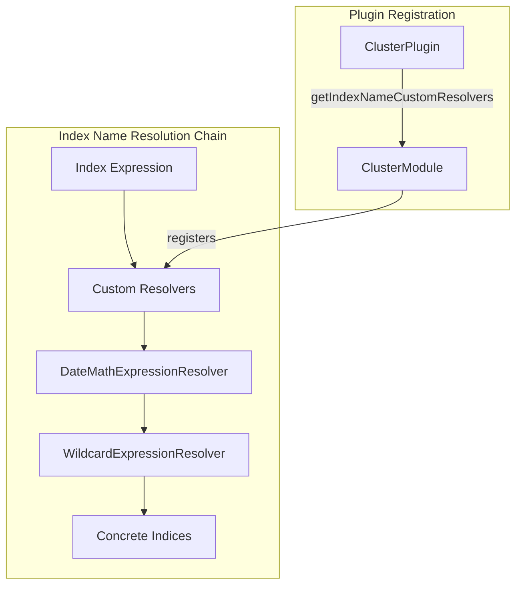

---
tags:
  - indexing
---

# Custom Index Name Resolver

## Summary

OpenSearch v3.2.0 introduces support for custom index name expression resolvers through the ClusterPlugin interface. This feature allows plugins to implement their own index name resolution logic, enabling custom wildcards and expression patterns beyond the built-in date math and wildcard resolvers.

## Details

### What's New in v3.2.0

This release adds an extensibility point for cluster plugins to provide custom `ExpressionResolver` implementations. Previously, index name resolution was limited to the built-in `DateMathExpressionResolver` and `WildcardExpressionResolver`. Now plugins can register additional resolvers to handle custom expression patterns.

### Technical Changes

#### Architecture Changes



#### New Components

| Component | Description |
|-----------|-------------|
| `ExpressionResolver` interface | Public API (`@PublicApi(since = "3.1.0")`) for implementing custom index name resolvers |
| `Context` class | Public API for accessing cluster state and resolution options during expression resolution |
| `ClusterPlugin.getIndexNameCustomResolvers()` | New method for plugins to provide custom resolver implementations |

#### API Changes

**ClusterPlugin Interface**

New method added:
```java
default Collection<IndexNameExpressionResolver.ExpressionResolver> getIndexNameCustomResolvers() {
    return Collections.emptyList();
}
```

**ExpressionResolver Interface**

Made public with `@PublicApi(since = "3.1.0")`:
```java
public interface ExpressionResolver {
    List<String> resolve(Context context, List<String> expressions);
}
```

**Context Class**

Made public with `@PublicApi(since = "3.1.0")` and added public constructor:
```java
public Context(ClusterState state, IndicesOptions options, boolean isSystemIndexAccessAllowed)
```

### Usage Example

```java
public class MyClusterPlugin extends Plugin implements ClusterPlugin {
    
    @Override
    public Collection<IndexNameExpressionResolver.ExpressionResolver> getIndexNameCustomResolvers() {
        return Collections.singletonList(new MyCustomResolver());
    }
}

public class MyCustomResolver implements IndexNameExpressionResolver.ExpressionResolver {
    
    @Override
    public List<String> resolve(IndexNameExpressionResolver.Context context, List<String> expressions) {
        List<String> resolved = new ArrayList<>();
        for (String expression : expressions) {
            if (expression.startsWith("_my_custom_")) {
                // Custom resolution logic
                resolved.add(resolveCustomExpression(expression, context));
            } else {
                resolved.add(expression);
            }
        }
        return resolved;
    }
}
```

### Resolution Order

Custom resolvers are executed **before** the built-in resolvers:

1. Custom resolvers (in registration order)
2. DateMathExpressionResolver
3. WildcardExpressionResolver

This ordering ensures that custom expressions are resolved before the WildcardExpressionResolver attempts to match them, preventing exceptions for unrecognized patterns.

### Migration Notes

- Existing plugins do not require changes; the new method has a default implementation returning an empty list
- Custom resolvers must handle expressions they don't recognize by passing them through unchanged
- Duplicate resolver classes are not allowed and will throw `IllegalArgumentException`

## Limitations

- Custom resolvers cannot override the behavior of built-in resolvers
- Each resolver class can only be registered once across all plugins
- Custom resolvers must be thread-safe as they may be called concurrently

## References

### Documentation
- [Resolve Index API](https://docs.opensearch.org/3.0/api-reference/index-apis/resolve-index/): Documentation on index resolution

### Pull Requests
| PR | Description |
|----|-------------|
| [#18593](https://github.com/opensearch-project/OpenSearch/pull/18593) | Add support for custom index name resolver from cluster plugin |

### Issues (Design / RFC)
- [Issue #18676](https://github.com/opensearch-project/OpenSearch/issues/18676): Feature request for custom index name resolver support

## Related Feature Report

- [Full feature documentation](../../../features/opensearch/opensearch-custom-index-name-resolver.md)
