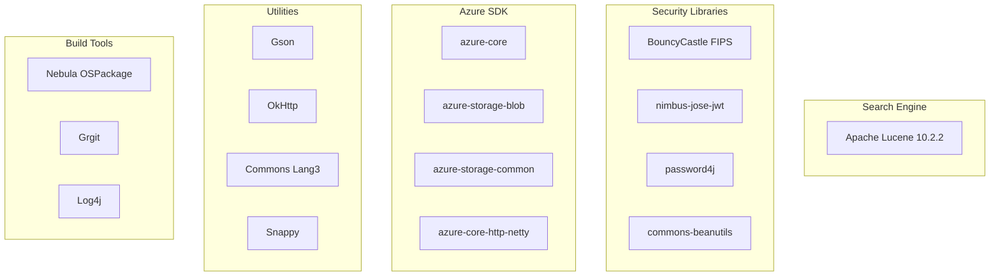

---
tags:
  - domain/core
  - component/server
  - search
  - security
---
# Dependency Bumps (OpenSearch Core)

## Summary

OpenSearch v3.2.0 includes 20 dependency updates for the core engine, covering critical components like Apache Lucene, Log4j, BouncyCastle cryptographic libraries, and various Azure SDK components. The most significant update is the Apache Lucene bump to version 10.2.2.

## Details

### What's New in v3.2.0

This release includes routine maintenance updates to keep third-party libraries current and address potential security vulnerabilities.

### Technical Changes

#### Key Dependency Updates

| Category | Dependency | Previous | New | PR |
|----------|------------|----------|-----|-----|
| Search Engine | Apache Lucene | 10.2.1 | 10.2.2 | [#18573](https://github.com/opensearch-project/OpenSearch/pull/18573) |
| Logging | log4j-core | 2.24.3 | 2.25.1 | [#18589](https://github.com/opensearch-project/OpenSearch/pull/18589) |
| Security | bctls-fips | 2.0.19 | 2.0.20 | [#18668](https://github.com/opensearch-project/OpenSearch/pull/18668) |
| Security | bcpkix-fips | 2.0.7 | 2.0.8 | [#18668](https://github.com/opensearch-project/OpenSearch/pull/18668) |
| Security | bcpg-fips | 2.0.10 | 2.0.11 | [#18668](https://github.com/opensearch-project/OpenSearch/pull/18668) |
| Security | password4j | 1.8.2 | 1.8.3 | [#18668](https://github.com/opensearch-project/OpenSearch/pull/18668) |
| HTTP Client | okhttp | 4.12.0 | 5.1.0 | [#18749](https://github.com/opensearch-project/OpenSearch/pull/18749) |
| Build | nebula.ospackage-base | 11.11.2 | 12.0.0 | [#18646](https://github.com/opensearch-project/OpenSearch/pull/18646) |
| Utilities | gson | 2.13.0 | 2.13.1 | [#18585](https://github.com/opensearch-project/OpenSearch/pull/18585) |
| Utilities | okio | 3.13.0 | 3.15.0 | [#18645](https://github.com/opensearch-project/OpenSearch/pull/18645) |
| Utilities | commons-lang3 | 3.17.0 | 3.18.0 | [#18745](https://github.com/opensearch-project/OpenSearch/pull/18745) |
| Utilities | jimfs | 1.3.0 | 1.3.1 | [#18743](https://github.com/opensearch-project/OpenSearch/pull/18743) |
| Utilities | failureaccess | 1.0.1 | 1.0.2 | [#18672](https://github.com/opensearch-project/OpenSearch/pull/18672) |
| Utilities | snappy-java | 1.1.10.7 | 1.1.10.8 | [#18803](https://github.com/opensearch-project/OpenSearch/pull/18803) |
| Security | nimbus-jose-jwt | 10.2 | 10.4 | [#18759](https://github.com/opensearch-project/OpenSearch/pull/18759) |
| Security | commons-beanutils | 1.9.4 | 1.11.0 | [#18401](https://github.com/opensearch-project/OpenSearch/pull/18401) |
| Azure | azure-core-http-netty | 1.15.11 | 1.15.12 | [#18586](https://github.com/opensearch-project/OpenSearch/pull/18586) |
| Azure | azure-storage-blob | 12.30.0 | 12.30.1 | [#18644](https://github.com/opensearch-project/OpenSearch/pull/18644) |
| Azure | azure-storage-common | 12.29.0 | 12.29.1 | [#18742](https://github.com/opensearch-project/OpenSearch/pull/18742) |
| Azure | azure-core | 1.55.3 | 1.55.5 | [#18691](https://github.com/opensearch-project/OpenSearch/pull/18691) |
| Build | grgit-core | 5.2.1 | 5.3.2 | [#18935](https://github.com/opensearch-project/OpenSearch/pull/18935) |
| Streaming | kafka-clients | 3.8.1 | 3.9.1 | [#18935](https://github.com/opensearch-project/OpenSearch/pull/18935) |
| CI | git-auto-commit-action | 5 | 6 | [#18524](https://github.com/opensearch-project/OpenSearch/pull/18524) |

#### Dependency Categories

### Migration Notes

These are routine dependency updates with no breaking changes expected. Users upgrading from v3.1.0 should experience seamless compatibility.

## Limitations

- Some dependency updates may introduce subtle behavioral changes in edge cases
- Third-party library updates are subject to their respective release notes

## References

### Documentation
- [Apache Lucene 10.2.2 Release Notes](https://lucene.apache.org/core/10_2_2/changes/Changes.html)
- [Log4j 2.25.0 Release Notes](https://logging.apache.org/log4j/2.x/release-notes.html)
- [BouncyCastle FIPS Releases](https://www.bouncycastle.org/fips-java/)
- [OkHttp 5.x Migration Guide](https://square.github.io/okhttp/upgrading_to_okhttp_5/)

### Pull Requests
| PR | Description |
|----|-------------|
| [#18573](https://github.com/opensearch-project/OpenSearch/pull/18573) | Bump Apache Lucene to 10.2.2 |
| [#18589](https://github.com/opensearch-project/OpenSearch/pull/18589) | Bump log4j-core from 2.24.3 to 2.25.1 |
| [#18668](https://github.com/opensearch-project/OpenSearch/pull/18668) | Bump BouncyCastle and password4j |
| [#18749](https://github.com/opensearch-project/OpenSearch/pull/18749) | Bump okhttp from 4.12.0 to 5.1.0 |
| [#18646](https://github.com/opensearch-project/OpenSearch/pull/18646) | Bump nebula.ospackage-base from 11.11.2 to 12.0.0 |
| [#18585](https://github.com/opensearch-project/OpenSearch/pull/18585) | Bump gson from 2.13.0 to 2.13.1 |
| [#18586](https://github.com/opensearch-project/OpenSearch/pull/18586) | Bump azure-core-http-netty from 1.15.11 to 1.15.12 |
| [#18645](https://github.com/opensearch-project/OpenSearch/pull/18645) | Bump okio from 3.13.0 to 3.15.0 |
| [#18644](https://github.com/opensearch-project/OpenSearch/pull/18644) | Bump azure-storage-blob from 12.30.0 to 12.30.1 |
| [#18672](https://github.com/opensearch-project/OpenSearch/pull/18672) | Bump failureaccess from 1.0.1 to 1.0.2 |
| [#18691](https://github.com/opensearch-project/OpenSearch/pull/18691) | Bump azure-core from 1.55.3 to 1.55.5 |
| [#18742](https://github.com/opensearch-project/OpenSearch/pull/18742) | Bump azure-storage-common from 12.29.0 to 12.29.1 |
| [#18743](https://github.com/opensearch-project/OpenSearch/pull/18743) | Bump jimfs from 1.3.0 to 1.3.1 |
| [#18745](https://github.com/opensearch-project/OpenSearch/pull/18745) | Bump commons-lang3 from 3.17.0 to 3.18.0 |
| [#18759](https://github.com/opensearch-project/OpenSearch/pull/18759) | Bump nimbus-jose-jwt from 10.2 to 10.4 |
| [#18401](https://github.com/opensearch-project/OpenSearch/pull/18401) | Bump commons-beanutils from 1.9.4 to 1.11.0 |
| [#18803](https://github.com/opensearch-project/OpenSearch/pull/18803) | Bump snappy-java from 1.1.10.7 to 1.1.10.8 |
| [#18935](https://github.com/opensearch-project/OpenSearch/pull/18935) | Bump grgit-core and kafka-clients |
| [#18524](https://github.com/opensearch-project/OpenSearch/pull/18524) | Bump git-auto-commit-action from 5 to 6 |

## Related Feature Report

- Full feature documentation
