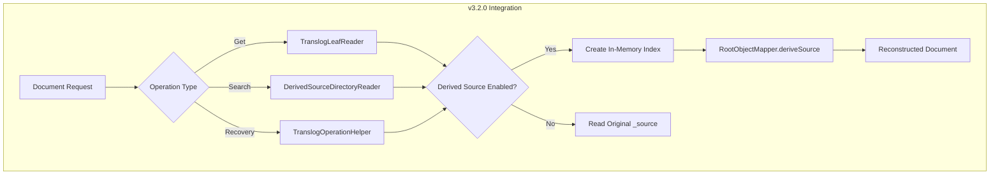

# Derived Source Integration

## Summary

OpenSearch v3.2.0 completes the integration of the derived source feature across all critical paths including get, search, and recovery operations. This release fixes flaky test issues from the reverted PR #18054 and adds comprehensive support for translog-based operations, ensuring derived source works reliably in production environments.

## Details

### What's New in v3.2.0

This release integrates derived source functionality across various operational paths:

1. **Get/Search Path Integration**: Documents can now be retrieved with dynamically reconstructed `_source` from doc_values and stored fields during search and get operations
2. **Recovery Path Support**: Derived source now works correctly during shard recovery, including both Lucene-based and translog-based recovery
3. **Translog Operation Support**: Added `TranslogOperationHelper` class to properly handle derived source comparison during translog operations
4. **Star-Tree Mapper Compatibility**: Overridden derived source validation for StarTreeMapper to skip star-tree fields (not part of ingested documents)

### Technical Changes

#### Architecture Changes



#### New Components

| Component | Description |
|-----------|-------------|
| `DerivedSourceDirectoryReader` | FilterDirectoryReader that wraps readers to support derived source |
| `DerivedSourceLeafReader` | LeafReader wrapper providing access to derived source |
| `DerivedSourceStoredFieldsReader` | StoredFieldsReader that injects `_source` field by deriving it dynamically |
| `TranslogOperationHelper` | Helper class for comparing translog operations with derived source support |

#### New Configuration

| Setting | Description | Default |
|---------|-------------|---------|
| `index.derived_source.translog.enabled` | Enable/disable derived source for translog reads (dynamic setting) | Same as `index.derived_source.enabled` |

### Usage Example

```json
PUT sample-index
{
  "settings": {
    "index": {
      "derived_source": {
        "enabled": true,
        "translog": {
          "enabled": false
        }
      }
    }
  },
  "mappings": {
    "properties": {
      "name": { "type": "keyword" },
      "value": { "type": "integer" },
      "timestamp": { "type": "date" }
    }
  }
}
```

To avoid performance impact on translog-based recovery, you can disable derived source for translog while keeping it enabled for the main index:

```json
PUT sample-index/_settings
{
  "index.derived_source.translog.enabled": false
}
```

### Migration Notes

- The `index.derived_source.translog.enabled` setting can be dynamically updated after index creation
- When `translog.enabled` is `false`, real-time get operations return the original `_source` format until documents are flushed to segments
- After flush, documents will always return derived source format regardless of translog setting

## Limitations

- **Translog-based recovery performance**: Operation-based recovery can be slower when derived source is enabled for translog, as documents must be re-indexed in memory to reconstruct the source
- **Source format differences**: When `translog.enabled` is `false`, the `_source` format may differ between translog reads (original format) and segment reads (derived format)

## Related PRs

| PR | Description |
|----|-------------|
| [#18565](https://github.com/opensearch-project/OpenSearch/pull/18565) | Add integration of derived source feature across various paths like get/search/recovery |

## References

- [Issue #17073](https://github.com/opensearch-project/OpenSearch/issues/17073): Add support for deriving source field in FieldMapper
- [Issue #9568](https://github.com/opensearch-project/OpenSearch/issues/9568): Optimizing Data Storage and Retrieval for Time Series data
- [Documentation: Derived source](https://docs.opensearch.org/3.2/field-types/metadata-fields/source/#derived-source)
- [Blog: Save up to 2x on storage with derived source](https://opensearch.org/blog/save-up-to-2x-on-storage-with-derived-source/)

## Related Feature Report

- [Full feature documentation](../../../../features/opensearch/derived-source.md)
