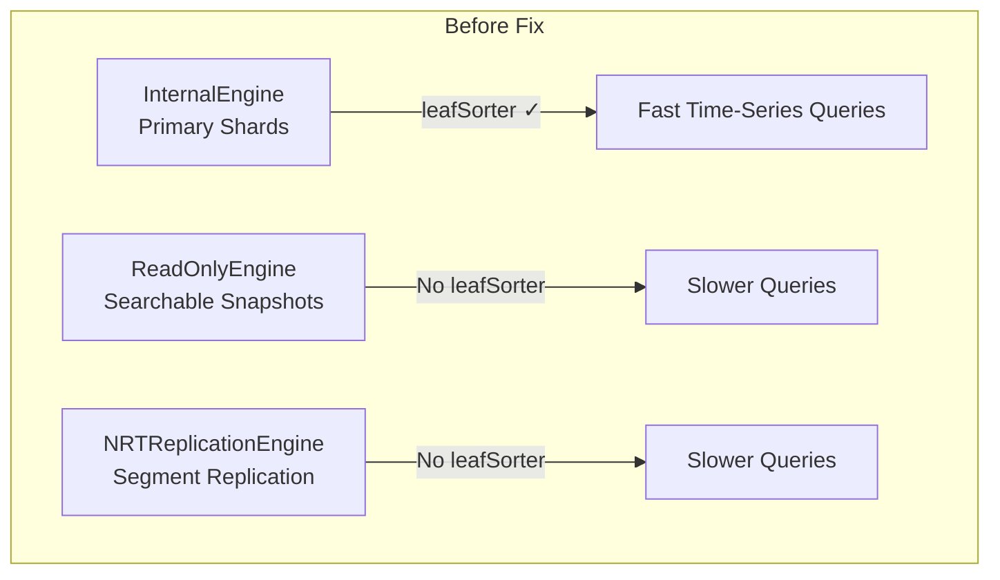
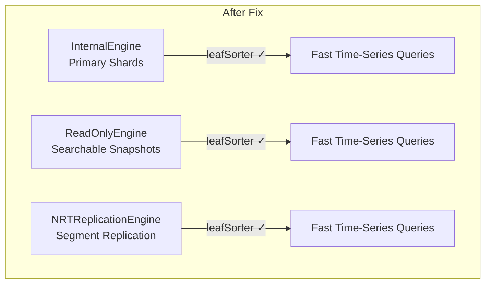

---
tags:
  - domain/core
  - component/server
  - indexing
  - performance
  - search
---
# Engine Optimization Fixes

## Summary

This bugfix ensures that timestamp sort optimizations (leafSorter) work consistently across all OpenSearch engine types. Previously, the optimization only worked on primary shards using `InternalEngine`, while `ReadOnlyEngine` (searchable snapshots) and `NRTReplicationEngine` (segment replication replicas) did not benefit from this performance enhancement. This fix applies the leafSorter optimization to all engine types, providing consistent time-series query performance across the cluster.

## Details

### What's New in v3.2.0

The fix ensures that `DirectoryReader.open()` calls in `ReadOnlyEngine` and `NRTReplicationEngine` include the `leafSorter` parameter, which was previously only applied in `InternalEngine`.

### Technical Changes

#### Problem Background

OpenSearch applies a sort to the `IndexWriterConfig` so that any `IndexReader` opened from the `IndexWriter` has its segments sorted by descending max timestamp. This optimization enables faster time-series queries by allowing early termination when searching sorted data.

However, this optimization was only implemented in `InternalEngine`, which has an `IndexWriter`. Other engine types (`ReadOnlyEngine` and `NRTReplicationEngine`) don't have an `IndexWriter` since they don't write Lucene indexes directly.





#### Code Changes

| File | Change |
|------|--------|
| `ReadOnlyEngine.java` | Added new `openDirectory()` overload that accepts `leafSorter` parameter |
| `NoOpEngine.java` | Updated to use new `openDirectory()` with `leafSorter` |
| `NRTReplicationEngine.java` | Pass `leafSorter` to `DirectoryReader.open()` |
| `NRTReplicationReaderManager.java` | Accept `EngineConfig` and use `leafSorter` in `refreshIfNeeded()` |

#### Key Implementation Details

1. **ReadOnlyEngine**: New overloaded method passes `leafSorter` to `DirectoryReader.open()`:
```java
protected static DirectoryReader openDirectory(
    Directory directory, 
    boolean wrapSoftDeletes, 
    Comparator<LeafReader> leafSorter
) throws IOException {
    final DirectoryReader reader = DirectoryReader.open(directory, leafSorter);
    if (wrapSoftDeletes) {
        return new SoftDeletesDirectoryReaderWrapper(reader, Lucene.SOFT_DELETES_FIELD);
    }
    return reader;
}
```

2. **NRTReplicationEngine**: Updated `getDirectoryReader()` to include leafSorter:
```java
private DirectoryReader getDirectoryReader() throws IOException {
    return new SoftDeletesDirectoryReaderWrapper(
        DirectoryReader.open(store.directory(), engineConfig.getLeafSorter()),
        Lucene.SOFT_DELETES_FIELD
    );
}
```

3. **NRTReplicationReaderManager**: Now accepts `EngineConfig` and uses `leafSorter` when refreshing:
```java
DirectoryReader innerReader = StandardDirectoryReader.open(
    referenceToRefresh.directory(),
    currentInfos,
    subs,
    engineConfig.getLeafSorter()
);
```

### Performance Impact

| Scenario | Before | After |
|----------|--------|-------|
| Primary shard time-series query | Optimized | Optimized |
| Searchable snapshot time-series query | Not optimized | Optimized |
| Segment replication replica time-series query | Not optimized | Optimized |

### Usage Example

No configuration changes required. The fix is automatically applied when using:

- **Searchable Snapshots**: Queries on searchable snapshot indexes now benefit from timestamp sort optimization
- **Segment Replication**: Replica shards using segment replication now have consistent query performance with primary shards

```json
// Time-series query that benefits from this fix
GET logs-*/_search
{
  "size": 10,
  "sort": [
    { "@timestamp": { "order": "desc" } }
  ],
  "query": {
    "range": {
      "@timestamp": {
        "gte": "now-1h"
      }
    }
  }
}
```

## Limitations

- The optimization applies to timestamp-based sorting only
- Requires indexes to have the `@timestamp` field or equivalent time field configured for sorting

## References

### Documentation
- [Segment Replication Documentation](https://docs.opensearch.org/3.0/tuning-your-cluster/availability-and-recovery/segment-replication/index/)
- [Searchable Snapshots Documentation](https://docs.opensearch.org/3.0/tuning-your-cluster/availability-and-recovery/snapshots/searchable_snapshot/)
- [PR #7967](https://github.com/opensearch-project/OpenSearch/pull/7967): Original timestamp sort optimization implementation

### Pull Requests
| PR | Description |
|----|-------------|
| [#18639](https://github.com/opensearch-project/OpenSearch/pull/18639) | Fix leafSorter optimization for ReadOnlyEngine and NRTReplicationEngine |

### Issues (Design / RFC)
- [Issue #17579](https://github.com/opensearch-project/OpenSearch/issues/17579): Bug report - Timestamp sort optimizations don't work on searchable snapshot or segrep replicas

## Related Feature Report

- [Full feature documentation](../../../../features/opensearch/engine-optimization-fixes.md)
