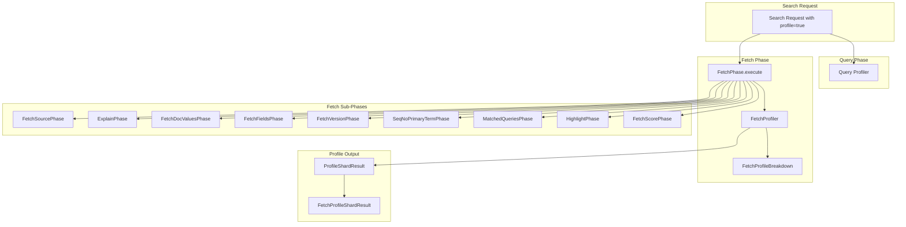

---
tags:
  - indexing
  - performance
  - search
---

# Fetch Phase Profiling

## Summary

OpenSearch v3.2.0 adds comprehensive fetch phase profiling to the Profile API. Previously, the Profile API only covered query and aggregation phases, making it difficult to diagnose performance issues in the fetch phase. This enhancement adds detailed timing breakdowns for fetch operations including stored field loading, source loading, and all fetch sub-phases.

## Details

### What's New in v3.2.0

The Profile API now includes a `fetch` array in the profile response that provides timing information for:

- Root fetch phase operations (stored fields visitor creation, sub-phase processor building, segment switching, stored field loading, source loading)
- Individual fetch sub-phase timings (FetchSourcePhase, ExplainPhase, FetchDocValuesPhase, etc.)

### Technical Changes

#### Architecture Changes



#### New Components

| Component | Description |
|-----------|-------------|
| `FetchProfiler` | Main profiler class for fetch phase operations |
| `FetchProfileBreakdown` | Tracks timing for individual fetch operations |
| `FetchProfileShardResult` | Holds fetch profile results for a shard |
| `FetchTimingType` | Enum defining timing points for fetch profiling |
| `FlatFetchProfileTree` | Simplified profiling tree for fetch phase |

#### Timing Types

| Timing Type | Description |
|-------------|-------------|
| `create_stored_fields_visitor` | Time creating the stored fields visitor |
| `build_sub_phase_processors` | Time building fetch sub-phase processors |
| `get_next_reader` | Time getting the leaf reader context for a segment |
| `set_next_reader` | Time setting next reader for each sub-phase processor |
| `load_stored_fields` | Time loading stored fields for a hit |
| `load_source` | Time loading the document `_source` |
| `process` | Time executing a fetch sub-phase |

#### Profiled Fetch Sub-Phases

| Sub-Phase | Description |
|-----------|-------------|
| `FetchSourcePhase` | Loads document `_source` |
| `ExplainPhase` | Generates query explanations |
| `FetchDocValuesPhase` | Loads doc values fields |
| `FetchFieldsPhase` | Loads stored fields |
| `FetchVersionPhase` | Retrieves document versions |
| `SeqNoPrimaryTermPhase` | Retrieves sequence numbers and primary terms |
| `MatchedQueriesPhase` | Identifies matched named queries |
| `HighlightPhase` | Generates search highlights |
| `FetchScorePhase` | Retrieves document scores when sorting |

### Usage Example

```json
GET /myindex/_search
{
  "profile": true,
  "explain": true,
  "version": true,
  "query": {
    "match": { "title": "opensearch" }
  },
  "highlight": {
    "fields": { "title": {} }
  }
}
```

Response includes fetch phase profiling:

```json
{
  "profile": {
    "shards": [{
      "searches": [...],
      "aggregations": [...],
      "fetch": [{
        "type": "fetch",
        "description": "fetch",
        "time_in_nanos": 1234567,
        "breakdown": {
          "create_stored_fields_visitor": 1000,
          "create_stored_fields_visitor_count": 1,
          "build_sub_phase_processors": 5000,
          "build_sub_phase_processors_count": 1,
          "get_next_reader": 2000,
          "get_next_reader_count": 1,
          "load_stored_fields": 50000,
          "load_stored_fields_count": 10,
          "load_source": 30000,
          "load_source_count": 10
        },
        "children": [
          {
            "type": "FetchSourcePhase",
            "description": "FetchSourcePhase",
            "time_in_nanos": 25000,
            "breakdown": {
              "process": 20000,
              "process_count": 10,
              "set_next_reader": 5000,
              "set_next_reader_count": 1
            }
          },
          {
            "type": "ExplainPhase",
            "description": "ExplainPhase",
            "time_in_nanos": 15000,
            "breakdown": {
              "process": 12000,
              "process_count": 10,
              "set_next_reader": 3000,
              "set_next_reader_count": 1
            }
          },
          {
            "type": "HighlightPhase",
            "description": "HighlightPhase",
            "time_in_nanos": 35000,
            "breakdown": {
              "process": 30000,
              "process_count": 10,
              "set_next_reader": 5000,
              "set_next_reader_count": 1
            }
          }
        ]
      }]
    }]
  }
}
```

### Migration Notes

- Fetch phase profiling is automatically included when `profile: true` is set
- No configuration changes required
- Profile response size increases due to additional fetch timing data
- Inner hits and top_hits aggregations are not profiled to avoid complexity

## Limitations

- Inner hits fetch operations are not profiled (excluded to simplify output)
- Top hits aggregation fetch operations use a separate description (`fetch_top_hits_aggregation`)
- Profiling adds overhead to fetch operations
- Only the standard fetch phase is profiled; nested fetch contexts are excluded

## References

### Documentation
- [Profile API Documentation](https://docs.opensearch.org/3.0/api-reference/search-apis/profile/): Official API reference

### Pull Requests
| PR | Description |
|----|-------------|
| [#18664](https://github.com/opensearch-project/OpenSearch/pull/18664) | Add fetch phase profiling |

### Issues (Design / RFC)
- [Issue #1764](https://github.com/opensearch-project/OpenSearch/issues/1764): Original feature request (December 2021)

## Related Feature Report

- [Full feature documentation](../../../features/opensearch/opensearch-profiler.md)
