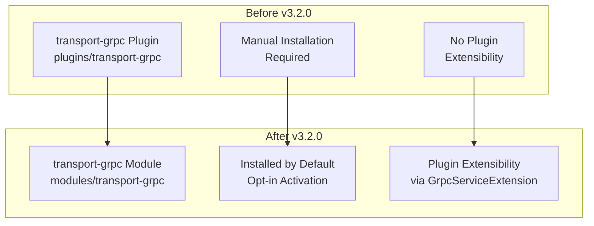
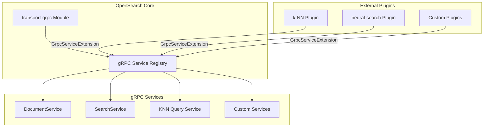

---
tags:
  - k-nn
  - search
---

# GRPC Transport

## Summary

OpenSearch v3.2.0 marks the General Availability (GA) of gRPC Transport, transitioning it from an experimental feature to a production-ready module. Key changes include moving transport-grpc from a plugin to a core module, enabling plugin extensibility, upgrading to protobufs 0.6.0, implementing proper gRPC status codes, and removing the experimental designation from settings.

## Details

### What's New in v3.2.0

This release represents a major milestone for gRPC Transport with the following key changes:

1. **GA Status**: gRPC Transport is now generally available and production-ready
2. **Module Migration**: Moved from `/plugins` to `/modules` directory, making it installed by default
3. **Plugin Extensibility**: External plugins (k-NN, neural-search) can now register custom gRPC services
4. **Proper Error Handling**: gRPC status codes now properly map to OpenSearch exceptions
5. **Package Reorganization**: Renamed from `org.opensearch.plugin.transport.grpc` to `org.opensearch.transport.grpc`

### Technical Changes

#### Architecture Changes



#### Plugin Extensibility Architecture



#### New Components

| Component | Description |
|-----------|-------------|
| `GrpcServiceExtension` | Interface for plugins to register custom gRPC services |
| `ExceptionsHelper.ErrorMessages` | Shared error message constants for HTTP/gRPC parity |
| `GrpcStatusMapper` | Maps OpenSearch exceptions to proper gRPC status codes |

#### Configuration Changes

| Setting | Change | Notes |
|---------|--------|-------|
| `grpc.port` | No longer experimental | Default: `9400` |
| `grpc.publish_port` | No longer experimental | Same as `grpc.port` |
| `grpc.bind_host` | No longer experimental | Network host setting |
| `grpc.publish_host` | No longer experimental | Network host setting |

#### Error Handling Improvements

| Exception Type | Before (v3.1.0) | After (v3.2.0) |
|----------------|-----------------|----------------|
| `OpenSearchRejectedExecutionException` | `INTERNAL (13)` | `RESOURCE_EXHAUSTED (8)` |
| `CircuitBreakingException` | `INTERNAL (13)` | `RESOURCE_EXHAUSTED (8)` |
| `IllegalArgumentException` | `INTERNAL (13)` | `INVALID_ARGUMENT (3)` |
| `IndexNotFoundException` | `INTERNAL (13)` | `NOT_FOUND (5)` |

### Usage Example

**No Installation Required (Module):**

```yaml
# opensearch.yml - Enable gRPC transport
grpc.port: 9400
```

**Plugin Extension Example:**

```java
public class MyPlugin extends Plugin implements GrpcServiceExtension {
    
    @Override
    public Collection<BindableService> getGrpcServices(
            Client client, 
            ClusterService clusterService) {
        return List.of(new MyCustomGrpcService(client));
    }
}
```

**gRPC Client with Proper Error Handling:**

```java
try {
    SearchResponse response = searchStub.search(request);
} catch (StatusRuntimeException e) {
    switch (e.getStatus().getCode()) {
        case INVALID_ARGUMENT:
            // Handle invalid query
            break;
        case RESOURCE_EXHAUSTED:
            // Handle rate limiting
            break;
        case NOT_FOUND:
            // Handle missing index
            break;
    }
}
```

### Migration Notes

1. **No Manual Installation**: The transport-grpc plugin no longer needs to be installed manually; it's included as a module
2. **Opt-in Activation**: gRPC is still opt-in; configure `grpc.port` to enable
3. **Package Import Changes**: Update imports from `org.opensearch.plugin.transport.grpc` to `org.opensearch.transport.grpc`
4. **Error Handling**: Update client code to handle proper gRPC status codes instead of generic `INTERNAL`

## Limitations

- gRPC Transport remains an opt-in feature requiring explicit configuration
- Limited query types supported (match_all, term, terms, match_none)
- Aggregation support not yet available via gRPC
- Only Bulk and Search endpoints implemented

## References

### Documentation
- [gRPC APIs Documentation](https://docs.opensearch.org/3.0/api-reference/grpc-apis/index/): Official documentation

### Pull Requests
| PR | Description |
|----|-------------|
| [#18516](https://github.com/opensearch-project/OpenSearch/pull/18516) | Make GRPC transport extensible to allow plugins to register custom services |
| [#18897](https://github.com/opensearch-project/OpenSearch/pull/18897) | Move transport-grpc from a core plugin to a module |
| [#18915](https://github.com/opensearch-project/OpenSearch/pull/18915) | Remove `experimental` designation from transport-grpc settings |
| [#18923](https://github.com/opensearch-project/OpenSearch/pull/18923) | Rename package org.opensearch.plugin.transport.grpc to org.opensearch.transport.grpc |
| [#18925](https://github.com/opensearch-project/OpenSearch/pull/18925) | Map to proper GRPC status codes and achieve exception handling parity with HTTP |
| [#18880](https://github.com/opensearch-project/OpenSearch/pull/18880) | Upgrade to protobufs 0.6.0 and clean up deprecated TermQueryProtoUtils code |

### Issues (Design / RFC)
- [Issue #18893](https://github.com/opensearch-project/OpenSearch/issues/18893): Move transport-grpc from plugin to module
- [Issue #18513](https://github.com/opensearch-project/OpenSearch/issues/18513): GRPC Plugin Extensibility for Query Conversion
- [Issue #16787](https://github.com/opensearch-project/OpenSearch/issues/16787): gRPC Transport tracking issue

## Related Feature Report

- [Full feature documentation](../../../features/opensearch/opensearch-grpc-transport--services.md)
