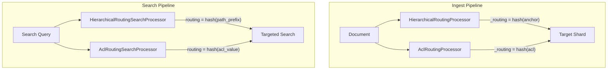

# Hierarchical & ACL-aware Routing

## Summary

OpenSearch 3.2.0 introduces two new routing processor pairs for ingest and search pipelines that enable intelligent document co-location based on hierarchical paths and ACL (Access Control List) metadata. These processors improve query performance in multi-tenant environments and hierarchical data structures by ensuring related documents are routed to the same shards.

## Details

### What's New in v3.2.0

This release adds four new processors:

1. **HierarchicalRoutingProcessor** (ingest) - Routes documents based on hierarchical path structures
2. **HierarchicalRoutingSearchProcessor** (search) - Automatically adds routing to search requests based on path queries
3. **AclRoutingProcessor** (ingest) - Routes documents based on ACL/tenant metadata
4. **AclRoutingSearchProcessor** (search) - Extracts ACL values from queries to set search routing

### Technical Changes

#### Architecture



#### New Components

| Component | Module | Description |
|-----------|--------|-------------|
| `HierarchicalRoutingProcessor` | ingest-common | Extracts path, normalizes, computes routing via MurmurHash3 |
| `HierarchicalRoutingSearchProcessor` | search-pipeline-common | Extracts path from queries, sets search routing |
| `AclRoutingProcessor` | ingest-common | Hashes ACL field value for routing |
| `AclRoutingSearchProcessor` | search-pipeline-common | Extracts ACL from term/terms queries |

#### New Configuration

**Hierarchical Routing Processor (Ingest)**

| Setting | Description | Default |
|---------|-------------|---------|
| `path_field` | Field containing hierarchical path | Required |
| `anchor_depth` | Number of path segments for routing | `2` |
| `path_separator` | Path delimiter character | `/` |
| `ignore_missing` | Skip if field missing | `false` |
| `override_existing` | Overwrite existing routing | `true` |

**ACL Routing Processor (Ingest)**

| Setting | Description | Default |
|---------|-------------|---------|
| `acl_field` | Field containing ACL/tenant value | Required |
| `target_field` | Field to store routing value | `_routing` |
| `ignore_missing` | Skip if field missing | `false` |
| `override_existing` | Overwrite existing routing | `true` |

**Hierarchical Routing Search Processor**

| Setting | Description | Default |
|---------|-------------|---------|
| `path_field` | Field to extract from queries | Required |
| `anchor_depth` | Path segments for routing | `2` |
| `path_separator` | Path delimiter | `/` |
| `enable_auto_detection` | Auto-detect path in queries | `true` |

**ACL Routing Search Processor**

| Setting | Description | Default |
|---------|-------------|---------|
| `acl_field` | ACL field to extract from queries | Required |
| `extract_from_query` | Extract ACL from query | `true` |

### Usage Example

**Ingest Pipeline with Hierarchical Routing:**

```json
PUT _ingest/pipeline/hierarchical-routing
{
  "processors": [
    {
      "hierarchical_routing": {
        "path_field": "file_path",
        "anchor_depth": 2,
        "path_separator": "/"
      }
    }
  ]
}
```

**Search Pipeline with ACL Routing:**

```json
PUT _search/pipeline/acl-routing-search
{
  "request_processors": [
    {
      "acl_routing_search": {
        "acl_field": "team",
        "extract_from_query": true
      }
    }
  ]
}
```

**Indexing Documents:**

```json
POST test-index/_doc?pipeline=hierarchical-routing
{
  "file_path": "/company/engineering/backend/api.pdf",
  "content": "API documentation"
}
```

Documents with paths `/company/engineering/backend/api.pdf` and `/company/engineering/frontend/ui.pdf` will be routed to the same shard because they share the anchor `/company/engineering`.

### Routing Algorithm

Both processor types use MurmurHash3 for consistent routing:

1. **Hierarchical**: Normalize path → Extract anchor (first N segments) → Hash anchor → Set `_routing`
2. **ACL**: Extract ACL value → Hash value with Base64 encoding → Set `_routing`

The search processors use identical hashing to ensure queries are routed to the correct shards.

### Migration Notes

- These processors are opt-in and require explicit pipeline configuration
- No changes to existing routing behavior unless processors are enabled
- For existing indices, re-indexing is required to apply new routing

## Limitations

- Hierarchical routing requires consistent path formats across documents
- ACL routing assumes single ACL value per document (first value used for multi-value fields)
- Search processors only extract routing from `term`, `terms`, `prefix`, and `wildcard` queries on the configured field
- `should` and `must_not` clauses in bool queries are ignored for routing extraction

## References

### Documentation
- [Routing Documentation](https://docs.opensearch.org/3.2/field-types/metadata-fields/routing/): OpenSearch routing field documentation
- [Search Shard Routing](https://docs.opensearch.org/3.2/search-plugins/searching-data/search-shard-routing/): Search routing documentation

### Pull Requests
| PR | Description |
|----|-------------|
| [#18826](https://github.com/opensearch-project/OpenSearch/pull/18826) | Add hierarchical routing processors for ingest and search pipelines |
| [#18834](https://github.com/opensearch-project/OpenSearch/pull/18834) | Add ACL-aware routing processors for multi-tenant document routing |

### Issues (Design / RFC)
- [Issue #18829](https://github.com/opensearch-project/OpenSearch/issues/18829): RFC: ACL-Aware Routing Strategy for Shard Assignment

## Related Feature Report

- [Full feature documentation](../../../features/opensearch/hierarchical-acl-aware-routing.md)
