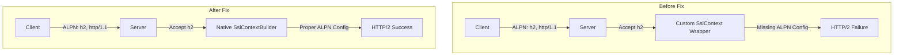

# HTTP/2 & Reactor-Netty Fix

## Summary

This bugfix resolves an issue where HTTP/2 communication failed when using the `reactor-netty4-secure` HTTP transport. Clients attempting to communicate via HTTP/2 received errors indicating the server did not properly support the protocol, while HTTP/1.1 connections worked correctly.

## Details

### What's New in v3.2.0

The fix addresses the root cause of HTTP/2 communication failures in the Reactor Netty transport by properly configuring SSL/TLS context with ALPN (Application-Layer Protocol Negotiation) support.

### Technical Changes

#### Problem Analysis

When `http.type: reactor-netty4-secure` was configured, the server would:
1. Accept HTTP/2 during ALPN negotiation
2. Fail to send proper HTTP/2 SETTINGS frame
3. Cause clients to receive: "Remote peer returned unexpected data while we expected SETTINGS frame"

The issue was in how the SSL context was being constructed - it used a custom `SslContext` wrapper that didn't properly support HTTP/2 protocol negotiation.

#### Architecture Changes



#### Code Changes

The fix replaces the custom `SslContext` wrapper with Netty's native `SslContextBuilder`:

| Component | Change |
|-----------|--------|
| `ReactorNetty4HttpServerTransport` | Use `SslContextBuilder.forServer()` instead of custom wrapper |
| `SecureHttpTransportSettingsProvider` | New `parameters()` method for SSL configuration |
| `SslUtils` | Made `DEFAULT_SSL_PROTOCOLS` public |

#### New Configuration Interface

The fix introduces `SecureHttpTransportParameters` interface:

| Method | Description |
|--------|-------------|
| `keyManagerFactory()` | Returns KeyManagerFactory for server certificates |
| `trustManagerFactory()` | Returns TrustManagerFactory for client verification |
| `protocols()` | Returns supported TLS protocols |
| `cipherSuites()` | Returns allowed cipher suites |
| `sslProvider()` | Returns SSL provider (JDK or OpenSSL) |
| `clientAuth()` | Returns client authentication mode |

#### ALPN Configuration

The fix properly configures ALPN for HTTP/2:

```java
new ApplicationProtocolConfig(
    ApplicationProtocolConfig.Protocol.ALPN,
    ApplicationProtocolConfig.SelectorFailureBehavior.NO_ADVERTISE,
    ApplicationProtocolConfig.SelectedListenerFailureBehavior.ACCEPT,
    ApplicationProtocolNames.HTTP_2,
    ApplicationProtocolNames.HTTP_1_1
)
```

### Additional Fix: URI Length Validation

The PR also adds URI length validation for HTTP/2 requests, as Reactor Netty doesn't respect `maxInitialLineLength` for HTTP/2:

```java
if (request.uri().length() > maxInitialLineLength.bytesAsInt()) {
    return response.status(HttpResponseStatus.REQUEST_URI_TOO_LONG).send();
}
```

### Usage Example

```yaml
# opensearch.yml
http.type: reactor-netty4-secure
```

```bash
# HTTP/2 now works correctly
curl -XGET https://localhost:9200/_cat/nodes -u admin:admin --insecure -v

# Output shows successful HTTP/2 communication:
# * ALPN: server accepted h2
# * using HTTP/2
# [successful response]
```

### Migration Notes

No migration required. The fix is backward compatible and automatically applies when using `reactor-netty4-secure` transport.

## Limitations

- The `transport-reactor-netty4` plugin remains experimental
- Requires proper SSL/TLS certificate configuration via security plugin

## References

### Documentation
- [Network Settings Documentation](https://docs.opensearch.org/3.0/install-and-configure/configuring-opensearch/network-settings/): Transport configuration

### Pull Requests
| PR | Description |
|----|-------------|
| [#18599](https://github.com/opensearch-project/OpenSearch/pull/18599) | Fix HTTP/2 communication when reactor-netty is enabled |

### Issues (Design / RFC)
- [Issue #18559](https://github.com/opensearch-project/OpenSearch/issues/18559): Bug report for HTTP/2 failure

## Related Feature Report

- [Streaming Indexing](../../../features/opensearch/streaming-indexing.md)
