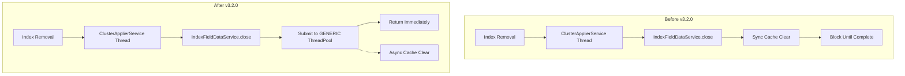

---
tags:
  - indexing
  - performance
---

# IndexFieldDataService Async Close

## Summary

This bugfix changes the `IndexFieldDataService.close()` method to clear the field data cache asynchronously instead of synchronously. Previously, when an index was removed, the field data cache cleanup blocked the cluster applier thread, potentially causing data nodes to be removed from the cluster due to lagging when the cache contained many entries.

## Details

### What's New in v3.2.0

The `IndexFieldDataService` now accepts a `ThreadPool` parameter and uses the `GENERIC` thread pool executor to clear the field data cache asynchronously during index removal.

### Technical Changes

#### Problem

When an index is removed, the associated field data cache entries are cleared by iterating over ALL cache keys, regardless of whether they belong to the target index. This operation was performed synchronously on the cluster applier thread (`clusterApplierService#updateTask`).

With large field data caches, this synchronous cleanup could take significant time, preventing the data node from acknowledging cluster state updates. This caused nodes to be removed from the cluster due to "lagging."

CPU profile showing the issue:
```
100.4% (501.8ms out of 500ms) cpu usage by thread 'opensearch[...][clusterApplierService#updateTask][T#1]'
  org.opensearch.indices.fielddata.cache.IndicesFieldDataCache$IndexFieldCache.clear()
  org.opensearch.index.fielddata.IndexFieldDataService.clear()
  org.opensearch.index.fielddata.IndexFieldDataService.close()
  ...
  org.opensearch.indices.IndicesService.removeIndex()
  org.opensearch.indices.cluster.IndicesClusterStateService.removeIndices()
  org.opensearch.cluster.service.ClusterApplierService.applyChanges()
```

#### Solution

The fix modifies `IndexFieldDataService.close()` to execute cache clearing on a separate thread:

```java
@Override
public void close() throws IOException {
    // Clear the field data cache for this index in an async manner
    threadPool.executor(ThreadPool.Names.GENERIC).execute(() -> {
        try {
            this.clear();
        } catch (Exception ex) {
            logger.warn(
                "Exception occurred while clearing index field data cache for index: {}, exception: {}",
                indexSettings.getIndex().getName(),
                ex
            );
        }
    });
}
```

#### Architecture Changes



#### Modified Components

| Component | Change |
|-----------|--------|
| `IndexFieldDataService` | Added `ThreadPool` parameter, async close implementation |
| `IndexService` | Pass `ThreadPool` to `IndexFieldDataService` constructor |

#### Constructor Change

```java
// Before
public IndexFieldDataService(
    IndexSettings indexSettings,
    IndicesFieldDataCache indicesFieldDataCache,
    CircuitBreakerService circuitBreakerService,
    MapperService mapperService
)

// After
public IndexFieldDataService(
    IndexSettings indexSettings,
    IndicesFieldDataCache indicesFieldDataCache,
    CircuitBreakerService circuitBreakerService,
    MapperService mapperService,
    ThreadPool threadPool  // New parameter
)
```

### Usage Example

No user-facing configuration changes are required. The fix is applied automatically when indexes are removed.

### Migration Notes

This is a transparent bugfix. No migration steps are required.

## Limitations

- This fix addresses only the synchronous blocking issue during index removal
- The underlying inefficiency of iterating over all cache keys remains (planned for future optimization in Issue #13862)
- Cache clearing errors are logged but do not fail the index removal operation

## References

### Documentation
- [CAT Field Data API](https://docs.opensearch.org/3.0/api-reference/cat/cat-field-data/): API to view field data cache memory usage

### Pull Requests
| PR | Description |
|----|-------------|
| [#18888](https://github.com/opensearch-project/OpenSearch/pull/18888) | Close IndexFieldDataService asynchronously |

### Issues (Design / RFC)
- [Issue #13862](https://github.com/opensearch-project/OpenSearch/issues/13862): Optimize FieldDataCache removal flow (parent enhancement issue)

## Related Feature Report

- [Full feature documentation](../../../../features/opensearch/field-data-cache.md)
