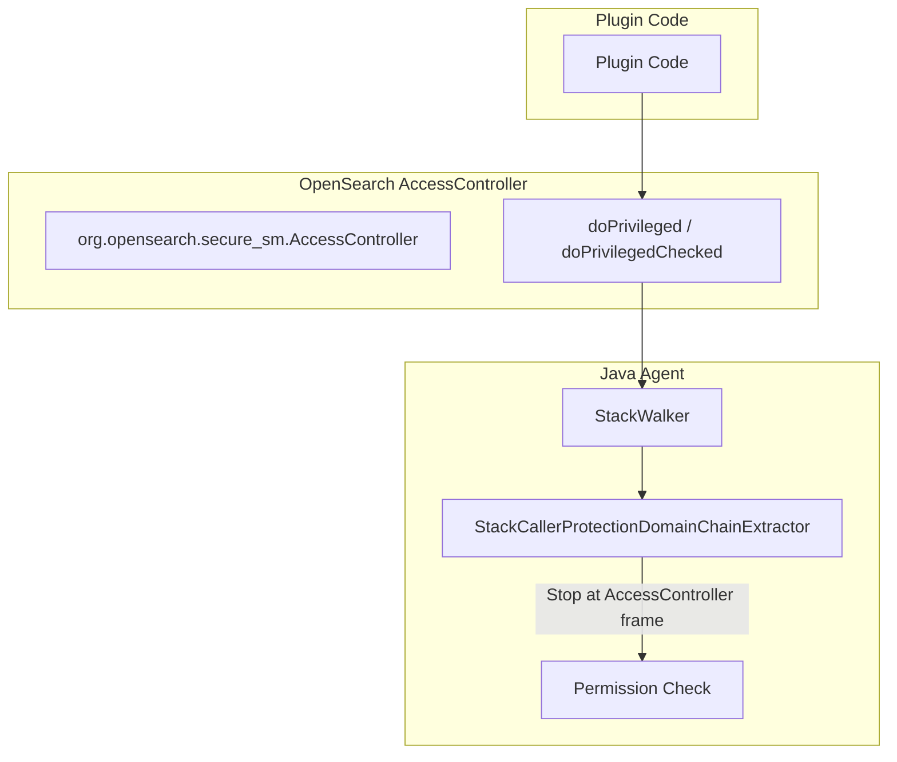

---
tags:
  - domain/core
  - component/server
  - ml
  - security
---
# Java Agent AccessController

## Summary

OpenSearch v3.2.0 introduces `org.opensearch.secure_sm.AccessController`, a replacement for Java's deprecated `java.security.AccessController`. This new utility class provides methods to execute code in a privileged context, enabling the Java agent to properly truncate stack walking when checking permissions. This change prepares OpenSearch for JDK 24+, where the original `AccessController` will be removed.

## Details

### What's New in v3.2.0

The JDK's `java.security.AccessController` is [marked for removal](https://github.com/openjdk/jdk24u/blob/master/src/java.base/share/classes/java/security/AccessController.java#L39) starting with JDK 24. OpenSearch 3.0 replaced the Java Security Manager (JSM) with a custom Java agent, but the agent still relied on `AccessController.doPrivileged` as a marker to know when to stop walking the call stack during permission checks.

This release introduces OpenSearch's own `AccessController` class that:
- Provides equivalent `doPrivileged` and `doPrivilegedChecked` methods
- Acts as a stack frame marker for the Java agent's permission checking
- Allows plugins to migrate away from the deprecated JDK class

### Technical Changes

#### Architecture Changes



#### New Components

| Component | Description |
|-----------|-------------|
| `org.opensearch.secure_sm.AccessController` | Replacement for JDK's `AccessController` with `doPrivileged` methods |
| `AccessController.CheckedRunnable<E>` | Functional interface for actions that throw checked exceptions |
| `AccessController.CheckedSupplier<R, E>` | Functional interface for suppliers that throw checked exceptions |

#### API Methods

| Method | Description |
|--------|-------------|
| `doPrivileged(Runnable)` | Execute action in privileged context (void return) |
| `doPrivileged(Supplier<T>)` | Execute action in privileged context (with return value) |
| `doPrivilegedChecked(CheckedRunnable<T>)` | Execute action that may throw checked exception (void return) |
| `doPrivilegedChecked(CheckedSupplier<R, T>)` | Execute action that may throw checked exception (with return value) |

### Usage Example

```java
import org.opensearch.secure_sm.AccessController;

// Simple privileged action (void)
AccessController.doPrivileged(() -> {
    // code that requires privileges
    performPrivilegedOperation();
});

// Privileged action with return value
String result = AccessController.doPrivileged(() -> {
    return readPrivilegedData();
});

// Privileged action with checked exception
AccessController.doPrivilegedChecked(() -> {
    // code that may throw IOException
    Files.readAllBytes(path);
});

// Privileged action with return value and checked exception
byte[] data = AccessController.doPrivilegedChecked(() -> {
    return Files.readAllBytes(path);
});
```

### Migration Notes

Plugin developers should migrate from the JDK's `AccessController` to OpenSearch's replacement:

**Before (deprecated):**
```java
import java.security.AccessController;
import java.security.PrivilegedAction;

AccessController.doPrivileged((PrivilegedAction<Void>) () -> {
    // privileged code
    return null;
});
```

**After:**
```java
import org.opensearch.secure_sm.AccessController;

AccessController.doPrivileged(() -> {
    // privileged code
});
```

Key differences:
- No need for `PrivilegedAction` or `PrivilegedExceptionAction` wrappers
- Simpler lambda syntax with `Runnable`, `Supplier`, or custom functional interfaces
- Located in `libs/agent-sm/agent-policy` module

## Limitations

- Does not provide replacements for `AccessControlContext` or other JSM-related classes
- Complex use cases like `TikaImpl` that use `AccessControlContext` need alternative approaches
- The Java agent only intercepts specific privileged operations (file/network access), not all JSM permission types

## References

### Documentation
- [JEP 486](https://openjdk.org/jeps/486): JDK AccessController removal

### Blog Posts
- [Blog: Finding a replacement for JSM in OpenSearch 3.0](https://opensearch.org/blog/finding-a-replacement-for-jsm-in-opensearch-3-0/): Background on JSM replacement strategy

### Pull Requests
| PR | Description |
|----|-------------|
| [#18346](https://github.com/opensearch-project/OpenSearch/pull/18346) | Create equivalents of JSM's AccessController in the java agent |

### Issues (Design / RFC)
- [Issue #18339](https://github.com/opensearch-project/OpenSearch/issues/18339): Original feature request
- [Issue #1687](https://github.com/opensearch-project/OpenSearch/issues/1687): JSM replacement discussion

## Related Feature Report

- [Full feature documentation](../../../../features/opensearch/opensearch-java-agent-accesscontroller.md)
