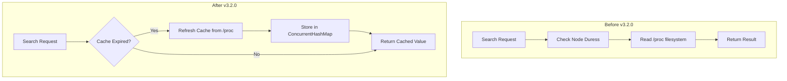

---
tags:
  - domain/core
  - component/server
  - performance
  - search
---
# Node Duress Caching

## Summary

This release introduces time-based caching for node duress values in the Search Backpressure mechanism. Previously, every call to check if a node was under duress required reading CPU and JVM memory utilization from the `/proc` virtual file system, causing significant latency overhead (3x-9x regression) under workload management traffic. The new caching mechanism amortizes this cost by caching duress values for 1 second, dramatically reducing search request latency from 35+ ms to 4-6 ms.

## Details

### What's New in v3.2.0

The `NodeDuressTrackers` class now caches resource duress values using a new `TimeBasedExpiryTracker` utility. Instead of evaluating node duress on every request, the system now:

1. Checks if the cache has expired (default: 1 second)
2. If expired, refreshes all resource type duress values
3. Returns cached values for subsequent requests within the expiry window

### Technical Changes

#### Architecture Changes



#### New Components

| Component | Description |
|-----------|-------------|
| `TimeBasedExpiryTracker` | A utility class that tracks time-based expiration events with nanosecond precision. Returns `true` when the configured expiry time has elapsed since the last access. |
| `resourceDuressCache` | A `ConcurrentHashMap<ResourceType, Boolean>` that stores cached duress values for each resource type (CPU, MEMORY). |
| `nodeDuressCacheExpiryChecker` | A `BooleanSupplier` that determines when the cache should be refreshed. |

#### New Configuration

| Setting | Description | Default |
|---------|-------------|---------|
| Cache expiry time | Time interval for cache refresh | 1 second (1,000,000,000 nanoseconds) |

Note: The cache expiry time is currently hardcoded and not configurable via cluster settings.

### Usage Example

The caching is transparent to users. No configuration changes are required. The performance improvement is automatic when using Search Backpressure or Workload Management features.

```java
// Internal implementation - cache is checked automatically
public boolean isResourceInDuress(ResourceType resourceType) {
    updateCache();  // Only refreshes if cache expired
    return resourceDuressCache.get(resourceType);
}

private void updateCache() {
    if (nodeDuressCacheExpiryChecker.getAsBoolean()) {
        for (ResourceType resourceType : ResourceType.values())
            resourceDuressCache.put(resourceType, duressTrackers.get(resourceType).test());
    }
}
```

### Migration Notes

No migration required. This is a transparent performance optimization that maintains backward compatibility.

## Limitations

- Cache expiry time (1 second) is not configurable via cluster settings
- The `TimeBasedExpiryTracker` is intentionally not completely thread-safe for nanosecond-level precision; minor timing variations are tolerable
- During the cache window, duress state changes may not be immediately reflected (up to 1 second delay)

## References

### Documentation
- [Search Backpressure Documentation](https://docs.opensearch.org/3.0/tuning-your-cluster/availability-and-recovery/search-backpressure/): Official documentation
- [Workload Management Documentation](https://docs.opensearch.org/3.0/tuning-your-cluster/availability-and-recovery/workload-management/wlm-feature-overview/): Workload management feature overview

### Pull Requests
| PR | Description |
|----|-------------|
| [#18649](https://github.com/opensearch-project/OpenSearch/pull/18649) | Make node duress values cacheable for NodeDuressTrackers |

### Issues (Design / RFC)
- [Issue #18641](https://github.com/opensearch-project/OpenSearch/issues/18641): Latency regression due to node duress trackers

## Related Feature Report

- [Full feature documentation](../../../../features/opensearch/opensearch-search-backpressure.md)
