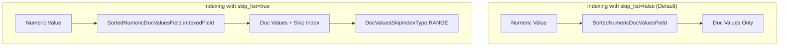

# Numeric Field Skip List

## Summary

OpenSearch 3.2.0 introduces a new `skip_list` parameter for numeric field mappers that enables skip list indexing on doc values. When enabled, this feature allows the query engine to skip over document ranges that don't match query criteria, significantly improving performance for range queries and aggregations on numeric fields.

## Details

### What's New in v3.2.0

The `skip_list` parameter is a new boolean mapping option for all numeric field types. When set to `true` and `doc_values` is also enabled, OpenSearch creates indexed doc values using Lucene's `SortedNumericDocValuesField.indexedField()` method instead of the standard `SortedNumericDocValuesField` constructor. This enables the skip list data structure that allows efficient range-based document filtering.

### Technical Changes

#### Architecture Changes



#### New Configuration

| Setting | Description | Default |
|---------|-------------|---------|
| `skip_list` | Boolean value that enables skip list indexing for doc values. Requires `doc_values: true` to have effect. | `false` |

#### Supported Field Types

The `skip_list` parameter is supported on all numeric field types:

| Field Type | Support |
|------------|---------|
| `byte` | ✓ |
| `short` | ✓ |
| `integer` | ✓ |
| `long` | ✓ |
| `float` | ✓ |
| `double` | ✓ |
| `half_float` | ✓ |
| `unsigned_long` | ✓ |
| `scaled_float` | ✓ (via LONG type) |
| `token_count` | ✓ (via INTEGER type) |

### Usage Example

Create an index with skip list enabled on a numeric field:

```json
PUT /testindex_skiplist
{
  "mappings": {
    "properties": {
      "price": {
        "type": "double",
        "skip_list": true
      },
      "quantity": {
        "type": "integer",
        "skip_list": true
      }
    }
  }
}
```

Index documents:

```json
PUT testindex_skiplist/_doc/1
{
  "price": 19.99,
  "quantity": 100
}
```

Range queries on these fields will benefit from skip list optimization:

```json
GET testindex_skiplist/_search
{
  "query": {
    "range": {
      "price": {
        "gte": 10.00,
        "lte": 50.00
      }
    }
  }
}
```

### Migration Notes

- This is a new optional parameter with no impact on existing indexes
- To enable skip list on existing fields, you must reindex the data
- The parameter only takes effect when `doc_values` is also `true`
- Backward compatible: older versions will ignore the parameter

## Limitations

- Skip list indexing increases index size due to additional skip index data structure
- Only effective when `doc_values` is enabled (default is `true`)
- Performance benefits are most noticeable for range queries and aggregations on fields with high cardinality
- The `scaled_float`, `token_count`, and `size` field mappers pass `false` for skip_list internally

## References

### Documentation
- [Numeric field types documentation](https://docs.opensearch.org/latest/field-types/supported-field-types/numeric/)
- [PR #18066](https://github.com/opensearch-project/OpenSearch/pull/18066): Previous implementation (replaced by #18889)

### Blog Posts
- [OpenSearch 3.2 Release Blog](https://opensearch.org/blog/introducing-opensearch-3-2-next-generation-search-and-anayltics-with-enchanced-ai-capabilities/)

### Pull Requests
| PR | Description |
|----|-------------|
| [#18889](https://github.com/opensearch-project/OpenSearch/pull/18889) | Add skip_list parameter to Numeric Field Mappers (default false) |
| [#10560](https://github.com/opensearch-project/documentation-website/pull/10560) | Documentation: Add skip_list parameter to numeric field type |

### Issues (Design / RFC)
- [Issue #17965](https://github.com/opensearch-project/OpenSearch/issues/17965): [SparseIndex] Modify FieldMappers to enable SkipList

## Related Feature Report

- [Full feature documentation](../../../../features/opensearch/numeric-field-skip-list.md)
