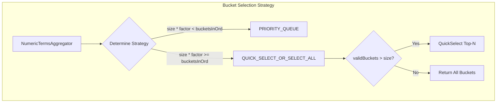

# Numeric Terms Aggregation Optimization

## Summary

This release introduces a performance optimization for numeric terms aggregations when dealing with large bucket counts. The optimization uses quickselect algorithm instead of priority queue for top-N bucket selection when the requested size is close to or exceeds the total bucket count, significantly improving aggregation performance.

## Details

### What's New in v3.2.0

The optimization addresses inefficiency in bucket aggregations where data nodes send top-N buckets to the coordinator. When the requested top-N bucket count is close to or exceeds the maximum bucket ordinal, using a PriorityQueue becomes inefficient or redundant.

### Technical Changes

#### Architecture Changes



#### New Components

| Component | Description |
|-----------|-------------|
| `BucketSelectionStrategy` | Enum defining bucket selection strategies (PRIORITY_QUEUE, QUICK_SELECT_OR_SELECT_ALL) |
| `SelectionInput` | Input parameters for strategy execution |
| `SelectionResult` | Result container with selected buckets and metadata |

#### New Configuration

| Setting | Description | Default |
|---------|-------------|---------|
| `search.aggregation.bucket_selection_strategy_factor` | Factor to determine when to switch from priority queue to quickselect. When `size * factor < bucketsInOrd`, priority queue is used; otherwise quickselect. | `5` |

The setting is:
- Dynamic (can be changed at runtime)
- Node-scoped
- Valid range: 0-10 (0 always uses priority queue)

### Strategy Selection Logic

The strategy is determined based on:

1. **PRIORITY_QUEUE**: Used when:
   - `size * factor < bucketsInOrd` (requested size is small relative to total buckets)
   - Order is by key (isKeyOrder)
   - Significant terms aggregation (partiallyBuiltBucketComparator is null)

2. **QUICK_SELECT_OR_SELECT_ALL**: Used when:
   - `size * factor >= bucketsInOrd` (requested size is large relative to total buckets)
   - Uses Lucene's `ArrayUtil.select()` for quickselect algorithm
   - Returns all buckets if valid bucket count <= requested size

### Usage Example

```json
// Terms aggregation with large bucket request
GET /my_index/_search
{
  "size": 0,
  "aggs": {
    "numeric_terms": {
      "terms": {
        "field": "numeric_field",
        "size": 1000
      }
    }
  }
}
```

The optimization is automatic and transparent to users. Debug information is available via the profile API:

```json
{
  "profile": {
    "shards": [{
      "aggregations": [{
        "debug": {
          "result_selection_strategy": "quick_select"
        }
      }]
    }]
  }
}
```

### Performance Impact

Benchmark results show significant improvements when the requested bucket size is close to or exceeds 20% of total buckets:

- **Priority Queue**: Optimal for small top-N requests (< 20% of total buckets)
- **QuickSelect**: Better performance for larger top-N requests (>= 20% of total buckets)
- **Select All**: Most efficient when all buckets are needed

## Limitations

- Only applies to `NumericTermsAggregator` (numeric field types)
- Does not apply to significant terms aggregations
- Does not apply when ordering by key
- The factor setting affects all numeric terms aggregations cluster-wide

## References

### Documentation
- [Terms Aggregation Documentation](https://docs.opensearch.org/3.2/aggregations/bucket/terms/): Official docs

### Pull Requests
| PR | Description |
|----|-------------|
| [#18702](https://github.com/opensearch-project/OpenSearch/pull/18702) | Optimization in Numeric Terms Aggregation query for Large Bucket Counts |

### Issues (Design / RFC)
- [Issue #18703](https://github.com/opensearch-project/OpenSearch/issues/18703): Performance optimization request

## Related Feature Report

- [Full feature documentation](../../../../features/opensearch/numeric-terms-aggregation-optimization.md)
