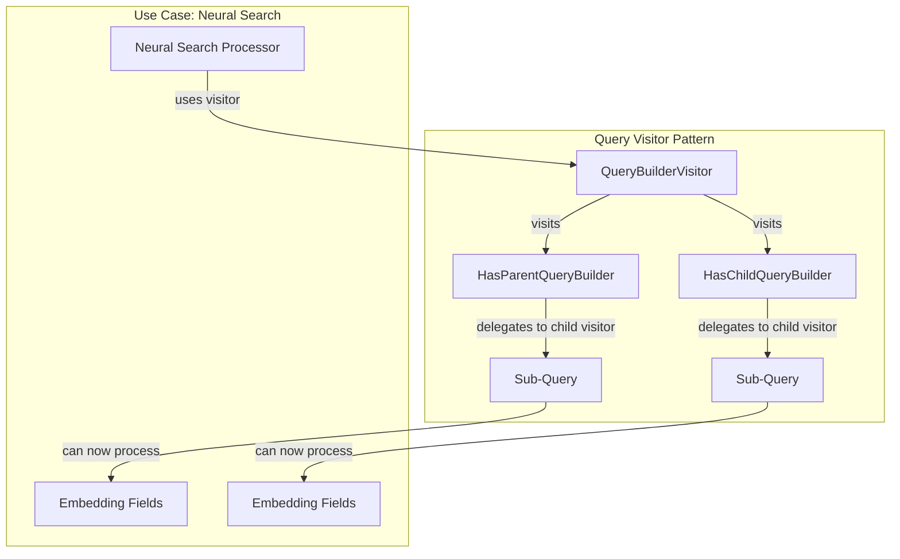

# Parent-Child Query Fixes

## Summary

This bugfix addresses a missing implementation in the `QueryBuilderVisitor` pattern for `HasParentQueryBuilder` and `HasChildQueryBuilder`. Without this fix, the visitor pattern could not traverse sub-queries within parent-child queries, which prevented features like neural search from properly processing embedding fields in nested join queries.

## Details

### What's New in v3.2.0

The `visit()` method has been implemented for both `HasParentQueryBuilder` and `HasChildQueryBuilder` classes. This allows the visitor pattern to properly traverse and process sub-queries within parent-child join queries.

### Technical Changes

#### Architecture Changes



#### Code Changes

| File | Change |
|------|--------|
| `HasChildQueryBuilder.java` | Added `visit()` method implementation |
| `HasParentQueryBuilder.java` | Added `visit()` method implementation |
| `HasChildQueryBuilderTests.java` | Added test for visitor pattern |
| `HasParentQueryBuilderTests.java` | Added test for visitor pattern |

#### Implementation Details

The fix adds the following `visit()` method to both query builders:

```java
@Override
public void visit(QueryBuilderVisitor visitor) {
    visitor.accept(this);
    query.visit(visitor.getChildVisitor(BooleanClause.Occur.MUST));
}
```

This implementation:
1. Accepts the current query builder with the visitor
2. Delegates to the child visitor for the inner query using `MUST` occurrence

### Usage Example

With this fix, neural search can now process embedding fields within parent-child queries:

```json
{
  "query": {
    "has_child": {
      "type": "child_doc",
      "query": {
        "neural": {
          "embedding_field": {
            "query_text": "search query",
            "model_id": "model_123"
          }
        }
      }
    }
  }
}
```

### Migration Notes

No migration required. This is a transparent bugfix that enables previously broken functionality.

## Limitations

- The fix only addresses the visitor pattern for `HasParentQuery` and `HasChildQuery`
- Other join queries may still need similar fixes if they have nested sub-queries

## References

### Documentation
- [Has Child Query Documentation](https://docs.opensearch.org/3.0/query-dsl/joining/has-child/): Official docs
- [Has Parent Query Documentation](https://docs.opensearch.org/3.0/query-dsl/joining/has-parent/): Official docs
- [Joining Queries Documentation](https://docs.opensearch.org/3.0/query-dsl/joining/index/): Overview of joining queries
- [PR #13837](https://github.com/opensearch-project/OpenSearch/pull/13837): Previous visitor pattern fix (stalled)
- [PR #14739](https://github.com/opensearch-project/OpenSearch/pull/14739): Fix for NestedQueryBuilder visitor
- [PR #10110](https://github.com/opensearch-project/OpenSearch/pull/10110): Original visitor pattern implementation

### Pull Requests
| PR | Description |
|----|-------------|
| [#18621](https://github.com/opensearch-project/OpenSearch/pull/18621) | Fix the visit of sub queries for HasParentQuery and HasChildQuery |

## Related Feature Report

- [Full feature documentation](../../../features/opensearch/parent-child-query.md)
