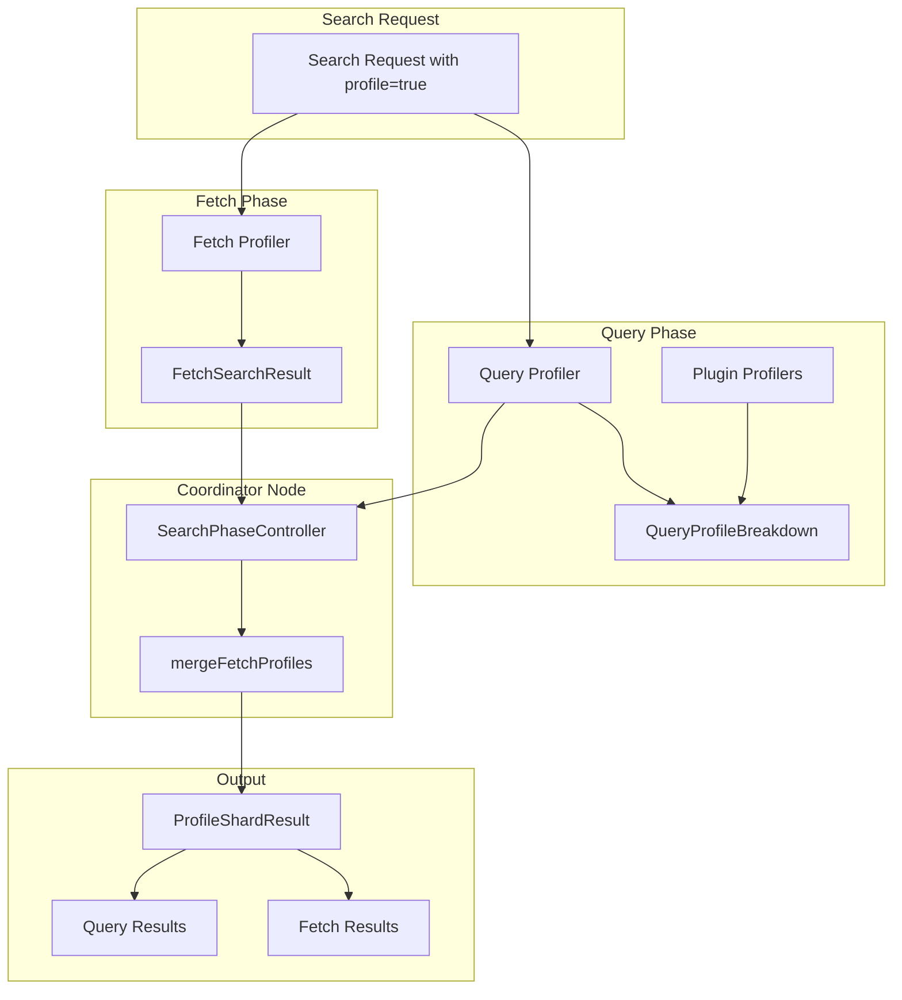

---
tags:
  - domain/core
  - component/server
  - indexing
  - k-nn
  - observability
  - search
---
# Plugin Profiling

## Summary

OpenSearch v3.2.0 introduces plugin profiling extensibility and multi-shard fetch phase profiling. Plugins can now contribute custom profiling metrics to the search profile output, and fetch phase profiling now works correctly across multi-shard queries.

## Details

### What's New in v3.2.0

This release includes two major profiling enhancements:

1. **Plugin Profiling Extensibility**: Plugins can now register custom `ProfileMetric` suppliers that are included in the query profile breakdown. This allows plugins like k-NN to provide detailed timing information about their internal operations.

2. **Multi-Shard Fetch Phase Profiling**: Previously, fetch phase profiling only worked for single-shard queries. Now fetch profile results are properly collected from each shard and merged with query profile results on the coordinating node.

### Technical Changes

#### Architecture Changes



#### New Components

| Component | Description |
|-----------|-------------|
| `SearchPlugin.ProfileMetricsProvider` | Interface for plugins to provide custom profile metrics |
| `SearchProfileShardResults.buildFetchOnlyShardResults()` | Helper method to build fetch-only profile results for multi-shard queries |
| `SearchPhaseController.mergeFetchProfiles()` | Merges fetch phase profiles with query phase profiles |
| `FetchSearchResult.profileResults` | New field to carry fetch profile data back to coordinator |

#### New Configuration

| Setting | Description | Default |
|---------|-------------|---------|
| N/A | Plugin profiling is automatically enabled when plugins implement `ProfileMetricsProvider` | - |

#### API Changes

**SearchPlugin Interface Extension**

Plugins can now implement `getQueryProfileMetricsProvider()` to contribute custom metrics:

```java
public interface SearchPlugin {
    default Optional<ProfileMetricsProvider> getQueryProfileMetricsProvider() {
        return Optional.empty();
    }
    
    interface ProfileMetricsProvider {
        Collection<Supplier<ProfileMetric>> getQueryProfileMetrics(
            SearchContext searchContext, 
            Query query
        );
    }
}
```

**FetchSearchResult Changes**

`FetchSearchResult` now includes profile data for multi-shard scenarios:

```java
public final class FetchSearchResult extends SearchPhaseResult {
    private ProfileShardResult profileShardResults;
    
    public void profileResults(ProfileShardResult shardResults) { ... }
    public ProfileShardResult getProfileResults() { ... }
}
```

### Usage Example

**Plugin Implementation**

```java
public class MySearchPlugin implements SearchPlugin {
    @Override
    public Optional<ProfileMetricsProvider> getQueryProfileMetricsProvider() {
        return Optional.of((searchContext, query) -> {
            if (query instanceof MyCustomQuery) {
                return List.of(() -> new Timer("my_custom_operation"));
            }
            return Collections.emptyList();
        });
    }
}
```

**Profile Response with Plugin Metrics**

```json
{
  "profile": {
    "shards": [{
      "searches": [{
        "query": [{
          "type": "MyCustomQuery",
          "breakdown": {
            "create_weight": 10000,
            "build_scorer": 50000,
            "my_custom_operation": 25000,
            "my_custom_operation_count": 5
          }
        }]
      }]
    }]
  }
}
```

### Migration Notes

- Existing search requests with `profile: true` will automatically include fetch phase profiling for multi-shard queries
- Plugin developers can optionally implement `ProfileMetricsProvider` to add custom metrics
- No breaking changes to existing profile API responses

## Limitations

- Plugin metrics are only included in the query breakdown, not as separate sections
- Fetch phase profiling adds serialization overhead for profile data between nodes
- Custom metrics must be implemented as `ProfileMetric` (typically `Timer`) instances

## References

### Documentation
- [Profile API Documentation](https://docs.opensearch.org/3.0/api-reference/search-apis/profile/): Official API reference

### Pull Requests
| PR | Description |
|----|-------------|
| [#18656](https://github.com/opensearch-project/OpenSearch/pull/18656) | Extend profile capabilities to plugins |
| [#18887](https://github.com/opensearch-project/OpenSearch/pull/18887) | Expand fetch phase profiling to multi-shard queries |

### Issues (Design / RFC)
- [Issue #18460](https://github.com/opensearch-project/OpenSearch/issues/18460): RFC for Profiling Extensibility
- [Issue #18863](https://github.com/opensearch-project/OpenSearch/issues/18863): Multi-shard fetch profiling request

## Related Feature Report

- [Full feature documentation](../../../features/opensearch/opensearch-profiler.md)
