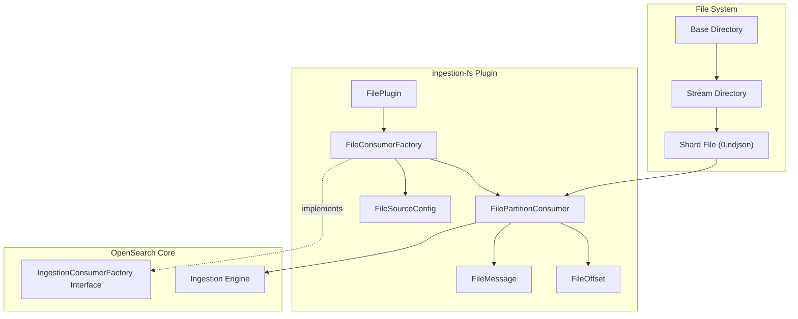

# Pull-based Ingestion

## Summary

This release introduces the `ingestion-fs` plugin, a new file-based ingestion source for the pull-based ingestion framework. This plugin enables developers to test pull-based ingestion locally without setting up external streaming infrastructure like Kafka or Kinesis.

## Details

### What's New in v3.2.0

The `ingestion-fs` plugin provides a simple file-based ingestion source for local testing and development purposes. It reads documents from `.ndjson` files on the local file system, following the standard pull-based ingestion message format.

### Technical Changes

#### Architecture Changes



#### New Components

| Component | Description |
|-----------|-------------|
| `FilePlugin` | Main plugin class implementing `IngestionConsumerPlugin` |
| `FileConsumerFactory` | Factory for creating file-based ingestion consumers |
| `FilePartitionConsumer` | Reads messages from shard-specific `.ndjson` files |
| `FileSourceConfig` | Configuration holder for stream name and base directory |
| `FileOffset` | Line-number based offset implementation |
| `FileMessage` | Message wrapper for file content with timestamp |

#### New Configuration

| Setting | Description | Default |
|---------|-------------|---------|
| `ingestion_source.type` | Set to `file` for file-based ingestion | Required |
| `ingestion_source.param.stream` | Stream name (subdirectory name) | Required |
| `ingestion_source.param.base_directory` | Path to base directory containing stream files | Required |

### File Structure Convention

The plugin expects files to follow this structure:

```
${base_directory}/${stream}/${shard_id}.ndjson
```

For example, with `base_directory=/data/ingestion` and `stream=test_stream`:
- Shard 0: `/data/ingestion/test_stream/0.ndjson`
- Shard 1: `/data/ingestion/test_stream/1.ndjson`

### Usage Example

**1. Prepare test data file (`/data/test_stream/0.ndjson`):**
```json
{"_id":"1","_version":"1","_op_type":"index","_source":{"name":"alice","age":30}}
{"_id":"2","_version":"1","_op_type":"index","_source":{"name":"bob","age":35}}
```

**2. Start OpenSearch with the plugin:**
```bash
./gradlew run -PinstalledPlugins="['ingestion-fs']"
```

**3. Create a pull-based index:**
```json
PUT /test-index
{
  "settings": {
    "ingestion_source": {
      "type": "file",
      "param": {
        "stream": "test_stream",
        "base_directory": "/data"
      }
    },
    "index.number_of_shards": 1,
    "index.number_of_replicas": 0,
    "index.replication.type": "SEGMENT"
  },
  "mappings": {
    "properties": {
      "name": { "type": "text" },
      "age": { "type": "integer" }
    }
  }
}
```

### Pointer Reset Modes

The file-based consumer supports all standard pointer reset modes:

| Mode | Behavior |
|------|----------|
| `earliest` | Start from line 0 (beginning of file) |
| `latest` | Start from end of file (no existing data ingested) |
| `reset_by_offset` | Start from specific line number |
| `reset_by_timestamp` | Falls back to `earliest` (timestamps not supported) |

### Migration Notes

This plugin is intended for local testing only. For production use cases, continue using the `ingestion-kafka` or `ingestion-kinesis` plugins.

## Limitations

- Designed for local testing only, not production use
- Timestamp-based pointer reset defaults to earliest pointer
- Files must exist before index creation (missing files result in empty index)
- One-to-one mapping between shards and files

## Related PRs

| PR | Description |
|----|-------------|
| [#18591](https://github.com/opensearch-project/OpenSearch/pull/18591) | Introduce ingestion-fs plugin for file-based indexing |

## References

- [Issue #18590](https://github.com/opensearch-project/OpenSearch/issues/18590): Feature request for file-based ingestion plugin
- [Documentation](https://docs.opensearch.org/3.0/api-reference/document-apis/pull-based-ingestion/): Pull-based ingestion
- [META Issue #16930](https://github.com/opensearch-project/OpenSearch/issues/16930): Pull-based ingestion tracking issue

## Related Feature Report

- [Full feature documentation](../../../features/opensearch/pull-based-ingestion.md)
