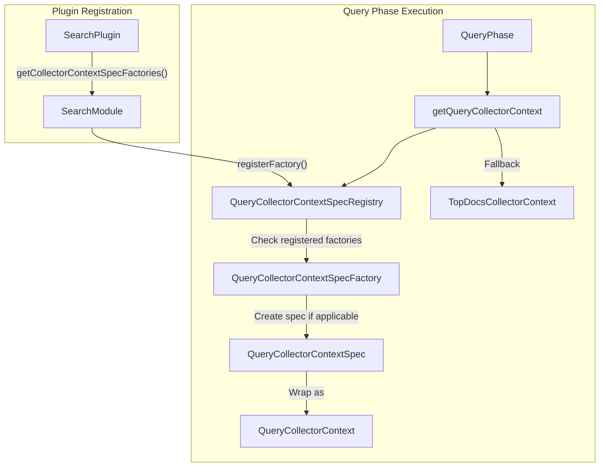

---
tags:
  - domain/core
  - component/server
  - performance
  - search
---
# Query Phase Plugin Extension

## Summary

This release introduces an extensibility mechanism that allows plugins to inject custom `QueryCollectorContext` during the Query Phase of search execution. Previously, the `TopDocsCollectorContext` was hardcoded in the search process, limiting plugins from providing custom collector implementations at the optimal point in the search lifecycle. This feature enables significant performance improvements for custom query types like hybrid queries.

## Details

### What's New in v3.2.0

OpenSearch v3.2.0 adds a plugin extension point for injecting custom collector contexts during the Query Phase. This allows plugins to:

1. Define custom `QueryCollectorContextSpec` implementations
2. Register `QueryCollectorContextSpecFactory` instances during cluster bootstrap
3. Have their custom collectors used instead of the default `TopDocsCollectorContext`

### Technical Changes

#### Architecture Changes



#### New Components

| Component | Description |
|-----------|-------------|
| `QueryCollectorContextSpec` | Interface defining collector creation, manager creation, and post-processing |
| `QueryCollectorContextSpecFactory` | Factory interface for creating `QueryCollectorContextSpec` based on search context and query |
| `QueryCollectorContextSpecRegistry` | Static registry that holds all registered factories and resolves specs at search time |
| `QueryCollectorArguments` | Arguments passed to factory for spec creation (e.g., `hasFilterCollector`) |

#### New Interfaces

**QueryCollectorContextSpec** (Experimental API):
```java
@ExperimentalApi
public interface QueryCollectorContextSpec {
    String getContextName();
    Collector create(Collector in) throws IOException;
    CollectorManager<?, ReduceableSearchResult> createManager(
        CollectorManager<?, ReduceableSearchResult> in) throws IOException;
    void postProcess(QuerySearchResult result) throws IOException;
}
```

**QueryCollectorContextSpecFactory** (Experimental API):
```java
@ExperimentalApi
public interface QueryCollectorContextSpecFactory {
    Optional<QueryCollectorContextSpec> createQueryCollectorContextSpec(
        SearchContext searchContext,
        Query query,
        QueryCollectorArguments queryCollectorArguments
    ) throws IOException;
}
```

#### SearchPlugin Extension

Plugins can now implement `getCollectorContextSpecFactories()` in their `SearchPlugin`:

```java
public class MySearchPlugin extends Plugin implements SearchPlugin {
    @Override
    public List<QueryCollectorContextSpecFactory> getCollectorContextSpecFactories() {
        return List.of(new MyQueryCollectorContextSpecFactory());
    }
}
```

### Usage Example

```java
// 1. Implement QueryCollectorContextSpec
public class HybridQueryCollectorContextSpec implements QueryCollectorContextSpec {
    @Override
    public String getContextName() {
        return "hybrid_query_collector";
    }
    
    @Override
    public Collector create(Collector in) throws IOException {
        return new HybridTopScoreDocCollector(in);
    }
    
    @Override
    public CollectorManager<?, ReduceableSearchResult> createManager(
            CollectorManager<?, ReduceableSearchResult> in) throws IOException {
        return new HybridCollectorManager(in);
    }
    
    @Override
    public void postProcess(QuerySearchResult result) throws IOException {
        // Custom post-processing logic
    }
}

// 2. Implement QueryCollectorContextSpecFactory
public class HybridQueryCollectorContextSpecFactory 
        implements QueryCollectorContextSpecFactory {
    @Override
    public Optional<QueryCollectorContextSpec> createQueryCollectorContextSpec(
            SearchContext searchContext,
            Query query,
            QueryCollectorArguments args) throws IOException {
        // Only create spec for hybrid queries
        if (query instanceof HybridQuery) {
            return Optional.of(new HybridQueryCollectorContextSpec());
        }
        return Optional.empty();
    }
}

// 3. Register in plugin
public class NeuralSearchPlugin extends Plugin implements SearchPlugin {
    @Override
    public List<QueryCollectorContextSpecFactory> getCollectorContextSpecFactories() {
        return List.of(new HybridQueryCollectorContextSpecFactory());
    }
}
```

### Performance Impact

Based on benchmarking performed during development (noaa-semantic-search dataset with hybrid query using 3 subqueries):

| Metric | Before (GA) | After (with extension) | Improvement |
|--------|-------------|------------------------|-------------|
| p50 latency | 280.16 ms | 246.99 ms | 11.83% |
| p90 latency | 299.51 ms | 250.9 ms | 16.22% |
| p99 latency | 326.92 ms | 289.33 ms | 11.49% |
| p100 latency | 334.57 ms | 324.19 ms | 3.10% |

The improvement comes from:
- Eliminating the need for `EmptyCollectorContext` workarounds
- Removing the custom `HybridQueryAggregationProcessor` wrapper
- Injecting collectors at the optimal point in the search lifecycle

## Limitations

- This is an **Experimental API** (`@ExperimentalApi`) and may change in future versions
- Only one `QueryCollectorContextSpec` can be active per search request (first matching factory wins)
- Factories are evaluated in registration order

## References

### Documentation
- [PR #18007](https://github.com/opensearch-project/OpenSearch/pull/18007): POC for moving Hybrid Search to OpenSearch core (benchmarking reference)

### Pull Requests
| PR | Description |
|----|-------------|
| [#18637](https://github.com/opensearch-project/OpenSearch/pull/18637) | Add functionality for plugins to inject QueryCollectorContext during QueryPhase |

### Issues (Design / RFC)
- [Issue #18278](https://github.com/opensearch-project/OpenSearch/issues/18278): Feature request for enabling collector context injection from plugins

## Related Feature Report

- [Full feature documentation](../../../../features/opensearch/opensearch-query-phase-plugin-extension.md)
