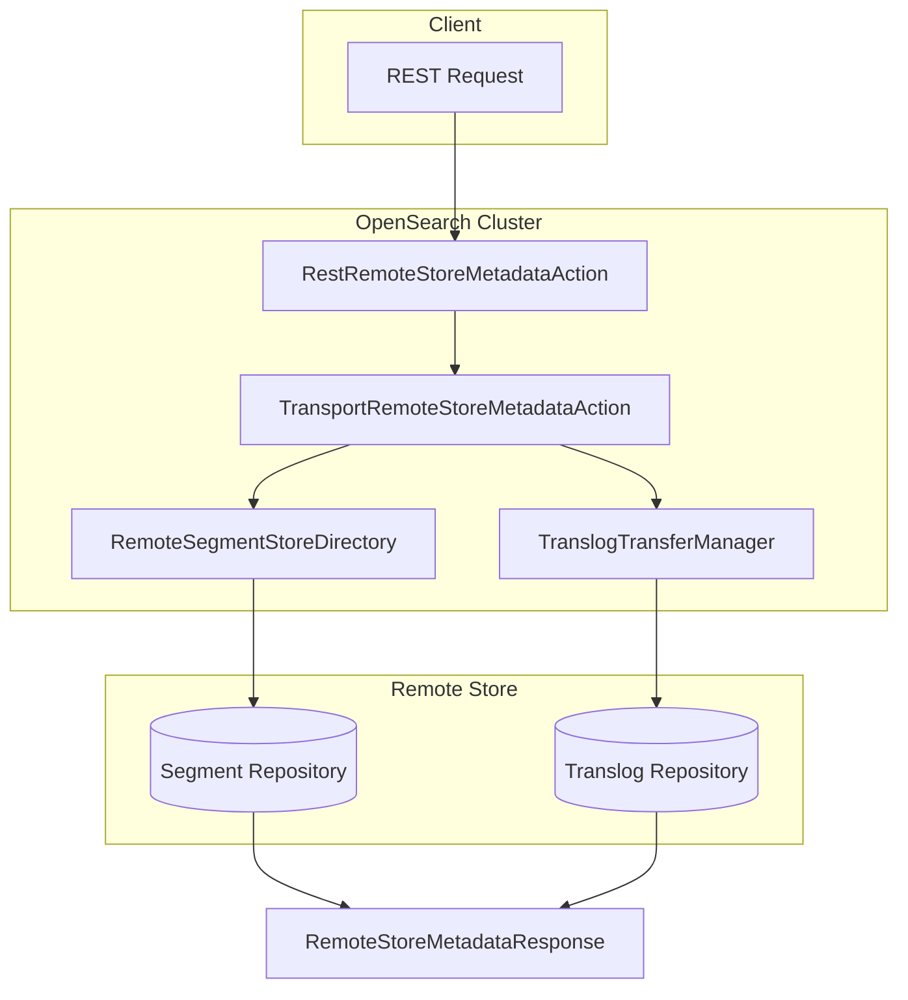

---
tags:
  - domain/core
  - component/server
  - indexing
  - observability
  - performance
---
# Remote Store Metadata API

## Summary

OpenSearch v3.2.0 introduces a new cluster-level API (`/_remotestore/metadata`) that enables users to retrieve segment and translog metadata from remote-backed storage for specific indexes and shards. This API enhances observability and debugging capabilities for indexes backed by remote storage, complementing the existing Remote Store Stats API.

## Details

### What's New in v3.2.0

This release adds a new REST API endpoint that fetches detailed metadata about segment and translog files stored in remote repositories. Unlike the Remote Store Stats API (which provides performance metrics), this new Metadata API returns the actual metadata file contents, including file checksums, sizes, and replication checkpoint information.

### Technical Changes

#### Architecture Changes



#### New Components

| Component | Description |
|-----------|-------------|
| `RemoteStoreMetadataAction` | Action type registered under `cluster:admin/remote_store/metadata` |
| `RemoteStoreMetadataRequest` | Request object supporting index name and optional shard IDs |
| `RemoteStoreMetadataResponse` | Response containing per-shard metadata with success/failure info |
| `RemoteStoreShardMetadata` | Holds parsed segment and translog metadata per shard |
| `RestRemoteStoreMetadataAction` | REST handler for the new endpoints |
| `TransportRemoteStoreMetadataAction` | Transport action that collects metadata from remote store |

#### API Endpoints

| Endpoint | Description |
|----------|-------------|
| `GET /_remotestore/metadata/{index}` | Fetch metadata for all shards of an index |
| `GET /_remotestore/metadata/{index}/{shard_id}` | Fetch metadata for a specific shard |

### Usage Example

```bash
GET /_remotestore/metadata/my-index-1?pretty
```

```json
{
  "_shards": {
    "total": 1,
    "successful": 1,
    "failed": 0
  },
  "indices": {
    "my-index-1": {
      "shards": {
        "0": [
          {
            "index": "my-index-1",
            "shard": 0,
            "latest_segment_metadata_filename": "metadata__9223372036854775806__...",
            "latest_translog_metadata_filename": "metadata__9223372036854775806__...",
            "available_segment_metadata_files": {
              "metadata__...": {
                "files": {
                  "_0.cfe": {
                    "original_name": "_0.cfe",
                    "checksum": "624593751",
                    "length": 517
                  }
                },
                "replication_checkpoint": {
                  "primary_term": 1,
                  "segments_gen": 3,
                  "segment_infos_version": 9,
                  "codec": "Lucene101",
                  "created_timestamp": 163477705159875
                }
              }
            },
            "available_translog_metadata_files": {
              "metadata__...": {
                "primary_term": 1,
                "generation": 3,
                "min_translog_gen": 3,
                "generation_to_primary_term": {
                  "3": "1"
                }
              }
            }
          }
        ]
      }
    }
  }
}
```

### Response Fields

#### Segment Metadata Files

| Field | Description |
|-------|-------------|
| `files` | Map of segment files with original name, checksum, and length |
| `replication_checkpoint` | Contains primary_term, segments_gen, segment_infos_version, codec, and created_timestamp |

#### Translog Metadata Files

| Field | Description |
|-------|-------------|
| `primary_term` | Primary term of the translog |
| `generation` | Current translog generation |
| `min_translog_gen` | Minimum translog generation |
| `generation_to_primary_term` | Mapping of generation to primary term |

## Limitations

- Only works with remote-store enabled indexes
- Returns up to 5 most recent metadata files per shard
- Requires `cluster:admin/remotestore/metadata` permission when Security plugin is enabled
- Marked as `@ExperimentalApi` - API may change in future releases

## References

### Documentation
- [Remote-backed storage documentation](https://docs.opensearch.org/3.0/tuning-your-cluster/availability-and-recovery/remote-store/index/)
- [Remote Store Stats API](https://docs.opensearch.org/3.0/tuning-your-cluster/availability-and-recovery/remote-store/remote-store-stats-api/)

### Pull Requests
| PR | Description |
|----|-------------|
| [#18257](https://github.com/opensearch-project/OpenSearch/pull/18257) | Created an API to fetch remote store metadata |

## Related Feature Report

- [Full feature documentation](../../../features/opensearch/opensearch-remote-store-metadata-api.md)
