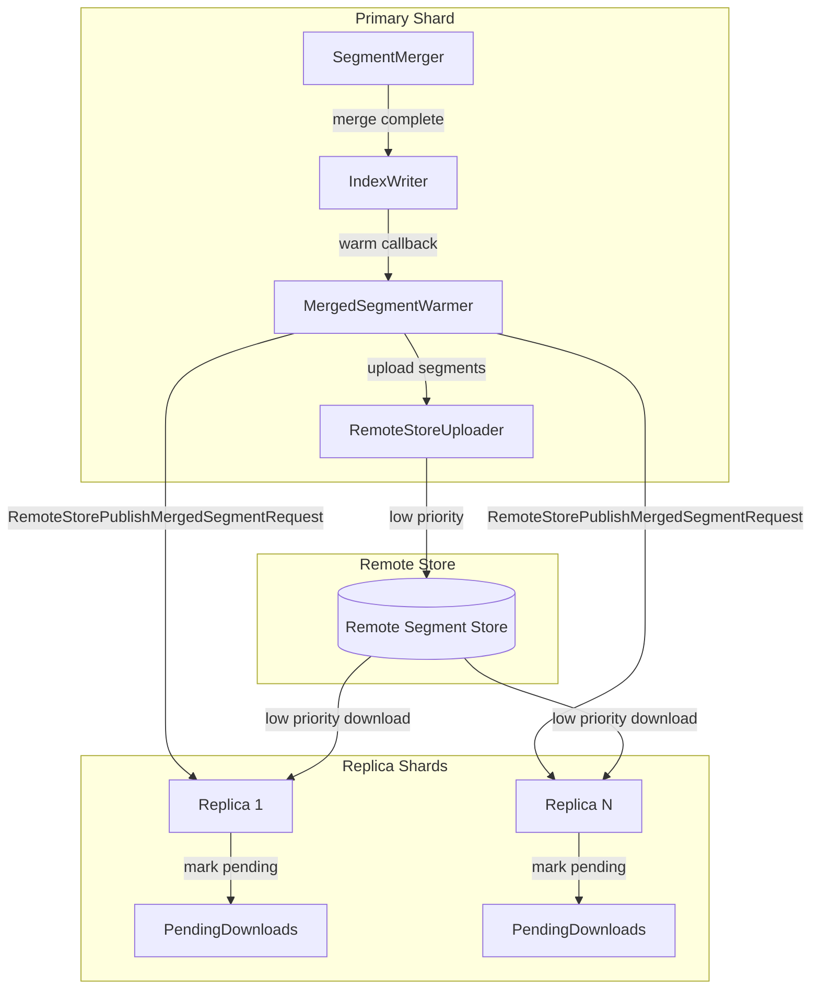

---
tags:
  - indexing
---

# Remote Store Segment Warming

## Summary

This release adds remote store support to the merged segment warmer feature. When segment merges complete on the primary shard, merged segments are now uploaded to the remote store and replicated to replica shards before the refresh completes. This significantly reduces replication lag in remote-store-enabled clusters by pre-copying merged segments through the remote store rather than waiting for the standard segment replication flow.

## Details

### What's New in v3.2.0

- **Remote Store Integration**: The merged segment warmer now supports remote-store-enabled domains, uploading merged segments to remote storage and notifying replicas to download them
- **Unified Warmer Implementation**: `LocalMergedSegmentWarmer` and `RemoteStoreMergedSegmentWarmer` have been consolidated into a single `MergedSegmentWarmer` class
- **Low-Priority Rate Limiting**: Downloads of merged segments use a separate low-priority rate limiter to avoid impacting regular operations
- **Pending Download Tracking**: Replica shards track pending merged segment downloads to coordinate with the remote store

### Technical Changes

#### Architecture Changes



#### New Components

| Component | Description |
|-----------|-------------|
| `RemoteStorePublishMergedSegmentAction` | Replication action that uploads merged segments to remote store and publishes checkpoints to replicas |
| `RemoteStoreMergedSegmentCheckpoint` | Checkpoint containing local-to-remote filename mappings for merged segments |
| `RemoteStorePublishMergedSegmentRequest` | Request sent to replica shards with merged segment information |
| `DownloadRateLimiterProvider` | Provides appropriate rate limiter based on whether download is for merged segments |

#### New Configuration

| Setting | Description | Default |
|---------|-------------|---------|
| `max_remote_low_priority_download_bytes_per_sec` | Rate limit for low-priority downloads (merged segments) | `0` (unlimited) |

#### API Changes

New transport action registered:
- `indices:admin/remote_publish_merged_segment` - Publishes merged segment checkpoint to replica shards

### Usage Example

The feature is automatically enabled when using remote-store-enabled indexes with the merged segment warmer feature flag:

```yaml
# opensearch.yml
opensearch.experimental.feature.merged_segment_warmer.enabled: true
```

Configure low-priority download rate limiting in repository settings:

```json
PUT _snapshot/my-repo
{
  "type": "s3",
  "settings": {
    "bucket": "my-bucket",
    "max_remote_low_priority_download_bytes_per_sec": "100mb"
  }
}
```

### Migration Notes

- Existing remote-store-enabled clusters will automatically benefit from this feature when the feature flag is enabled
- No configuration changes required for basic functionality
- Consider configuring `max_remote_low_priority_download_bytes_per_sec` to control bandwidth usage for merged segment downloads

## Limitations

- Requires the experimental feature flag `opensearch.experimental.feature.merged_segment_warmer.enabled`
- Only applicable to remote-store-enabled indexes with segment replication
- Failures during the warming process are logged but do not block the merge operation
- Timeout for merged segment replication is controlled by recovery settings

## References

### Documentation
- [Remote-backed Storage Documentation](https://docs.opensearch.org/3.0/tuning-your-cluster/availability-and-recovery/remote-store/index/): Official docs

### Pull Requests
| PR | Description |
|----|-------------|
| [#18683](https://github.com/opensearch-project/OpenSearch/pull/18683) | Core implementation for warming merged segments in remote-store enabled domains |
| [#18255](https://github.com/opensearch-project/OpenSearch/pull/18255) | Local merged segment warmer support (prerequisite) |

### Issues (Design / RFC)
- [Issue #17528](https://github.com/opensearch-project/OpenSearch/issues/17528): RFC - Introduce Pre-copy Merged Segment into Segment Replication
- [Issue #18625](https://github.com/opensearch-project/OpenSearch/issues/18625): META - Merged segment pre-copy tracking issue

## Related Feature Report

- [Full feature documentation](../../../features/opensearch/segment-warmer.md)
