---
tags:
  - domain/core
  - component/server
  - indexing
  - observability
---
# Replication Lag Fix

## Summary

This release fixes bugs in segment replication lag computation that caused incorrect lag metrics to be reported. The fix addresses two issues: using the correct epoch reference point for timestamp calculations and fixing the checkpoint pruning logic to properly remove synced checkpoints from tracking.

## Details

### What's New in v3.2.0

This bugfix corrects the segment replication lag metric (`segments.segment_replication.max_replication_lag`) which was reporting incorrect values—sometimes showing lag in days when the actual lag was minimal.

### Technical Changes

#### Bug 1: Incorrect Timestamp Reference

The original implementation used `System.nanoTime()` for timestamp calculations, which provides a monotonic clock without a fixed epoch reference. This caused incorrect lag calculations when comparing timestamps across different time references.

**Before:**
```java
long replicationLag = bytesBehind > 0L
    ? TimeUnit.NANOSECONDS.toMillis(System.nanoTime() - lowestEntry.getValue().getTimestamp())
    : 0;
```

**After:**
```java
long replicationLag = bytesBehind > 0L
    ? Duration.ofNanos(DateUtils.toLong(Instant.now()) - lowestEntry.getValue().getTimestamp()).toMillis()
    : 0;
```

The fix uses `DateUtils.toLong(Instant.now())` which provides a consistent epoch-based timestamp, ensuring accurate lag calculations.

#### Bug 2: Incorrect Checkpoint Pruning

The checkpoint pruning logic used `<` instead of `<=`, which kept the last synced checkpoint in tracking. This caused incorrect lag calculations when new checkpoints arrived.

**Before:**
```java
existingCheckpointStats.keySet().removeIf(key -> key < segmentInfoVersion);
```

**After:**
```java
existingCheckpointStats.keySet().removeIf(key -> key <= segmentInfoVersion);
```

### Architecture Changes

```mermaid
graph TB
    subgraph "Segment Replication Stats"
        PC[Primary Checkpoint] --> |timestamp| RCS[ReplicationCheckpointStats]
        RCS --> |bytesBehind, timestamp| Stats[ReplicationStats]
    end
    
    subgraph "Lag Calculation (Fixed)"
        NOW[Instant.now] --> |DateUtils.toLong| EPOCH[Epoch Timestamp]
        EPOCH --> |subtract oldest checkpoint| LAG[Replication Lag]
    end
    
    subgraph "Pruning (Fixed)"
        SYNC[Replica Sync Complete] --> |remove key <= version| PRUNE[Prune Checkpoints]
    end
```



### Modified Components

| Component | File | Change |
|-----------|------|--------|
| `SegmentReplicator` | `SegmentReplicator.java` | Fixed lag calculation using `DateUtils.toLong(Instant.now())` |
| `SegmentReplicator` | `SegmentReplicator.java` | Fixed pruning logic to use `<=` instead of `<` |
| `ReplicationCheckpoint` | `ReplicationCheckpoint.java` | Updated timestamp creation to use `DateUtils.toLong(Instant.now())` |

### Impact

- **Accuracy**: Replication lag metrics now correctly reflect the actual time difference between primary and replica shards
- **Monitoring**: Users can now rely on `max_replication_lag` metric for accurate monitoring and alerting
- **Consistency**: Lag values properly correlate with `bytes_behind` metrics

## Limitations

- This fix only affects segment replication; document replication uses different mechanisms
- Historical lag data collected before this fix may be inaccurate

## References

### Documentation
- [Segment Replication Documentation](https://docs.opensearch.org/3.0/tuning-your-cluster/availability-and-recovery/segment-replication/index/): Official segment replication docs
- [CAT Segment Replication API](https://docs.opensearch.org/3.0/api-reference/cat/cat-segment-replication/): API for viewing segment replication metrics

### Pull Requests
| PR | Description |
|----|-------------|
| [#18602](https://github.com/opensearch-project/OpenSearch/pull/18602) | Fix bugs in replication lag computation |

### Issues (Design / RFC)
- [Issue #18437](https://github.com/opensearch-project/OpenSearch/issues/18437): Bug report for incorrect segment replication lag metric

## Related Feature Report

- [Full feature documentation](../../../features/opensearch/segment-opensearch-replication.md)
