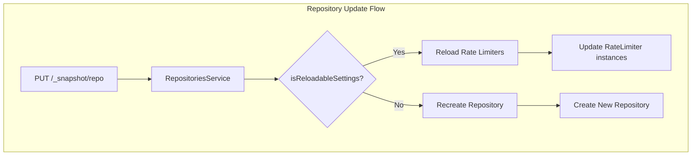

---
tags:
  - domain/core
  - component/server
  - indexing
---
# Repository Rate Limiters

## Summary

This release makes snapshot and restore rate limiter settings dynamically adjustable without recreating the repository. Previously, changing `max_snapshot_bytes_per_sec` or `max_restore_bytes_per_sec` required deleting and recreating the repository. Now these settings can be updated on-the-fly, allowing operators to adjust throughput based on I/O resource availability.

## Details

### What's New in v3.2.0

The following rate limiter settings are now dynamically reloadable:

- `max_snapshot_bytes_per_sec` - Controls snapshot creation rate
- `max_restore_bytes_per_sec` - Controls snapshot restore rate
- `max_remote_upload_bytes_per_sec` - Controls remote store upload rate
- `max_remote_low_priority_upload_bytes_per_sec` - Controls low-priority remote uploads
- `max_remote_download_bytes_per_sec` - Controls remote store download rate

### Technical Changes

#### Architecture Changes



#### New Components

| Component | Description |
|-----------|-------------|
| `RELOADABLE_SETTINGS` | Set of setting keys that can be updated without repository recreation |
| `isReloadableSettings()` | Method in `Repository` interface to check if settings change is reloadable |

#### New Configuration

| Setting | Description | Default |
|---------|-------------|---------|
| `max_snapshot_bytes_per_sec` | Maximum rate for snapshot creation | `40mb` |
| `max_restore_bytes_per_sec` | Maximum rate for snapshot restore | `0` (unlimited) |
| `max_remote_upload_bytes_per_sec` | Maximum rate for remote store uploads | `0` (unlimited) |
| `max_remote_low_priority_upload_bytes_per_sec` | Maximum rate for low-priority remote uploads | `0` (unlimited) |
| `max_remote_download_bytes_per_sec` | Maximum rate for remote store downloads | `0` (unlimited) |

### Usage Example

```json
// Create repository with initial rate limits
PUT /_snapshot/my-fs-repository/
{
  "type": "fs",
  "settings": {
    "location": "/path/to/snapshots",
    "max_restore_bytes_per_sec": "100mb",
    "max_snapshot_bytes_per_sec": "100mb"
  }
}

// Dynamically adjust rate limits (no repository recreation needed)
PUT /_snapshot/my-fs-repository/
{
  "type": "fs",
  "settings": {
    "max_restore_bytes_per_sec": "50mb",
    "max_snapshot_bytes_per_sec": "50mb"
  }
}
```

### Migration Notes

- No migration required - existing repositories automatically support dynamic rate limiting
- Only rate limiter settings can be changed dynamically; other settings (e.g., `location`, `io_buffer_size`) still require repository recreation
- Rate changes take effect immediately on ongoing snapshot/restore operations

## Limitations

- Only the five rate limiter settings listed above are dynamically reloadable
- Changing non-reloadable settings (e.g., `chunk_size`, `io_buffer_size`) alongside rate limiters will trigger a full repository recreation
- The repository must not be in use (no active snapshot/restore operations) when changing non-reloadable settings

## References

### Documentation
- [Register Snapshot Repository API](https://docs.opensearch.org/3.0/api-reference/snapshots/create-repository/): Official documentation

### Pull Requests
| PR | Description |
|----|-------------|
| [#18069](https://github.com/opensearch-project/OpenSearch/pull/18069) | Making multi rate limiters in repository dynamic |

### Issues (Design / RFC)
- [Issue #17488](https://github.com/opensearch-project/OpenSearch/issues/17488): Feature request for dynamic snapshot rate settings

## Related Feature Report

- Full feature documentation
