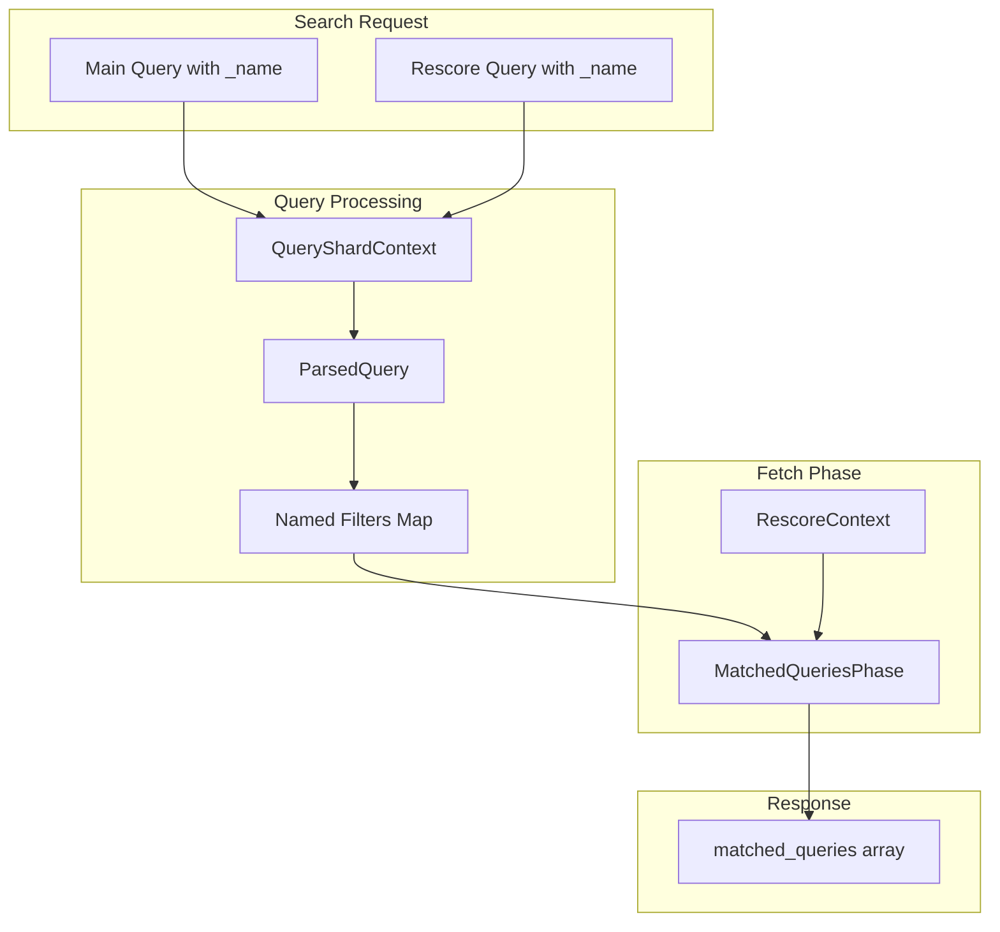

# Rescore Named Queries

## Summary

OpenSearch v3.2.0 adds support for surfacing named queries from rescore contexts in the `matched_queries` array of search hits. Previously, when a `_name` was specified inside a `rescore.query.rescore_query`, that name was not included in `matched_queries` even if the query matched and impacted the final score. This enhancement enables better debugging, logging, and ML model building that relies on signal-level match information.

## Details

### What's New in v3.2.0

Named queries defined within rescore query clauses are now propagated to the `matched_queries` array in search results. This includes support for:

- Named query names appearing in `matched_queries` array
- Named query scores when `include_named_queries_score` is set to `true`

### Technical Changes

#### Architecture Changes



#### Modified Components

| Component | Description |
|-----------|-------------|
| `RescoreContext` | Added `getParsedQueries()` method to return `ParsedQuery` objects with named filters |
| `QueryRescoreContext` | Changed from storing raw `Query` to `ParsedQuery` to preserve named query metadata |
| `QueryRescorerBuilder` | Updated to use `context.toQuery()` instead of `queryBuilder.toQuery()` |
| `MatchedQueriesPhase` | Extended to collect named queries from rescore contexts |
| `DfsPhase` | Updated to use `ParsedQuery` from rescore contexts |

#### Key Code Changes

The core change is in `MatchedQueriesPhase.java`:

```java
if (context.rescore() != null) {
    for (RescoreContext rescoreContext : context.rescore()) {
        rescoreContext.getParsedQueries()
            .forEach(query -> namedQueries.putAll(query.namedFilters()));
    }
}
```

### Usage Example

```json
PUT /rescore_test
{
  "mappings": {
    "properties": {
      "headline": { "type": "text" },
      "summary": { "type": "text" }
    }
  }
}

POST /rescore_test/_doc/1
{
  "headline": "OpenSearch rescore behavior",
  "summary": "This document illustrates how rescore affects scoring."
}

GET /rescore_test/_search
{
  "query": {
    "match": {
      "headline": {
        "query": "rescore behavior",
        "_name": "headline_match"
      }
    }
  },
  "rescore": {
    "window_size": 50,
    "query": {
      "rescore_query": {
        "match_phrase": {
          "summary": {
            "query": "rescore affects scoring",
            "_name": "summary_phrase_match"
          }
        }
      }
    }
  }
}
```

Response now includes both named queries:

```json
{
  "hits": {
    "hits": [
      {
        "_id": "1",
        "matched_queries": ["headline_match", "summary_phrase_match"]
      }
    ]
  }
}
```

### With Named Query Scores

```json
GET /rescore_test/_search?include_named_queries_score=true
{
  "query": {
    "match": {
      "headline": {
        "query": "rescore",
        "_name": "main_query"
      }
    }
  },
  "rescore": {
    "window_size": 10,
    "query": {
      "rescore_query": {
        "match": {
          "summary": {
            "query": "scoring",
            "_name": "rescore_query"
          }
        }
      },
      "query_weight": 0.5,
      "rescore_query_weight": 1.5
    }
  }
}
```

Response includes scores for each named query:

```json
{
  "hits": {
    "hits": [
      {
        "_id": "1",
        "matched_queries": {
          "main_query": 1.2345,
          "rescore_query": 0.9876
        }
      }
    ]
  }
}
```

## Limitations

- Named queries in rescore are only supported in OpenSearch 3.2.0 and above
- The feature works with the standard query rescorer; custom rescorers need to implement `getParsedQueries()` method

## References

### Documentation
- [Highlight query matches](https://docs.opensearch.org/3.2/search-plugins/searching-data/highlight/): Documentation on using rescore with highlighting

### Pull Requests
| PR | Description |
|----|-------------|
| [#18697](https://github.com/opensearch-project/OpenSearch/pull/18697) | Include named queries from rescore contexts in matched_queries array |

### Issues (Design / RFC)
- [Issue #18665](https://github.com/opensearch-project/OpenSearch/issues/18665): Feature request for surfacing named rescore queries

## Related Feature Report

- [Full feature documentation](../../../../features/opensearch/rescore-named-queries.md)
