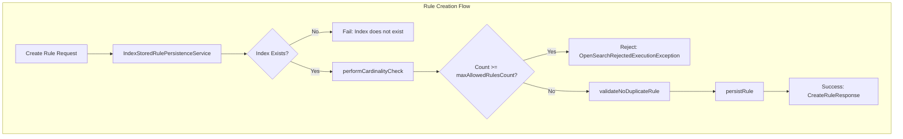

# Rule Cardinality Limit

## Summary

This release introduces a configurable limit on the number of rules that can be created in the Workload Management (WLM) auto-tagging system. The feature prevents users from creating unlimited rule documents, which could lead to performance degradation and resource exhaustion. A default limit of 200 rules is enforced, with a configurable range between 10 and 500.

## Details

### What's New in v3.2.0

OpenSearch v3.2.0 adds a cardinality check to the rule creation process in the WLM auto-tagging framework. Before creating a new rule, the system now validates that the total number of existing rules does not exceed the configured maximum. If the limit is reached, the create operation is rejected with an `OpenSearchRejectedExecutionException`.

### Technical Changes

#### New Components

| Component | Description |
|-----------|-------------|
| `MAX_WLM_RULES_SETTING` | Dynamic cluster setting to configure maximum allowed rules |
| `performCardinalityCheck()` | Method in `IndexStoredRulePersistenceService` that validates rule count before creation |
| `getCardinalityQuery()` | New method in `RuleQueryMapper` interface for counting existing rules |

#### New Configuration

| Setting | Description | Default | Range |
|---------|-------------|---------|-------|
| `wlm.autotagging.max_rules` | Maximum number of rules allowed in the system | 200 | 10-500 |

The setting is:
- **Node-scoped**: Applied at the node level
- **Dynamic**: Can be updated at runtime without restart

#### Architecture Changes



#### API Changes

No new APIs are introduced. The existing Rule CRUD APIs now enforce the cardinality limit:

- `PUT /_rules/workload_group` - Create rule (now validates cardinality)
- `POST /_rules/workload_group` - Create rule (now validates cardinality)

### Usage Example

**Configure Maximum Rules:**
```json
PUT _cluster/settings
{
  "persistent": {
    "wlm.autotagging.max_rules": 300
  }
}
```

**Error Response When Limit Exceeded:**
```json
{
  "error": {
    "root_cause": [
      {
        "type": "rejected_execution_exception",
        "reason": "This create operation will violate the cardinality limit of 200. Please delete some stale or redundant rules first"
      }
    ],
    "type": "rejected_execution_exception",
    "reason": "This create operation will violate the cardinality limit of 200. Please delete some stale or redundant rules first"
  },
  "status": 429
}
```

### Migration Notes

- Existing clusters with more than 200 rules will not be affected until new rule creation is attempted
- Administrators should review and clean up unused rules if approaching the limit
- The limit can be increased up to 500 if more rules are required

## Limitations

- The cardinality check uses a synchronous search operation which may add slight latency to rule creation
- The error message currently shows the default limit (200) rather than the configured limit
- The limit applies cluster-wide, not per feature type

## Related PRs

| PR | Description |
|----|-------------|
| [#18663](https://github.com/opensearch-project/OpenSearch/pull/18663) | Add the configurable limit on rule cardinality |

## References

- [Workload Management Documentation](https://docs.opensearch.org/3.0/tuning-your-cluster/availability-and-recovery/workload-management/wlm-feature-overview/)
- [Rule Lifecycle API](https://docs.opensearch.org/3.0/tuning-your-cluster/availability-and-recovery/rule-based-autotagging/rule-lifecycle-api/)

## Related Feature Report

- [Full feature documentation](../../../features/opensearch/workload-management.md)
