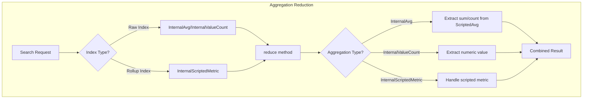

---
tags:
  - domain/core
  - component/server
  - indexing
  - observability
  - search
---
# Scripted Metric Aggregation Support in Reducing Aggregations

## Summary

This release adds support for `InternalScriptedMetric` when reducing `InternalValueCount` and `InternalAvg` aggregations. This fix resolves a `ClassCastException` that occurred when searching rollup and raw indices together, where rollup indices use scripted metric aggregations internally.

## Details

### What's New in v3.2.0

The Index Management plugin introduced support for searching rollup and raw indices together in a previous release. However, a bug was discovered where a `ClassCastException` occurred when trying to reduce `InternalValueCount` and `InternalAvg` aggregations because both used `InternalScriptedMetric` in their aggregation builder for rollup indices.

This PR fixes the issue by adding support for `InternalScriptedMetric` in the reduce methods of both aggregation types.

### Technical Changes

#### New Components

| Component | Description |
|-----------|-------------|
| `ScriptedAvg` | New class to represent scripted average calculations containing sum and count values |

#### Modified Components

| Component | Change |
|-----------|--------|
| `InternalAvg.reduce()` | Now handles `InternalScriptedMetric` aggregations by extracting `ScriptedAvg` objects |
| `InternalValueCount.reduce()` | Now handles `InternalScriptedMetric` aggregations by extracting numeric values |

#### Architecture Changes



### Usage Example

When searching across both rollup and raw indices with avg or value_count aggregations:

```json
GET rollup_index,raw_index/_search
{
  "size": 0,
  "aggs": {
    "avg_field": {
      "avg": {
        "field": "numeric_field"
      }
    },
    "count_field": {
      "value_count": {
        "field": "numeric_field"
      }
    }
  }
}
```

The aggregation now correctly combines results from both index types without throwing a `ClassCastException`.

### Migration Notes

No migration required. This is a bug fix that enables previously failing queries to work correctly.

## Limitations

- The `ScriptedAvg` class expects a specific format from the scripted metric aggregation result
- Invalid scripted metric results will throw an `IllegalArgumentException` with a descriptive error message

## References

### Documentation
- [Scripted Metric Aggregation Documentation](https://docs.opensearch.org/3.0/aggregations/metric/scripted-metric/): Official docs
- [Index Rollups Documentation](https://docs.opensearch.org/3.0/im-plugin/index-rollups/index/): Rollup feature docs
- [PR #18288](https://github.com/opensearch-project/OpenSearch/pull/18288): Related PR (closed without merge)
- [Index Management PR #1268](https://github.com/opensearch-project/index-management/pull/1268): Original rollup and raw indices search support

### Pull Requests
| PR | Description |
|----|-------------|
| [#18411](https://github.com/opensearch-project/OpenSearch/pull/18411) | Supporting Scripted Metric Aggregation when reducing aggregations in InternalValueCount and InternalAvg |

## Related Feature Report

- Full feature documentation
