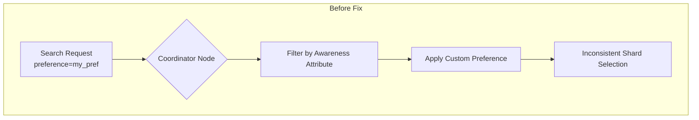
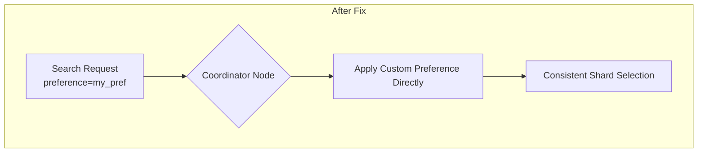

---
tags:
  - domain/core
  - component/server
  - indexing
  - search
---
# Search Preference & Awareness Fix

## Summary

This bugfix resolves an issue where custom string preferences in search requests did not produce consistent shard routing when awareness attributes were enabled on the cluster. Previously, the coordinating node's awareness attribute would take precedence over the custom preference string, causing inconsistent routing behavior.

## Details

### What's New in v3.2.0

The fix modifies the `OperationRouting` class to ignore awareness attributes when a custom string preference is provided with a search request. This ensures that custom preference strings now behave consistently, regardless of which node acts as the coordinator.

### Technical Changes

#### Problem Background

When awareness attributes (e.g., `rack`, `zone`) are configured on a cluster:
1. The coordinating node would prefer shards sharing its own awareness attribute
2. Custom preference strings were only applied *after* this attribute-based filtering
3. Different coordinators with different attributes would route the same preference string to different shards



#### Solution

The fix changes the behavior so that custom string preferences bypass awareness attribute filtering entirely, matching the behavior of other preference types like `_primary`, `_local`, etc.



#### Code Change

In `OperationRouting.java`, the `preferenceActiveShardIterator` method was simplified:

```java
// Before: Custom preference still considered awareness attributes
} else if (ignoreAwarenessAttributes()) {
    return indexShard.activeInitializingShardsIt(routingHash);
} else {
    return indexShard.preferAttributesActiveInitializingShardsIt(awarenessAttributes, nodes, routingHash);
}

// After: Custom preference always ignores awareness attributes
} else {
    return indexShard.activeInitializingShardsIt(routingHash);
}
```

### Usage Example

Custom preference strings now work consistently:

```bash
# This will always route to the same shard replica, regardless of coordinator
GET /my-index/_search?preference=user_session_123
{
  "query": {
    "match_all": {}
  }
}
```

### Migration Notes

No migration required. This is a behavioral fix that makes custom preference strings work as expected. Existing queries using custom preference strings will now route consistently.

## Limitations

- This fix only affects custom string preferences (e.g., `preference=my_custom_string`)
- Other preference types (`_primary`, `_local`, `_shards`, etc.) already bypassed awareness attributes
- Weighted routing still takes precedence when configured with strict mode

## References

### Documentation
- [Search Shard Routing Documentation](https://docs.opensearch.org/3.0/search-plugins/searching-data/search-shard-routing/): Official documentation on search shard routing

### Pull Requests
| PR | Description |
|----|-------------|
| [#18848](https://github.com/opensearch-project/OpenSearch/pull/18848) | Ignore awareness attributes when custom preference is set |

### Issues (Design / RFC)
- [Issue #18817](https://github.com/opensearch-project/OpenSearch/issues/18817): Bug report - Custom string preference with awareness attributes does not produce consistent routing

## Related Feature Report

- [Full feature documentation](../../../../features/opensearch/opensearch-search-shard-routing.md)
