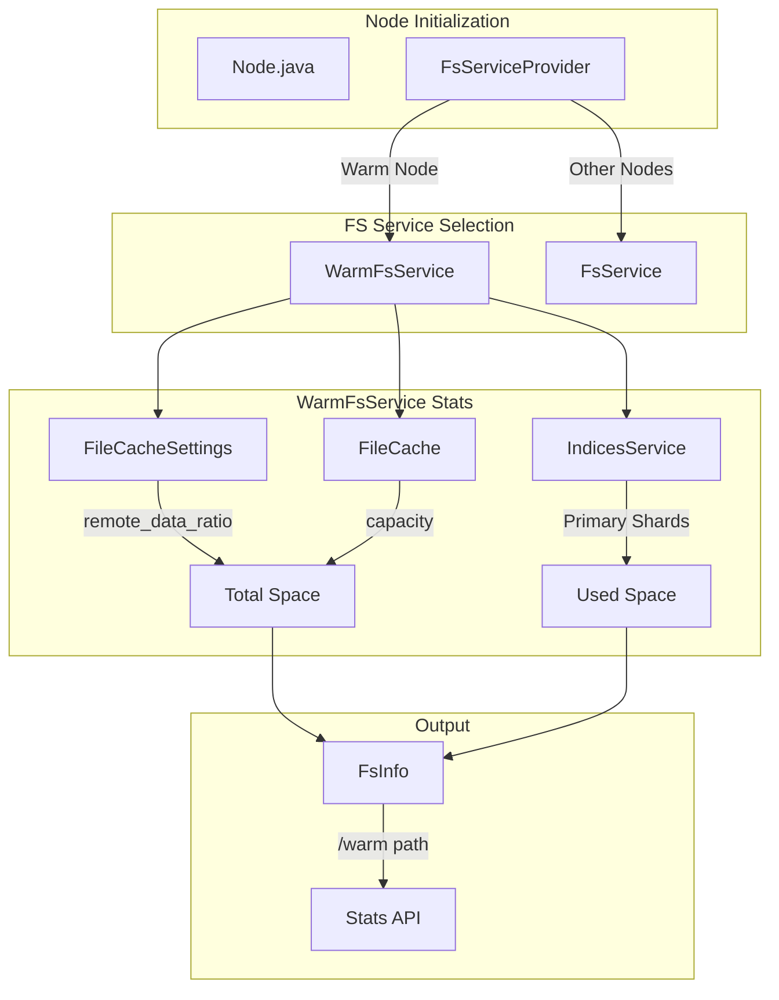

---
tags:
  - indexing
  - observability
  - performance
---

# Searchable Snapshots & Writeable Warm

## Summary

This release changes the default value of `cluster.filecache.remote_data_ratio` from 0 (unlimited) to 5, and introduces a new `WarmFsService` that provides accurate filesystem statistics for warm nodes based on addressable space rather than physical disk metrics.

## Details

### What's New in v3.2.0

#### Default remote_data_ratio Change

The `cluster.filecache.remote_data_ratio` setting now defaults to 5 instead of 0, with a minimum allowed value of 1. This setting controls the maximum ratio of remote data to local file cache size for searchable snapshots and writeable warm features.

**Previous behavior (v3.1.0 and earlier):**
- Default: `0` (no limit)
- Minimum: `0`

**New behavior (v3.2.0):**
- Default: `5`
- Minimum: `1`

This change provides a safeguard against oversubscribing clusters with remote data.

#### Warm Node FS Stats Based on Addressable Space

Previously, warm nodes reported physical filesystem statistics similar to hot nodes, which didn't accurately reflect the actual addressable storage capacity. The new implementation calculates disk usage based on:

- **Total space** = `file_cache_size × remote_data_ratio`
- **Used space** = Sum of all primary shard sizes on the warm node
- **Free space** = Total - Used

### Technical Changes

#### Architecture Changes



#### New Components

| Component | Description |
|-----------|-------------|
| `FsServiceProvider` | Factory class that creates appropriate FsService based on node type (warm vs. other) |
| `WarmFsService` | Specialized FsService for warm nodes that calculates disk usage based on addressable space |

#### Configuration Changes

| Setting | Old Default | New Default | New Minimum |
|---------|-------------|-------------|-------------|
| `cluster.filecache.remote_data_ratio` | `0` (unlimited) | `5` | `1` |

### Usage Example

#### Warm Node FS Stats Response

```json
GET /_nodes/<warm-node>/stats/fs?pretty
{
  "nodes": {
    "<node-id>": {
      "name": "opensearch-warm1",
      "roles": ["warm"],
      "fs": {
        "total": {
          "total_in_bytes": 2097152000,
          "free_in_bytes": 2064519020,
          "available_in_bytes": 2064519020,
          "cache_reserved_in_bytes": 1048576000,
          "cache_utilized": 32632980
        },
        "data": [
          {
            "path": "/warm",
            "mount": "warm",
            "type": "warm",
            "total_in_bytes": 2097152000,
            "free_in_bytes": 2064519020,
            "available_in_bytes": 2064519020,
            "cache_reserved_in_bytes": 1048576000,
            "cache_utilized": 32632980
          }
        ]
      }
    }
  }
}
```

In this example with a 1GB file cache and remote_data_ratio of 2:
- Total addressable space: 2GB (1GB × 2)
- Cache reserved: 1GB
- Used by shards: ~31MB
- Free: ~1.92GB

### Migration Notes

- **Breaking change for unlimited ratio users**: If you were relying on `remote_data_ratio=0` for unlimited remote data, you must now explicitly set a higher ratio value
- The minimum value of 1 ensures at least 1:1 ratio between remote data and cache size
- Existing warm nodes will automatically use the new `WarmFsService` for accurate stats reporting
- DiskThresholdMonitor and DiskThresholdDecider now receive consistent metrics from warm nodes

## Limitations

- The `/warm` path shown in stats is a virtual path representing addressable space, not a physical filesystem path
- Only primary shard sizes are counted toward used space on warm nodes
- The change in default ratio may affect clusters that were previously operating with unlimited remote data

## References

### Documentation
- [Searchable Snapshots Documentation](https://docs.opensearch.org/3.0/tuning-your-cluster/availability-and-recovery/snapshots/searchable_snapshot/)

### Pull Requests
| PR | Description |
|----|-------------|
| [#18767](https://github.com/opensearch-project/OpenSearch/pull/18767) | FS stats for warm nodes based on addressable space; change default remote_data_ratio from 0 to 5 |

### Issues (Design / RFC)
- [Issue #18768](https://github.com/opensearch-project/OpenSearch/issues/18768): [WRITABLE WARM] FS stats for warm nodes
- [Issue #11676](https://github.com/opensearch-project/OpenSearch/issues/11676): Remote data ratio configuration details

## Related Feature Report

- [Full feature documentation](../../../../features/opensearch/warm-storage-tiering.md)
