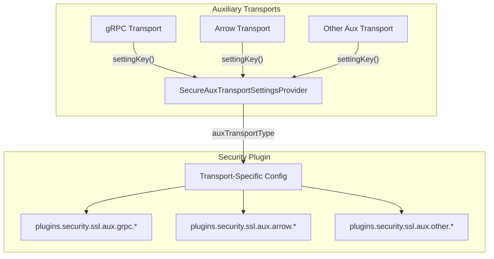

# Secure Aux Transport Settings

## Summary

This release updates the `SecureAuxTransportSettingsProvider` interface to distinguish between different auxiliary transport types. The API change allows security plugins to provide transport-specific SSL/TLS configurations for each auxiliary transport (e.g., gRPC, Arrow Flight) rather than using a single shared configuration.

## Details

### What's New in v3.2.0

The `SecureAuxTransportSettingsProvider` interface methods now accept an `auxTransportType` string parameter instead of an `AuxTransport` instance. This enables security plugins to identify which auxiliary transport is requesting security settings and provide transport-specific configurations.

### Technical Changes

#### API Changes

The interface signature changed from:

```java
// Before v3.2.0
Optional<SSLContext> buildSecureAuxServerTransportContext(Settings settings, AuxTransport transport);
Optional<SecureAuxTransportParameters> parameters();
```

To:

```java
// v3.2.0
Optional<SSLContext> buildSecureAuxServerTransportContext(Settings settings, String auxTransportType) throws SSLException;
Optional<SecureAuxTransportParameters> parameters(Settings settings, String auxTransportType) throws SSLException;
```

#### Key Changes

| Change | Description |
|--------|-------------|
| Parameter type | `AuxTransport transport` → `String auxTransportType` |
| Settings parameter | Added `Settings settings` to `parameters()` method |
| Exception handling | Both methods now declare `throws SSLException` |
| Import removal | Removed dependency on `AuxTransport` class |

#### Architecture Changes



### Usage Example

The gRPC transport now passes its setting key to the security provider:

```java
// SecureNetty4GrpcServerTransport.java
private JdkSslContext getSslContext(Settings settings, SecureAuxTransportSettingsProvider provider) throws SSLException {
    // Pass the transport's setting key instead of the transport instance
    Optional<SSLContext> sslContext = provider.buildSecureAuxServerTransportContext(settings, this.settingKey());
    
    // Get transport-specific parameters
    SecureAuxTransportParameters params = provider.parameters(settings, this.settingKey())
        .orElseGet(DefaultParameters::new);
    
    // Configure SSL context with transport-specific settings
    ClientAuth clientAuth = ClientAuth.valueOf(params.clientAuth().orElseThrow().toUpperCase(Locale.ROOT));
    return new JdkSslContext(sslContext.get(), false, params.cipherSuites(), ...);
}
```

### Migration Notes

Plugins implementing `SecureAuxTransportSettingsProvider` must update their implementations:

1. Change `buildSecureAuxServerTransportContext(Settings, AuxTransport)` to `buildSecureAuxServerTransportContext(Settings, String)`
2. Change `parameters()` to `parameters(Settings, String)`
3. Use the `auxTransportType` string to determine which transport-specific configuration to return
4. Add `throws SSLException` to method signatures

## Limitations

- The `SecureAuxTransportSettingsProvider` interface remains marked as `@ExperimentalApi`
- This is a breaking API change for existing implementations
- No authorization component is provided; only SSL/TLS configuration is supported

## Related PRs

| PR | Description |
|----|-------------|
| [#18616](https://github.com/opensearch-project/OpenSearch/pull/18616) | Update SecureAuxTransportSettingsProvider to distinguish between aux transport types |
| [security#5375](https://github.com/opensearch-project/security/pull/5375) | TLS support for auxiliary transports (security plugin implementation) |

## References

- [Issue #17795](https://github.com/opensearch-project/OpenSearch/issues/17795): Feature request for separation of auxiliary transport SSL configurations
- [SecureAuxTransportSettingsProvider.java](https://github.com/opensearch-project/OpenSearch/blob/main/server/src/main/java/org/opensearch/plugins/SecureAuxTransportSettingsProvider.java): Interface definition

## Related Feature Report

- [Full feature documentation](../../../features/opensearch/secure-aux-transport-settings.md)
