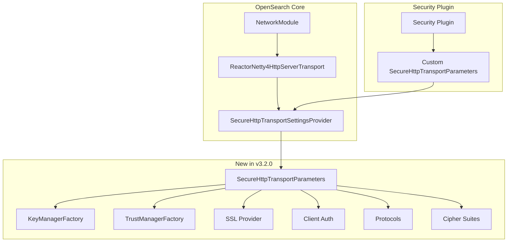

---
tags:
  - security
---

# Secure Transport Parameters

## Summary

This release introduces the `SecureHttpTransportParameters` experimental API, which complements the existing `SecureTransportParameters` interface. This new API provides a cleaner and more robust way to configure SSL context in the Reactor Netty 4 HTTP transport, addressing fragility issues in the previous SSL configuration approach.

## Details

### What's New in v3.2.0

The `SecureHttpTransportParameters` interface is added to `SecureHttpTransportSettingsProvider`, enabling security plugins to provide dynamic SSL/TLS configuration parameters specifically for HTTP transport. This mirrors the existing `SecureTransportParameters` interface used for inter-node transport communication.

### Technical Changes

#### Architecture Changes



#### New Components

| Component | Description |
|-----------|-------------|
| `SecureHttpTransportParameters` | New interface for providing dynamic HTTP transport SSL parameters |
| `DefaultSecureHttpTransportParameters` | Default implementation returning empty/default values |

#### New Configuration

The `SecureHttpTransportParameters` interface provides the following configuration options:

| Method | Return Type | Description |
|--------|-------------|-------------|
| `keyManagerFactory()` | `Optional<KeyManagerFactory>` | Provides the key manager factory for SSL |
| `trustManagerFactory()` | `Optional<TrustManagerFactory>` | Provides the trust manager factory for SSL |
| `sslProvider()` | `Optional<String>` | SSL provider (JDK, OpenSSL, etc.) |
| `clientAuth()` | `Optional<String>` | Client authentication level |
| `protocols()` | `Collection<String>` | Supported SSL/TLS protocols |
| `cipherSuites()` | `Collection<String>` | Supported cipher suites |

#### API Changes

New method added to `SecureHttpTransportSettingsProvider`:

```java
/**
 * Returns parameters that can be dynamically provided by a plugin 
 * providing a SecureHttpTransportParameters implementation
 * @param settings settings
 * @return an instance of SecureHttpTransportParameters
 */
default Optional<SecureHttpTransportParameters> parameters(Settings settings) {
    return Optional.of(new DefaultSecureHttpTransportParameters());
}
```

New interface `SecureHttpTransportParameters`:

```java
@ExperimentalApi
interface SecureHttpTransportParameters {
    Optional<KeyManagerFactory> keyManagerFactory();
    Optional<String> sslProvider();
    Optional<String> clientAuth();
    Collection<String> protocols();
    Collection<String> cipherSuites();
    Optional<TrustManagerFactory> trustManagerFactory();
}
```

### Usage Example

Security plugins can implement `SecureHttpTransportParameters` to provide custom SSL configuration:

```java
public class CustomSecureHttpTransportParameters 
    implements SecureHttpTransportSettingsProvider.SecureHttpTransportParameters {
    
    @Override
    public Optional<KeyManagerFactory> keyManagerFactory() {
        // Return custom KeyManagerFactory
        return Optional.of(customKeyManagerFactory);
    }
    
    @Override
    public Optional<TrustManagerFactory> trustManagerFactory() {
        // Return custom TrustManagerFactory
        return Optional.of(customTrustManagerFactory);
    }
    
    @Override
    public Optional<String> sslProvider() {
        return Optional.of("OpenSSL");
    }
    
    @Override
    public Optional<String> clientAuth() {
        return Optional.of("REQUIRE");
    }
    
    @Override
    public Collection<String> protocols() {
        return List.of("TLSv1.2", "TLSv1.3");
    }
    
    @Override
    public Collection<String> cipherSuites() {
        return List.of(
            "TLS_AES_256_GCM_SHA384",
            "TLS_AES_128_GCM_SHA256"
        );
    }
}
```

### Migration Notes

- This is an **experimental API** (`@ExperimentalApi`) and may change in future releases
- Existing implementations using `SecureHttpTransportSettingsProvider` will continue to work with the default implementation
- Security plugins should implement `SecureHttpTransportParameters` to take advantage of the cleaner SSL configuration approach

## Limitations

- The API is marked as experimental and subject to change
- The default implementation returns empty optionals and empty collections, requiring plugins to provide actual values
- This change is part of ongoing work to fix HTTP/2 communication issues with reactor-netty transport

## References

### Documentation
- [Network Settings Documentation](https://docs.opensearch.org/3.0/install-and-configure/configuring-opensearch/network-settings/): Reactor Netty transport configuration

### Pull Requests
| PR | Description |
|----|-------------|
| [#18572](https://github.com/opensearch-project/OpenSearch/pull/18572) | Introduce SecureHttpTransportParameters experimental API |

### Issues (Design / RFC)
- [Issue #18559](https://github.com/opensearch-project/OpenSearch/issues/18559): BUG - Cannot communicate with http2 when reactor-netty is enabled

## Related Feature Report

- [Full feature documentation](../../../../features/opensearch/opensearch-secure-transport-settings.md)
