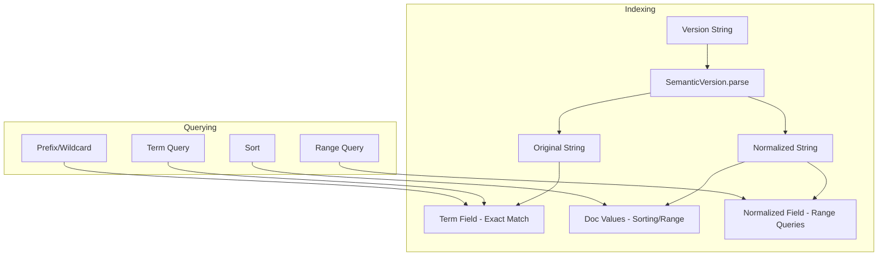

---
tags:
  - indexing
  - neural-search
  - search
---

# Semantic Version Field Type

## Summary

OpenSearch v3.2.0 introduces a new `version` field type that enables native indexing and querying of semantic version strings following the [SemVer 2.0.0 specification](https://semver.org/). This field type allows correct ordering and range queries for version strings like `1.0.0`, `1.0.0-alpha`, and `2.1.0+build.1`, addressing a long-requested feature for version-aware sorting and filtering.

## Details

### What's New in v3.2.0

The `version` field type provides:

- Native semantic versioning support with proper precedence ordering
- Pre-release version handling (`-alpha`, `-beta`, `-rc.1`)
- Build metadata support (`+build.123`) - ignored for ordering per SemVer spec
- Comprehensive query support including term, range, prefix, wildcard, regex, and fuzzy queries
- Proper sorting that respects semantic version precedence

### Technical Changes

#### Architecture



#### New Components

| Component | Description |
|-----------|-------------|
| `SemanticVersion` | Core class for parsing, comparing, and normalizing semantic version strings |
| `SemanticVersionFieldMapper` | Field mapper that handles indexing and query generation |
| `SemanticVersionFieldType` | Field type supporting term, range, prefix, wildcard, regex, and fuzzy queries |

#### Mapping Configuration

| Setting | Description | Default |
|---------|-------------|---------|
| `type` | Must be `version` | Required |
| `index` | Enable indexing for search | `true` |
| `doc_values` | Enable doc values for sorting/aggregations | `true` |
| `store` | Store original value for retrieval | `false` |

### Usage Example

**Create index with version field:**
```json
PUT test_versions
{
  "mappings": {
    "properties": {
      "app": { "type": "keyword" },
      "version": { "type": "version" },
      "release_date": { "type": "date" }
    }
  }
}
```

**Index documents:**
```json
POST test_versions/_bulk
{ "index": {} }
{ "app": "MyApp", "version": "1.0.0", "release_date": "2023-01-01" }
{ "index": {} }
{ "app": "MyApp", "version": "1.0.0-alpha", "release_date": "2022-12-01" }
{ "index": {} }
{ "app": "MyApp", "version": "1.0.0-beta", "release_date": "2022-12-15" }
{ "index": {} }
{ "app": "MyApp", "version": "2.0.0", "release_date": "2024-01-01" }
```

**Range query:**
```json
GET test_versions/_search
{
  "query": {
    "range": {
      "version": { "gte": "1.0.0", "lt": "2.0.0" }
    }
  }
}
```

**Sort by version:**
```json
GET test_versions/_search
{
  "query": { "match_all": {} },
  "sort": [{ "version": { "order": "asc" }}]
}
```

Results are sorted correctly: `1.0.0-alpha` < `1.0.0-beta` < `1.0.0` < `2.0.0`

### Supported Query Types

| Query Type | Support | Notes |
|------------|---------|-------|
| `term` | ✅ | Exact version match |
| `terms` | ✅ | Multiple version match |
| `range` | ✅ | Semantic version ordering |
| `prefix` | ✅ | Version prefix matching |
| `wildcard` | ✅ | Pattern matching |
| `regexp` | ✅ | Regex pattern matching |
| `fuzzy` | ✅ | Fuzzy version matching |
| `exists` | ✅ | Field existence check |
| `match` | ✅ | Full-text match |
| `match_phrase` | ✅ | Phrase matching |

### Version Precedence

Following SemVer 2.0.0 specification:

1. Major, minor, patch versions compared numerically
2. Pre-release versions have lower precedence than normal versions
3. Pre-release identifiers compared left-to-right
4. Numeric identifiers compared as integers
5. Alphanumeric identifiers compared lexically
6. Build metadata is ignored for precedence

Example ordering:
```
1.0.0-alpha < 1.0.0-alpha.1 < 1.0.0-beta < 1.0.0-beta.2 < 1.0.0-rc.1 < 1.0.0
```

## Limitations

- Aggregations on version fields are not yet fully supported (added to test denylist)
- Version strings must conform to SemVer 2.0.0 format
- Leading zeros in numeric identifiers are not allowed (e.g., `01.0.0` is invalid)

## References

### Documentation
- [Semantic Versioning 2.0.0](https://semver.org/): SemVer specification

### Pull Requests
| PR | Description |
|----|-------------|
| [#18454](https://github.com/opensearch-project/OpenSearch/pull/18454) | Add Semantic Version field type mapper |

### Issues (Design / RFC)
- [Issue #16814](https://github.com/opensearch-project/OpenSearch/issues/16814): Feature request for semantic versioning support

## Related Feature Report

- [Full feature documentation](../../../../features/opensearch/semantic-version-field-type.md)
