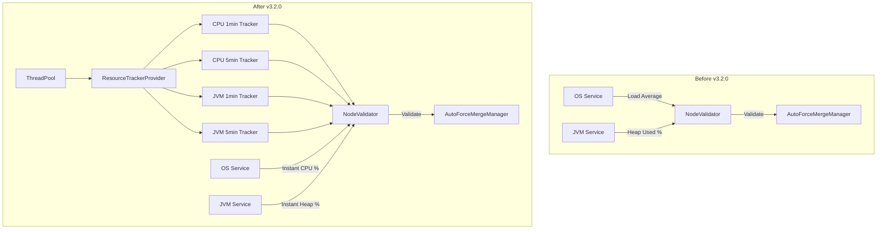

---
tags:
  - domain/core
  - component/server
  - performance
---
# Staggered Merge Optimization

## Summary

This bugfix improves the Auto Force Merge Manager's resource monitoring accuracy by replacing the CPU load average calculation with dedicated `AverageTracker` classes. The change provides more reliable resource usage measurements using 1-minute and 5-minute moving averages for both CPU and JVM memory, along with adjusted default thresholds for better merge scheduling decisions.

## Details

### What's New in v3.2.0

The Auto Force Merge Manager now uses `AverageCpuUsageTracker` and `AverageMemoryUsageTracker` classes instead of raw OS load average values. This provides more accurate and consistent resource monitoring for merge scheduling decisions.

### Technical Changes

#### Architecture Changes



#### New Components

| Component | Description |
|-----------|-------------|
| `ResourceTrackerProvider` | Factory class that creates and manages resource usage trackers |
| `ResourceTrackers` | Container holding CPU and JVM memory trackers with 1-minute and 5-minute windows |

#### Configuration Changes

| Setting | Old Default | New Default | Description |
|---------|-------------|-------------|-------------|
| `node.auto_force_merge.cpu.threshold` | 80% | 75% | CPU usage threshold to pause merge operations |
| `node.auto_force_merge.disk.threshold` | 90% | 85% | Disk usage threshold to pause merge operations |
| `node.auto_force_merge.merge_delay` | 10s | 15s | Delay between consecutive shard merges |

#### Resource Tracking Configuration

| Constant | Value | Description |
|----------|-------|-------------|
| `SHORT_POLL_INTERVAL` | 6 seconds | Polling interval for 1-minute average trackers |
| `LONG_POLL_INTERVAL` | 30 seconds | Polling interval for 5-minute average trackers |
| `SHORT_AVERAGE_WINDOW` | 1 minute | Time window for short-term averages |
| `LONG_AVERAGE_WINDOW` | 5 minutes | Time window for long-term averages |

### Validation Logic Changes

The `NodeValidator` now performs a three-tier check for both CPU and JVM:

1. **5-minute average** - Checked first for trend detection
2. **1-minute average** - Checked for recent spikes
3. **Instant value** - Fallback to current reading

```java
// CPU validation order
if (cpuFiveMinuteAverage >= threshold) return false;
if (cpuOneMinuteAverage >= threshold) return false;
if (instantCpuPercent >= threshold) return false;

// JVM validation order  
if (jvmFiveMinuteAverage >= threshold) return false;
if (jvmOneMinuteAverage >= threshold) return false;
if (instantJvmHeapPercent >= threshold) return false;
```

### Lifecycle Management

Resource trackers are now lifecycle-managed:
- **Start**: Trackers begin polling when `NodeValidator.validate()` is called
- **Stop**: Trackers stop when configuration validation fails (no warm nodes) or feature is disabled

This prevents unnecessary resource consumption when auto force merge is not active.

### Usage Example

No configuration changes required. The improvements are automatic when auto force merge is enabled:

```json
PUT _cluster/settings
{
  "persistent": {
    "cluster.auto_force_merge.enabled": true
  }
}
```

### Migration Notes

- Default thresholds have been lowered, which may result in more conservative merge scheduling
- If you had custom threshold settings, review them against the new defaults
- No API changes; existing configurations remain compatible

## Limitations

- Resource trackers add minimal memory overhead for storing moving averages
- Short polling interval (6 seconds) may slightly increase CPU sampling overhead
- Trackers require warm-up period before averages stabilize

## References

### Documentation
- [PR #18229](https://github.com/opensearch-project/OpenSearch/pull/18229): Original Auto Force Merge Manager implementation

### Pull Requests
| PR | Description |
|----|-------------|
| [#18666](https://github.com/opensearch-project/OpenSearch/pull/18666) | Replaced CPU load average logic with AverageTracker classes, modified default thresholds |

### Issues (Design / RFC)
- [Issue #20127](https://github.com/opensearch-project/OpenSearch/issues/20127): Related test failures being addressed

## Related Feature Report

- Warm Storage Tiering
