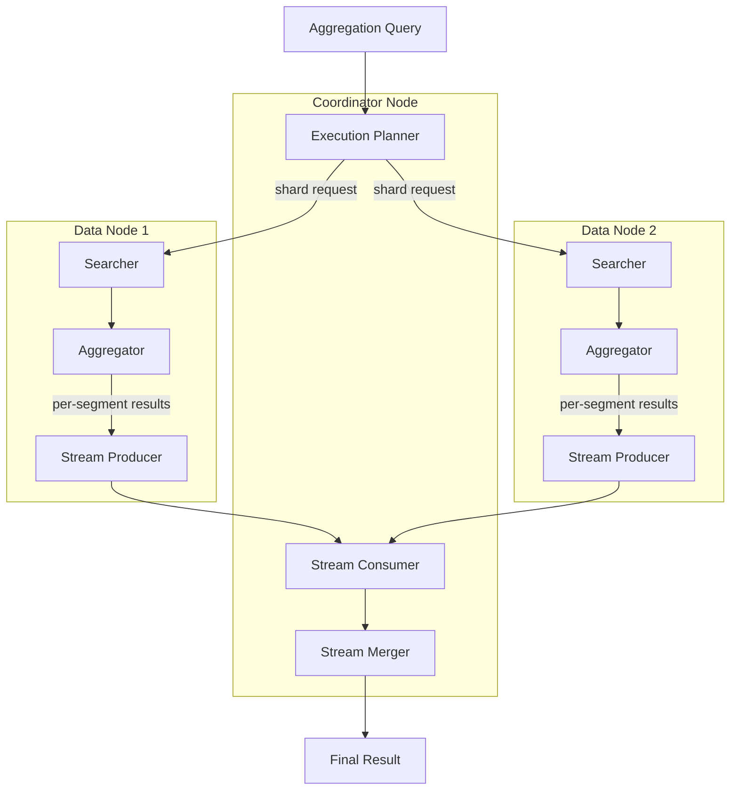

---
tags:
  - indexing
  - search
---

# Streaming Transport & Aggregation

## Summary

OpenSearch v3.2.0 introduces a new streaming transport framework and streaming aggregation capability. This feature enables memory-efficient aggregation processing by streaming partial results from data nodes to coordinator nodes, reducing memory pressure on data nodes and improving cluster stability for high-cardinality aggregation workloads.

## Details

### What's New in v3.2.0

This release introduces two major components:

1. **Stream Transport Framework**: A new transport layer that supports streaming responses, enabling multiple response batches for a single request
2. **Streaming Aggregation**: Per-segment aggregation results streamed to the coordinator, shifting memory load from data nodes to coordinator nodes

### Technical Changes

#### Architecture Changes



#### New Components

| Component | Description |
|-----------|-------------|
| `StreamTransportService` | Transport service for streaming requests with configurable timeout |
| `StreamSearchTransportService` | Search-specific streaming transport handling query/fetch phases |
| `StreamTransportResponseHandler` | Handler interface for processing streaming responses |
| `StreamQueryPhaseResultConsumer` | Consumes streaming aggregation results and merges them |
| `StreamSearchQueryThenFetchAsyncAction` | Async action coordinating streaming search execution |
| `StreamStringTermsAggregator` | Per-segment terms aggregator for streaming mode |
| `StreamSearchChannelListener` | Listener for sending streaming responses back to coordinator |

#### New Configuration

| Setting | Description | Default |
|---------|-------------|---------|
| `transport.stream.request_timeout` | Timeout for streaming transport requests | 5 minutes |
| `opensearch.experimental.feature.transport.stream.enabled` | Feature flag to enable stream transport | false |

#### API Changes

New `stream` query parameter for search REST endpoint:

```bash
GET /index/_search?stream=true
{
  "size": 0,
  "aggs": {
    "my_terms": {
      "terms": { "field": "category" }
    }
  }
}
```

### Usage Example

```java
// Client-side: Using streaming search
SearchRequestBuilder builder = client.prepareStreamSearch("index")
    .addAggregation(AggregationBuilders.terms("agg1").field("field1"))
    .setSize(0);
SearchResponse response = builder.execute().actionGet();
```

### Migration Notes

1. Enable the feature flag: `opensearch.experimental.feature.transport.stream.enabled=true`
2. Install the `arrow-flight-rpc` plugin for the underlying stream transport implementation
3. The feature is experimental and behind a feature flag - not recommended for production use yet

## Limitations

- Currently supports only `terms` bucket aggregation and `max` metric aggregation
- Requires the Arrow Flight RPC plugin to be installed
- Feature is experimental and behind a feature flag
- Does not support concurrent segment search mode with streaming
- Only `QUERY_THEN_FETCH` search type is supported for streaming

## References

### Pull Requests
| PR | Description |
|----|-------------|
| [#18722](https://github.com/opensearch-project/OpenSearch/pull/18722) | APIs for stream transport and stream-based search action |
| [#18874](https://github.com/opensearch-project/OpenSearch/pull/18874) | Streaming aggregation implementation |

### Issues (Design / RFC)
- [RFC #16774](https://github.com/opensearch-project/OpenSearch/issues/16774): Streaming Aggregation - A Memory-Efficient Approach
- [RFC #18425](https://github.com/opensearch-project/OpenSearch/issues/18425): Alternate Stream Transport in OpenSearch

## Related Feature Report

- [Full feature documentation](../../../features/opensearch/streaming-transport-aggregation.md)
