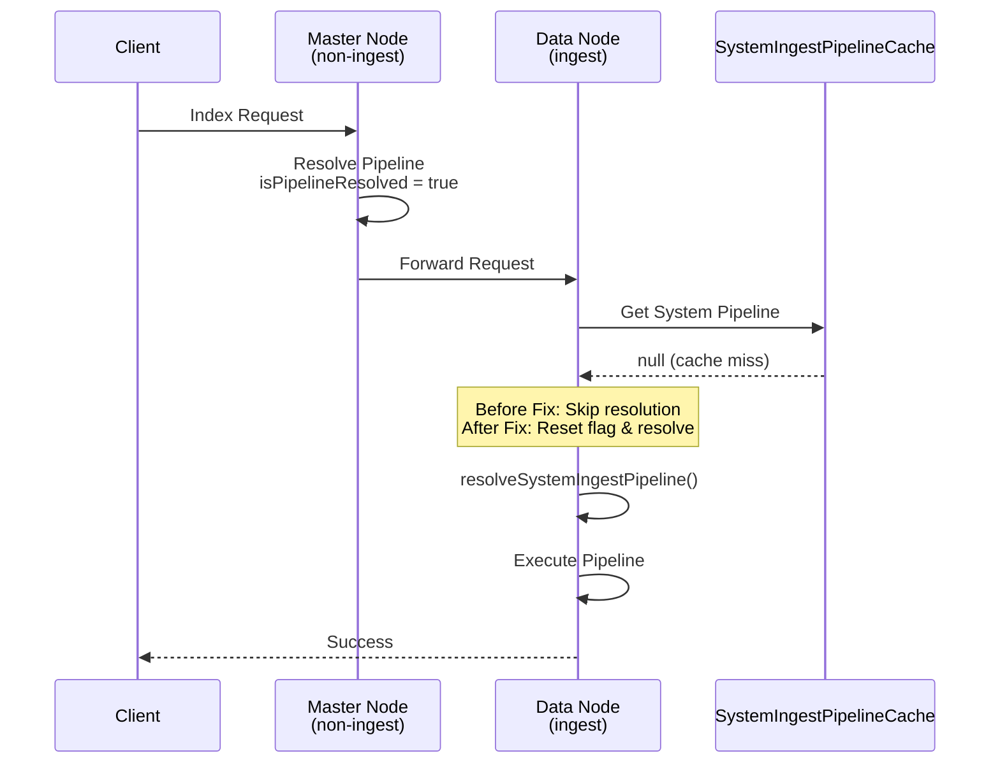

---
tags:
  - indexing
  - performance
---

# System Ingest Pipeline Fix

## Summary

This bugfix resolves an issue where the system ingest pipeline was not triggered when an index request was forwarded from a non-ingest node to an ingest node. The fix ensures that the `isPipelineResolved` flag is reset before attempting to resolve the system ingest pipeline again on the ingest node.

## Details

### What's New in v3.2.0

Fixed a bug where system ingest pipelines were silently skipped when:
1. An index request arrives at a non-ingest node (e.g., a dedicated master node)
2. The non-ingest node resolves the pipeline and marks `isPipelineResolved = true`
3. The request is forwarded to an ingest node
4. The ingest node's cache doesn't have the system pipeline
5. The ingest node skips pipeline resolution because `isPipelineResolved` is already `true`

### Technical Changes

#### Root Cause

The `IngestService.getPipeline()` method checks the `SystemIngestPipelineCache` for cached pipelines. When the cache is empty (e.g., on a fresh ingest node), it should re-resolve the system pipeline. However, the code was checking `indexRequest.isPipelineResolved()` before attempting resolution, causing it to skip the resolution step entirely.

#### Fix Implementation

The fix resets `isPipelineResolved` to `false` before calling `resolveSystemIngestPipeline()`:

```java
// In IngestService.getPipeline()
if (indexPipeline == null) {
    // reset isPipelineResolved as false so that we can resolve it again
    indexRequest.isPipelineResolved(false);
    resolveSystemIngestPipeline(actionRequest, indexRequest, state.metadata());
    // ...
}
```

#### Affected Code

| File | Change |
|------|--------|
| `IngestService.java` | Reset `isPipelineResolved` flag before re-resolving system pipeline |
| `IngestServiceTests.java` | Added test for cache miss scenario with forwarded requests |

### Scenario



### Impact

Without this fix, documents indexed through non-ingest nodes would not have system ingest processors applied, leading to:
- Missing auto-generated embeddings for semantic fields
- Inconsistent data depending on which node received the request
- Silent failures with no error messages

## Limitations

- This fix addresses the specific case of request forwarding between nodes
- The underlying cache invalidation behavior remains unchanged

## References

### Blog Posts
- [Blog: Making ingestion smarter](https://opensearch.org/blog/making-ingestion-smarter-system-ingest-pipelines-in-opensearch/): System ingest pipeline overview

### Pull Requests
| PR | Description |
|----|-------------|
| [#18911](https://github.com/opensearch-project/OpenSearch/pull/18911) | Reset isPipelineResolved to false to resolve the system ingest pipeline again |

### Issues (Design / RFC)
- [Issue #18909](https://github.com/opensearch-project/OpenSearch/issues/18909): System ingest pipeline not triggered when request is from a non-ingest node

## Related Feature Report

- [Full feature documentation](../../../features/opensearch/system-ingest-pipeline.md)
