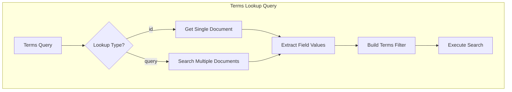

---
tags:
  - indexing
  - search
---

# Terms Lookup Query Enhancement

## Summary

OpenSearch v3.2.0 enhances the Terms Lookup Query to accept a query clause instead of only supporting a single document ID. This allows users to dynamically extract field values from multiple documents matching a query and use them as filter terms, enabling more flexible and powerful filtering scenarios.

## Details

### What's New in v3.2.0

Previously, the Terms Lookup Query required specifying a single document ID to fetch terms from. This enhancement introduces the ability to use a query clause to match multiple documents and collect all values from a specified field across those matches.

### Technical Changes

#### Architecture Changes



#### New Parameters

| Parameter | Type | Description |
|-----------|------|-------------|
| `query` | Object | A query clause to match documents for terms extraction. Mutually exclusive with `id`. |

#### Validation Rules

- Either `id` or `query` must be specified, but not both
- `index` and `path` remain required parameters
- When using `query`, results are limited by `max_terms_count`, `max_result_window`, and `max_clause_count` settings

#### Value Collection Behavior

When using query-based lookup:
- If a document does not contain the specified field, it is ignored
- If the field is a list, all items are collected
- If the field is a scalar, its value is collected
- Values from multiple documents are flattened and deduplicated
- If no documents match or none contain the field, the query matches nothing

### Usage Example

**Setup indexes:**
```json
PUT /users
{
  "mappings": {
    "properties": {
      "username": { "type": "keyword" }
    }
  }
}

PUT /groups
{
  "mappings": {
    "properties": {
      "group": { "type": "keyword" },
      "members": { "type": "keyword" }
    }
  }
}
```

**Query using terms lookup by query:**
```json
GET /users/_search
{
  "query": {
    "terms": {
      "username": {
        "index": "groups",
        "path": "members",
        "query": {
          "term": { "group": "g1" }
        }
      }
    }
  }
}
```

This query:
1. Searches the `groups` index for documents where `group` equals `g1`
2. Collects all values from the `members` field across matching documents
3. Uses those values as terms to filter the `users` index by `username`

### Migration Notes

- Existing queries using `id` parameter continue to work unchanged
- To migrate from ID-based to query-based lookup, replace `id` with `query` parameter
- Consider index settings limits when using query-based lookup with large result sets

## Limitations

- Total hits from the subquery cannot exceed the minimum of `max_terms_count`, `max_result_window`, and `max_clause_count`
- Query-based lookup may have higher latency than ID-based lookup due to search execution
- The `store` parameter works with both ID and query-based lookups

## References

### Documentation
- [Terms Query Documentation](https://docs.opensearch.org/3.2/query-dsl/term/terms/): Official documentation

### Pull Requests
| PR | Description |
|----|-------------|
| [#18195](https://github.com/opensearch-project/OpenSearch/pull/18195) | Enhance terms lookup query to take a query clause |

### Issues (Design / RFC)
- [Issue #17599](https://github.com/opensearch-project/OpenSearch/issues/17599): Original feature request

## Related Feature Report

- [Full feature documentation](../../../../features/opensearch/terms-lookup-query.md)
