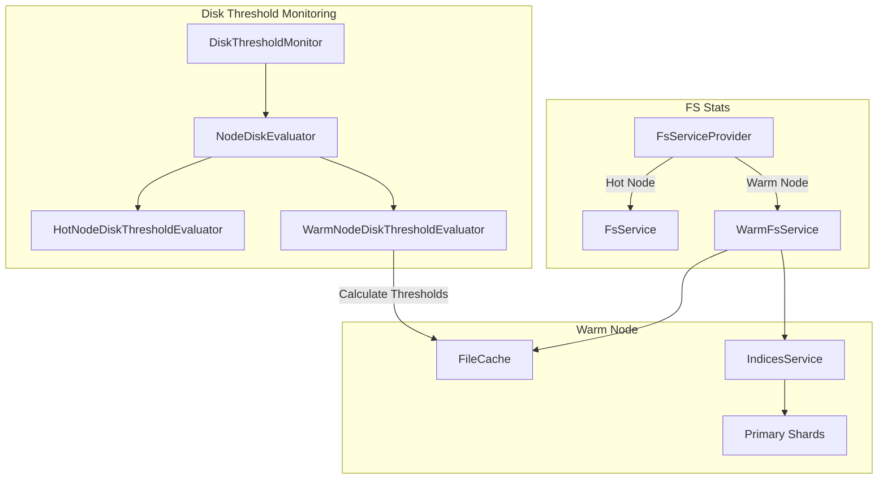

---
tags:
  - domain/core
  - component/server
  - observability
  - performance
---
# Warm Indices

## Summary

OpenSearch v3.2.0 enhances warm indices with three key improvements: write block support when flood watermark is breached, accurate filesystem statistics based on addressable space rather than physical disk, and restrictions on resize operations for warm indices. These changes improve operational safety and monitoring accuracy for warm tier deployments.

## Details

### What's New in v3.2.0

This release adds critical operational improvements for warm indices:

1. **Write Block on Flood Watermark Breach** - Warm indices now automatically apply write blocks when the flood stage watermark is exceeded, preventing data loss from disk pressure
2. **Addressable Space-based FS Stats** - Warm nodes report filesystem statistics based on total addressable space (file cache × remote_data_ratio) instead of physical disk, providing accurate capacity planning metrics
3. **Resize Operation Restrictions** - Clone, shrink, and split operations are now explicitly disallowed on warm indices to prevent data integrity issues

### Technical Changes

#### Architecture Changes



#### New Components

| Component | Description |
|-----------|-------------|
| `DiskThresholdEvaluator` | Interface for disk threshold evaluation logic with watermark checking methods |
| `HotNodeDiskThresholdEvaluator` | Standard disk usage evaluation for hot nodes using physical disk metrics |
| `WarmNodeDiskThresholdEvaluator` | Warm-specific evaluation using addressable space (cache × ratio) |
| `NodeDiskEvaluator` | Composite evaluator that delegates to hot or warm evaluator based on node type |
| `FsServiceProvider` | Factory that creates appropriate FsService based on node type |
| `WarmFsService` | Specialized FsService for warm nodes calculating disk usage from primary shard sizes |

#### New Configuration

| Setting | Description | Default |
|---------|-------------|---------|
| `cluster.filecache.remote_data_ratio` | Ratio of remote data to file cache size | `5.0` (changed from `0.0`, min: `1.0`) |

### Usage Example

#### Warm Node FS Stats Response

```json
GET /_nodes/warm-node/stats/fs
{
  "nodes": {
    "warm-node-id": {
      "fs": {
        "total": {
          "total_in_bytes": 2097152000,
          "free_in_bytes": 2064519020,
          "available_in_bytes": 2064519020,
          "cache_reserved_in_bytes": 1048576000,
          "cache_utilized": 32632980
        },
        "data": [
          {
            "path": "/warm",
            "mount": "warm",
            "type": "warm",
            "total_in_bytes": 2097152000,
            "free_in_bytes": 2064519020,
            "available_in_bytes": 2064519020,
            "cache_reserved_in_bytes": 1048576000,
            "cache_utilized": 32632980
          }
        ]
      }
    }
  }
}
```

The `total_in_bytes` is calculated as `file_cache_size × remote_data_ratio` (e.g., 1GB cache × 2 ratio = 2GB total addressable space).

#### Resize Operation Error

```json
POST /warm-index/_shrink/target-index
// Response:
{
  "error": {
    "type": "illegal_state_exception",
    "reason": "cannot resize warm index"
  },
  "status": 400
}
```

### Migration Notes

- **remote_data_ratio default changed**: The default value changed from `0` (unlimited) to `5`. Clusters relying on the previous unlimited behavior should explicitly set `cluster.filecache.remote_data_ratio: 0` or adjust capacity planning
- **Minimum ratio enforced**: The minimum allowed value is now `1.0` instead of `0.0`
- **Resize operations blocked**: Any existing automation that attempts to resize warm indices will now fail and needs to be updated

## Limitations

- Write blocks on warm indices during flood stage may impact ingestion pipelines targeting warm indices
- FS stats for warm nodes show virtual path `/warm` instead of actual filesystem paths
- Resize restrictions apply to all warm indices regardless of their current state

## References

### Documentation
- [Searchable Snapshots Documentation](https://docs.opensearch.org/3.0/tuning-your-cluster/availability-and-recovery/snapshots/searchable_snapshot/)

### Pull Requests
| PR | Description |
|----|-------------|
| [#18375](https://github.com/opensearch-project/OpenSearch/pull/18375) | Add support for Warm Indices Write Block on Flood Watermark breach |
| [#18767](https://github.com/opensearch-project/OpenSearch/pull/18767) | FS stats for warm nodes based on addressable space |
| [#18686](https://github.com/opensearch-project/OpenSearch/pull/18686) | Disallow resize for Warm Index, add Parameterized ITs for close in remote store |

### Issues (Design / RFC)
- [Issue #18768](https://github.com/opensearch-project/OpenSearch/issues/18768): [WRITABLE WARM] FS stats for warm nodes

## Related Feature Report

- Full feature documentation
